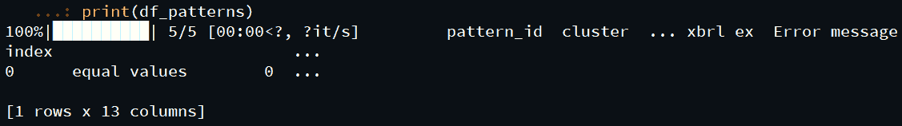
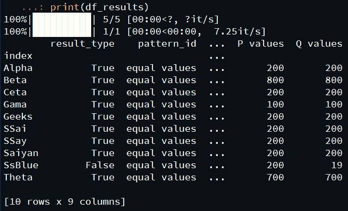

# 使用数据模式模块

识别数据帧中的模式

> 原文:[https://www . geesforgeks . org/identificating-patterns-in-data frames-use-data-pattern-module/](https://www.geeksforgeeks.org/identifying-patterns-in-dataframes-using-data-pattern-module/)

**先决条件:** [熊猫模块](https://www.geeksforgeeks.org/pandas-tutorial/)[熊猫数据框](https://www.geeksforgeeks.org/python-pandas-dataframe/)

**熊猫**是建立在 *NumPy* 库之上的开源库。它是一个 Python 包，提供了各种数据结构和操作来操作数字数据和时间序列。它主要是流行的，因为导入和分析数据容易得多。*熊猫*速度快，为用户带来高性能&生产力。

**数据框**是二维可变大小、潜在异构的表格数据结构，在*熊猫*中带有标记轴(行和列)。数据框是一种二维数据结构，即数据以表格形式排列成行和列。*熊猫*数据框由数据、行和列三个主要部分组成。

**数据模式**模块，为了在数据框中找到简单的数据模式，我们将使用 python 中的*数据-模式*模块，该模块用于在结构化数据集中生成和评估模式，并导出到 Excel 和 JSON，并将生成的模式转换为 Pandas 代码。

### 安装:

```
pip install data-patterns
```

### **分步方法:**

导入所需模块。

分配数据框。

使用数据框作为构造函数参数创建模式混合器对象。

调用模式混合器对象的 *find()* 方法来识别数据帧中的各种模式。

### 实施:

以下是基于上述方法的一些程序:

a

**输出:**



数据项*值 4* 和*值 5* 在 *9* 和 *1* 的支持下具有相等的*模式。
此外，借助 *analyze()* 方法，可以以适当的格式分析该数据，下面是改进后的程序:*

## 蟒蛇 3

```
# importing the data_patterns module
import data_patterns

# importing the pandas module
import pandas as pd

# creating a pandas dataframe
df = pd.DataFrame(columns=['Name', 'Grade', 'value1',
                           'Value2', 'Value3', 'Value4', 'value5'],
                  data=[['Alpha', 'A', 1000, 800, 0, 200, 200],
                        ['Beta', 'B', 4000, 0, 3200, 800, 800],
                        ['Gamma', 'A', 800, 0, 700, 100, 100],
                        ['Theta', 'B', 2500, 1800, 0, 700, 700],
                        ['Ceta', 'C', 2100, 0, 2200, 200, 200],
                        ['Saiyan', 'C', 9000, 8800, 0, 200, 200],
                        ['SSai', 'A', 9000, 0, 8800, 200, 200],
                        ['SSay', 'A', 9000, 8800, 0, 200, 200],
                        ['Geeks', 'A', 9000, 0, 8800, 200, 200],
                        ['SsBlue', 'B', 9000, 0, 8800, 200, 19]])

# setting datag=frame index
df.set_index('Name', inplace=True)

# creating a pattern mixer object
miner = data_patterns.PatternMiner(df)

# finding the pattern in the dataframe
# name is optional
# other patterns which can be used  ‘>’, ‘<’, ‘<=’, ‘>=’, ‘!=’, ‘sum’
df_patterns = miner.find({'name': 'equal values',
                          'pattern': '=',
                          'parameters': {"min_confidence": 0.5,
                                         "min_support": 2,
                                         "decimal": 8}})

# getting the analyzed dataframe
df_results = miner.analyze(df)

# printing the analyzed results
print(df_results)
```

**输出:**



正如我们在这里看到的，在数据框中出现的不同数据项之间识别了各种模式。