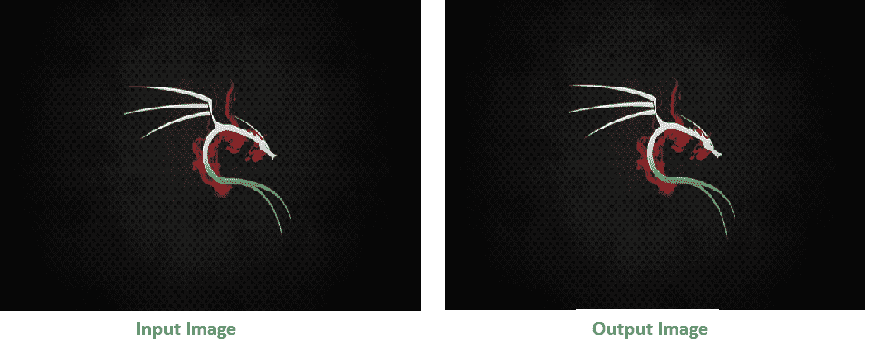
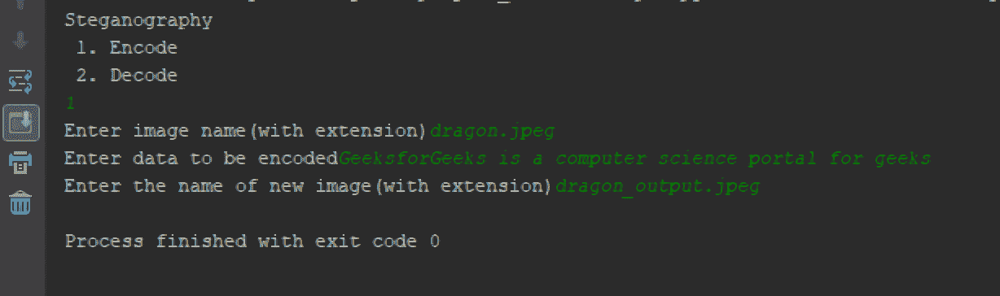

# 使用 Python 的基于图像的隐写术

> 原文:[https://www . geesforgeks . org/基于图像的隐写术-使用-python/](https://www.geeksforgeeks.org/image-based-steganography-using-python/)

**隐写术**是将秘密数据隐藏在任何图像/音频/视频中的方法。简而言之，隐写术的主要动机是将预期的信息隐藏在任何图像/音频/视频中，而这些信息仅仅通过查看似乎并不秘密。
基于图像的隐写术背后的想法非常简单。图像由数字数据(像素)组成，它描述了图片内部的内容，通常是所有像素的颜色。因为我们知道每个图像都是由像素组成的，每个像素包含 3 个值(红、绿、蓝)。

### 对数据进行编码:

使用 ASCII 值将数据的每个字节转换为其 8 位二进制代码。现在从左到右读取像素，每组 3 个像素，总共包含 9 个值。前 8 个值用于存储二进制数据。如果出现 1，则值为奇数，如果出现 0，则值为偶数。
**例如:**
假设要隐藏的消息是“ **Hii** ”。由于消息是 3 字节的，因此，编码数据所需的像素是 3×3 = 9。考虑一个总共有 12 个像素的 4 x 3 图像，这些像素足以对给定的数据进行编码。

```py
[(27, 64, 164), (248, 244, 194), (174, 246, 250), (149, 95, 232),
(188, 156, 169), (71, 167, 127), (132, 173, 97), (113, 69, 206),
(255, 29, 213), (53, 153, 220), (246, 225, 229), (142, 82, 175)]

```

“ **H** ”的 ASCII 值为 72，其二进制等价物为 01001000。
取前 3 个像素(27，64，164)，(248，244，194)，(174，246，250)进行编码。现在将像素改为奇数表示 1，偶数表示 0。因此，修改的像素是(26，63，164)，(248，243，194)，(174，246，250)。由于我们必须编码更多的数据，因此，最后一个值应该是偶数。类似地， **i** 可以编码在这个图像中。
新图像看起来像:

```py
[(26, 63, 164), (248, 243, 194), (174, 246, 250), (148, 95, 231),
(188, 155, 168), (70, 167, 126), (132, 173, 97), (112, 69, 206),
(254, 29, 213), (53, 153, 220), (246, 225, 229), (142, 82, 175)]

```

### 解码数据:

为了解码，一次读取三个像素，直到最后一个值为奇数，这意味着消息结束。每 3 个像素包含一个二进制数据，可以通过相同的编码逻辑提取。如果值为奇数，二进制位为 1，否则为 0。



以下是上述思路的实现:

## 计算机编程语言

```py
# Python program implementing Image Steganography

# PIL module is used to extract
# pixels of image and modify it
from PIL import Image

# Convert encoding data into 8-bit binary
# form using ASCII value of characters
def genData(data):

        # list of binary codes
        # of given data
        newd = []

        for i in data:
            newd.append(format(ord(i), '08b'))
        return newd

# Pixels are modified according to the
# 8-bit binary data and finally returned
def modPix(pix, data):

    datalist = genData(data)
    lendata = len(datalist)
    imdata = iter(pix)

    for i in range(lendata):

        # Extracting 3 pixels at a time
        pix = [value for value in imdata.__next__()[:3] +
                                imdata.__next__()[:3] +
                                imdata.__next__()[:3]]

        # Pixel value should be made
        # odd for 1 and even for 0
        for j in range(0, 8):
            if (datalist[i][j] == '0' and pix[j]% 2 != 0):
                pix[j] -= 1

            elif (datalist[i][j] == '1' and pix[j] % 2 == 0):
                if(pix[j] != 0):
                    pix[j] -= 1
                else:
                    pix[j] += 1
                # pix[j] -= 1

        # Eighth pixel of every set tells
        # whether to stop ot read further.
        # 0 means keep reading; 1 means thec
        # message is over.
        if (i == lendata - 1):
            if (pix[-1] % 2 == 0):
                if(pix[-1] != 0):
                    pix[-1] -= 1
                else:
                    pix[-1] += 1

        else:
            if (pix[-1] % 2 != 0):
                pix[-1] -= 1

        pix = tuple(pix)
        yield pix[0:3]
        yield pix[3:6]
        yield pix[6:9]

def encode_enc(newimg, data):
    w = newimg.size[0]
    (x, y) = (0, 0)

    for pixel in modPix(newimg.getdata(), data):

        # Putting modified pixels in the new image
        newimg.putpixel((x, y), pixel)
        if (x == w - 1):
            x = 0
            y += 1
        else:
            x += 1

# Encode data into image
def encode():
    img = input("Enter image name(with extension) : ")
    image = Image.open(img, 'r')

    data = input("Enter data to be encoded : ")
    if (len(data) == 0):
        raise ValueError('Data is empty')

    newimg = image.copy()
    encode_enc(newimg, data)

    new_img_name = input("Enter the name of new image(with extension) : ")
    newimg.save(new_img_name, str(new_img_name.split(".")[1].upper()))

# Decode the data in the image
def decode():
    img = input("Enter image name(with extension) : ")
    image = Image.open(img, 'r')

    data = ''
    imgdata = iter(image.getdata())

    while (True):
        pixels = [value for value in imgdata.__next__()[:3] +
                                imgdata.__next__()[:3] +
                                imgdata.__next__()[:3]]

        # string of binary data
        binstr = ''

        for i in pixels[:8]:
            if (i % 2 == 0):
                binstr += '0'
            else:
                binstr += '1'

        data += chr(int(binstr, 2))
        if (pixels[-1] % 2 != 0):
            return data

# Main Function
def main():
    a = int(input(":: Welcome to Steganography ::\n"
                        "1\. Encode\n2\. Decode\n"))
    if (a == 1):
        encode()

    elif (a == 2):
        print("Decoded Word :  " + decode())
    else:
        raise Exception("Enter correct input")

# Driver Code
if __name__ == '__main__' :

    # Calling main function
    main()
```

输出:

