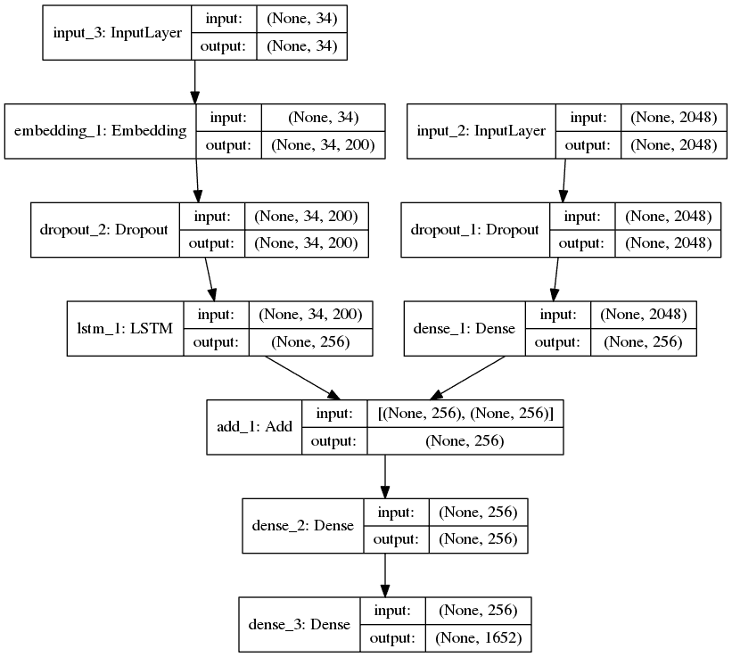
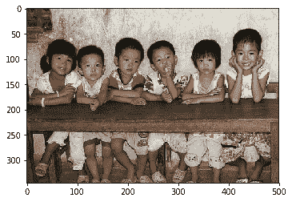
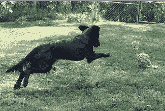
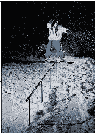

# 在 Flickr8K 数据集上使用深度学习的图像字幕生成器

> 原文:[https://www . geesforgeks . org/image-caption-generator-use-deep-learning-on-Flickr 8k-dataset/](https://www.geeksforgeeks.org/image-caption-generator-using-deep-learning-on-flickr8k-dataset/)

在深度学习领域，为给定图像生成字幕是一个具有挑战性的问题。在本文中，我们将使用计算机视觉和自然语言处理的不同技术来识别图像的上下文，并使用英语等自然语言来描述它们。我们将使用 CNN(卷积神经网络)和 LSTM(长短期记忆)单元来构建图像字幕生成器的工作模型。为了训练我们的模型，我使用了 [Flickr8K](https://www.kaggle.com/shadabhussain/flickr8k) 数据集。它由 8000 幅独特的图像组成，每幅图像将被映射到描述图像的五个不同的句子中。

**第一步:导入需要的库**

```
# linear algebra
import numpy as np  
# data processing, CSV file I / O (e.g. pd.read_csv)
import pandas as pd  
import os
import tensorflow as tf
from keras.preprocessing.sequence import pad_sequences
from keras.preprocessing.text import Tokenizer
from keras.models import Model
from keras.layers import Flatten, Dense, LSTM, Dropout, Embedding, Activation
from keras.layers import concatenate, BatchNormalization, Input
from keras.layers.merge import add
from keras.utils import to_categorical, plot_model
from keras.applications.inception_v3 import InceptionV3, preprocess_input
import matplotlib.pyplot as plt  # for plotting data
import cv2
```

**第二步:加载描述**
我们文件的格式是图像和标题用换行符(" \n ")隔开，即它由图像名称后跟空格和 CSV 格式的图像描述组成。这里，我们需要通过将图像存储在字典中来将图像映射到其描述。

```
def load_description(text):
    mapping = dict()
    for line in text.split("\n"):
        token = line.split("\t")
        if len(line) < 2:   # remove short descriptions
            continue
        img_id = token[0].split('.')[0] # name of the image
        img_des = token[1]              # description of the image
        if img_id not in mapping:
            mapping[img_id] = list()
        mapping[img_id].append(img_des)
    return mapping

token_path = '/kaggle / input / flickr8k / flickr_data / Flickr_Data / Flickr_TextData / Flickr8k.token.txt'
text = open(token_path, 'r', encoding = 'utf-8').read()
descriptions = load_description(text)
print(descriptions['1000268201_693b08cb0e'])
```

**输出:**

```
['A child in a pink dress is climbing up a set of stairs in an entry way .', 

'A girl going into a wooden building .', 

'A little girl climbing into a wooden playhouse .', 

'A little girl climbing the stairs to her playhouse .', 

'A little girl in a pink dress going into a wooden cabin .']

```

**第三步:清洗文字**
NLP 的主要步骤之一就是去除噪音，这样机器就可以轻松检测出文字中的图案。噪声将以特殊字符的形式出现，如标签、标点和数字。如果它们出现在文本中，所有这些对计算机来说都很难理解。所以我们需要去掉这些来获得更好的结果。此外，您还可以使用 NLTK 库删除停止词并执行**词干化**和**引理化**。

```
def clean_description(desc):
    for key, des_list in desc.items():
        for i in range(len(des_list)):
            caption = des_list[i]
            caption = [ch for ch in caption if ch not in string.punctuation]
            caption = ''.join(caption)
            caption = caption.split(' ')
            caption = [word.lower() for word in caption if len(word)>1 and word.isalpha()]
            caption = ' '.join(caption)
            des_list[i] = caption

clean_description(descriptions)
descriptions['1000268201_693b08cb0e']
```

**第四步:生成词汇**

词汇是存在于我们的文本语料库中的一组独特的词。当处理自然语言处理的原始文本时，一切都是围绕词汇进行的。

```
def to_vocab(desc):
    words = set()
    for key in desc.keys():
        for line in desc[key]:
            words.update(line.split())
    return words
vocab = to_vocab(descriptions)
```

**第五步:加载图像**

这里，我们需要将训练集中的图像映射到它们在我们的描述变量中出现的相应描述。创建所有训练图像的名称列表，然后创建一个空字典，使用图像名称作为关键字，使用描述列表作为值，将图像映射到它们的描述。在映射描述时，在开头和结尾添加唯一的单词来标识句子的开头和结尾。

```
import glob
images = '/kaggle / input / flickr8k / flickr_data / Flickr_Data / Images/'
# Create a list of all image names in the directory
img = glob.glob(images + '*.jpg')

train_path = '/kaggle / input / flickr8k / flickr_data / Flickr_Data / Flickr_TextData / Flickr_8k.trainImages.txt'
train_images = open(train_path, 'r', encoding = 'utf-8').read().split("\n")
train_img = []  # list of all images in training set
for im in img:
    if(im[len(images):] in train_images):
        train_img.append(im)

# load descriptions of training set in a dictionary. Name of the image will act as ey
def load_clean_descriptions(des, dataset):
    dataset_des = dict()
    for key, des_list in des.items():
        if key+'.jpg' in dataset:
            if key not in dataset_des:
                dataset_des[key] = list()
            for line in des_list:
                desc = 'startseq ' + line + ' endseq'
                dataset_des[key].append(desc)
    return dataset_des

train_descriptions = load_clean_descriptions(descriptions, train_images)
print(train_descriptions['1000268201_693b08cb0e'])
```

**输出:**

```
['startseq child in pink dress is climbing up set of stairs in an entry way endseq', 

'startseq girl going into wooden building endseq', 

'startseq little girl climbing into wooden playhouse endseq', 

'startseq little girl climbing the stairs to her playhouse endseq', 

'startseq little girl in pink dress going into wooden cabin endseq']

```

**第六步:提取所有图像的特征向量**

**现在我们将给出一个图像作为我们模型的输入，但是与人类不同，机器不能通过看到图像来理解图像。因此，我们需要将图像转换成编码，以便机器能够理解其中的模式。对于这个任务，我使用的是迁移学习，也就是说，我们使用一个已经在大数据集上训练过的预训练模型，并从这些模型中提取特征，并将其用于我们的工作。这里我使用的是 InceptionV3 模型，该模型已经在 Imagenet 数据集上进行了训练，该数据集有 1000 个不同的类要分类。我们可以直接从 Keras.applications 模块导入这个模型。**

**我们需要移除最后一个分类层，以从 InceptionV3 模型中获得(2048)维特征向量。**

```
from keras.preprocessing.image import load_img, img_to_array
def preprocess_img(img_path):
    # inception v3 excepts img in 299 * 299 * 3
    img = load_img(img_path, target_size = (299, 299))
    x = img_to_array(img)
    # Add one more dimension
    x = np.expand_dims(x, axis = 0)
    x = preprocess_input(x)
    return x

def encode(image):
    image = preprocess_img(image)
    vec = model.predict(image)
    vec = np.reshape(vec, (vec.shape[1]))
    return vec

base_model = InceptionV3(weights = 'imagenet')
model = Model(base_model.input, base_model.layers[-2].output)
# run the encode function on all train images and store the feature vectors in a list
encoding_train = {}
for img in train_img:
    encoding_train[img[len(images):]] = encode(img)
```

****第 7 步:** **标记词汇****

**在这一步中，我们需要标记词汇中的所有单词。或者，我们可以使用 Keras 中的 tokenizer 来完成此任务。**

```
# list of all training captions
all_train_captions = []
for key, val in train_descriptions.items():
    for caption in val:
        all_train_captions.append(caption)

# consider only words which occur atleast 10 times
vocabulary = vocab
threshold = 10 # you can change this value according to your need
word_counts = {}
for cap in all_train_captions:
    for word in cap.split(' '):
        word_counts[word] = word_counts.get(word, 0) + 1

vocab = [word for word in word_counts if word_counts[word] >= threshold]

# word mapping to integers
ixtoword = {}
wordtoix = {}

ix = 1
for word in vocab:
    wordtoix[word] = ix
    ixtoword[ix] = word
    ix += 1

# find the maximum length of a description in a dataset
max_length = max(len(des.split()) for des in all_train_captions)
max_length
```

****第 8 步:手套向量嵌入****

**GloVe 代表单词表示的全局向量。它是斯坦福开发的一种无监督学习算法，用于通过从语料库中聚合全局单词-单词共现矩阵来生成单词嵌入。此外，我们有 8000 张图片，每张图片有 5 个相关的标题。这意味着我们有 30000 个例子来训练我们的模型。由于有更多的例子，您也可以使用数据生成器将输入以批处理的形式输入到我们的模型中，而不是一次全部给出。为了简单起见，我这里不使用这个。**

**此外，我们将使用嵌入矩阵来存储词汇中单词之间的关系。嵌入矩阵是原始空间到实值空间的线性映射，其中实体将具有有意义的关系。**

```
X1, X2, y = list(), list(), list()
for key, des_list in train_descriptions.items():
    pic = train_features[key + '.jpg']
    for cap in des_list:
        seq = [wordtoix[word] for word in cap.split(' ') if word in wordtoix]
        for i in range(1, len(seq)):
            in_seq, out_seq = seq[:i], seq[i]
            in_seq = pad_sequences([in_seq], maxlen = max_length)[0]
            out_seq = to_categorical([out_seq], num_classes = vocab_size)[0]
            # store
            X1.append(pic)
            X2.append(in_seq)
            y.append(out_seq)

X2 = np.array(X2)
X1 = np.array(X1)
y = np.array(y)

# load glove vectors for embedding layer
embeddings_index = {}
golve_path ='/kaggle / input / glove-global-vectors-for-word-representation / glove.6B.200d.txt'
glove = open(golve_path, 'r', encoding = 'utf-8').read()
for line in glove.split("\n"):
    values = line.split(" ")
    word = values[0]
    indices = np.asarray(values[1: ], dtype = 'float32')
    embeddings_index[word] = indices

emb_dim = 200
emb_matrix = np.zeros((vocab_size, emb_dim))
for word, i in wordtoix.items():
    emb_vec = embeddings_index.get(word)
    if emb_vec is not None:
        emb_matrix[i] = emb_vec
emb_matrix.shape
```

****第 9 步:定义模型**
为了定义我们模型的结构，我们将使用来自功能 API 的 Keras 模型。它有三个主要步骤:**

*   **从文本中处理序列**
*   **从图像中提取特征向量**
*   **通过连接以上两层对输出进行解码**

```
# define the model
ip1 = Input(shape = (2048, ))
fe1 = Dropout(0.2)(ip1)
fe2 = Dense(256, activation = 'relu')(fe1)
ip2 = Input(shape = (max_length, ))
se1 = Embedding(vocab_size, emb_dim, mask_zero = True)(ip2)
se2 = Dropout(0.2)(se1)
se3 = LSTM(256)(se2)
decoder1 = add([fe2, se3])
decoder2 = Dense(256, activation = 'relu')(decoder1)
outputs = Dense(vocab_size, activation = 'softmax')(decoder2)
model = Model(inputs = [ip1, ip2], outputs = outputs)
```

****输出:**** 

<center> **

字幕生成器深度学习模型** </center>

****第十步:训练模型****

**为了训练我们的模型，我使用亚当的优化器和损失函数作为分类交叉熵。我正在为 50 个时代训练模型，这将足以预测产量。如果你有更多的计算能力(图形处理器的数量)，你可以通过减少批量和增加时期的数量来训练它。**

```
model.layers[2].set_weights([emb_matrix])
model.layers[2].trainable = False
model.compile(loss = 'categorical_crossentropy', optimizer = 'adam')
model.fit([X1, X2], y, epochs = 50, batch_size = 256)
# you can increase the number of epochs for better results
```

****输出:****

```
Epoch 1/1

292328/292328 [==============================] - 55s 189us/step - loss: 3.8895

Epoch 1/1

292328/292328 [==============================] - 55s 187us/step - loss: 3.1549

Epoch 1/1

292328/292328 [==============================] - 54s 186us/step - loss: 2.9185

Epoch 1/1

292328/292328 [==============================] - 54s 186us/step - loss: 2.7652

Epoch 1/1

292328/292328 [=================>.........] - ETA: 15s - loss: 2.6496 
```

****步骤 11:预测输出****

```
def greedy_search(pic):
    start = 'startseq'
    for i in range(max_length):
        seq = [wordtoix[word] for word in start.split() if word in wordtoix]
        seq = pad_sequences([seq], maxlen = max_length)
        yhat = model.predict([pic, seq])
        yhat = np.argmax(yhat)
        word = ixtoword[yhat]
        start += ' ' + word
        if word == 'endseq':
            break
    final = start.split()
    final = final[1:-1]
    final = ' '.join(final)
    return final
```

****输出:**T2】**

<center>**

预测输出:四个女孩坐在木地板上**  **

预测输出:黑狗正在草丛中奔跑



预测输出:人类正在坡道上玩滑板** </center>