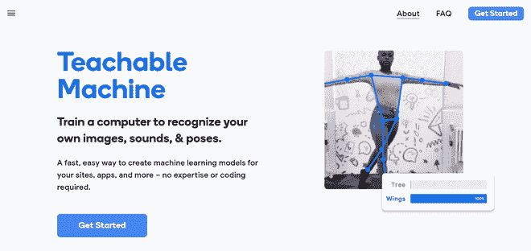
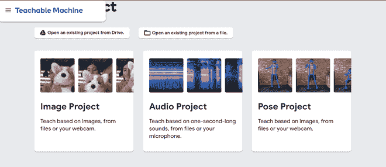
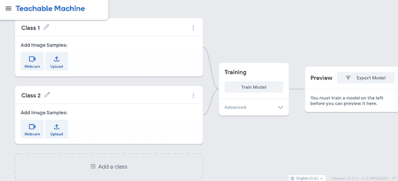
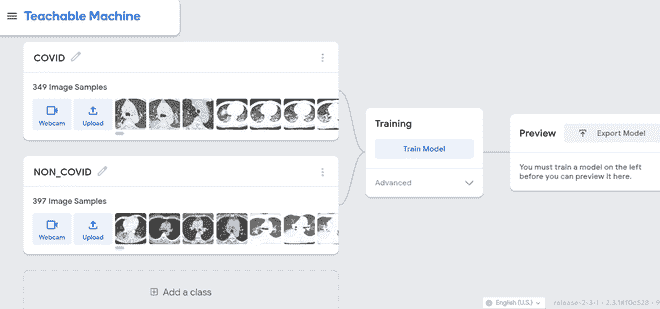
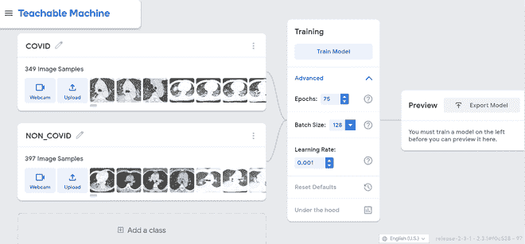
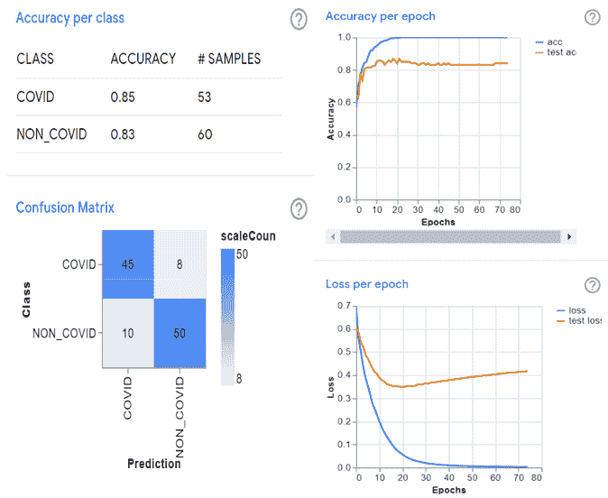
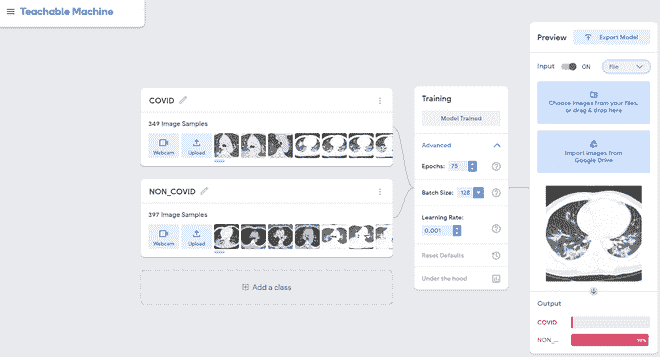

# 使用谷歌可教机器的图像分类

> 原文:[https://www . geeksforgeeks . org/image-分类-使用-谷歌-可教-机器/](https://www.geeksforgeeks.org/image-classification-using-googles-teachable-machine/)

机器学习是一个科学领域，它为计算机提供了无需直接编程就能学习的能力。当许多学习者、学生、工程师和数据科学家使用机器学习来创建多样化的项目和商品时，机器学习的应用是潮流的。然而，机器学习模型的开发涉及高设备参数，并且模型训练过程通常可以从几个小时到几天不等。因此，低端系统不能适应成功的机器学习模型的训练，或者可能出现关键的系统问题。

然而，在互联网上很容易获得几种机器学习环境，它们不需要任何系统规范或框架规范，并使用云技术在尽可能好的时间内训练模型。其中一些开源机器学习环境是[谷歌合作实验室](https://colab.research.google.com/notebooks/intro.ipynb)、[卡格尔·克纳尔](https://www.kaggle.com/)，这些都是云端深度学习和机器学习应用的优秀平台。它们都是谷歌的产品，需要数据科学的知识来开发和训练使用它们的模型。然而，谷歌推出了一个新的开源平台，用于培训开发人员编写代码的机器学习模型，即谷歌的可教机器。

[谷歌可教机器](https://teachablemachine.withgoogle.com/)是一个在线开源环境，用于开发和训练机器学习和深度学习监督模型，无需使用任何编程语言。

**以下是如何使用可教机器开发和训练机器学习模型的分步方法:**

*   前往[https://teachablemachine.withgoogle.com/](https://teachablemachine.withgoogle.com/)

*   点击*开始*，选择是打开现有项目还是创建新项目。为了创建一个新的项目，我们有三个选项，即图像项目，音频项目，或姿势项目。单击图像项目。

*   点击图像项目后，将显示以下网页。

*   添加一些类，重命名它们，并为每个类上传示例图像。我们要使用的数据集是[COVID 19-肺部 CT 扫描](https://www.kaggle.com/luisblanche/covidct)。

*   然后点击高级，调整*时代*、*批量*和*学习率。*

*   现在点击火车模型，需要一些时间来处理。模型训练完成后，点击引擎盖下的获取精度等细节。

*   您可以通过上传样本输入图像来测试模型。

*   点击*导出模型*下载模型或为模型生成可共享的公共链接。

这样，人们可以使用谷歌的可教机器轻松开发机器学习和深度学习监督模型。