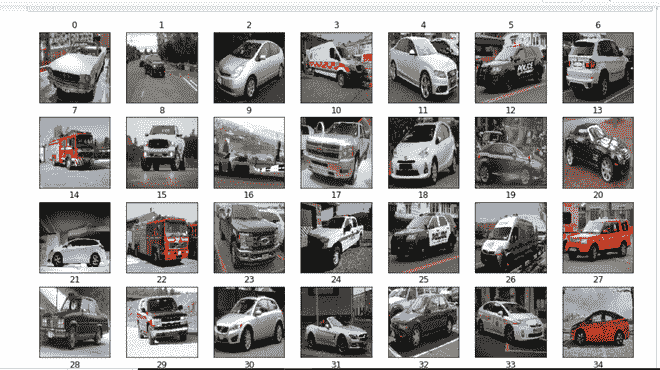
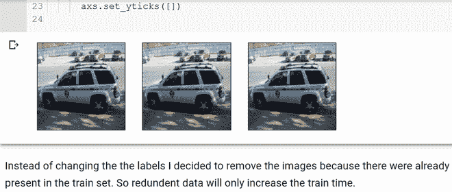
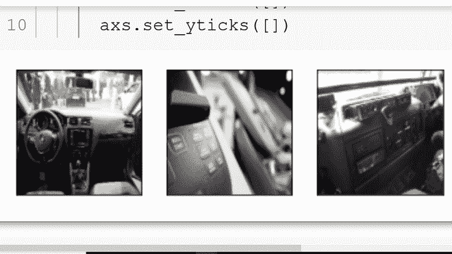
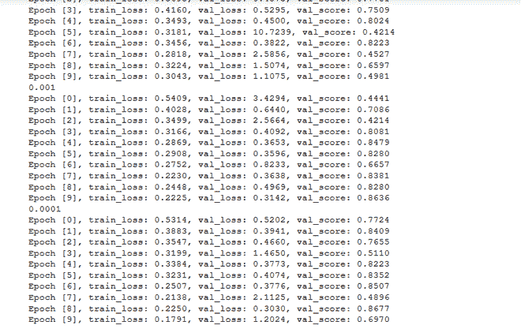
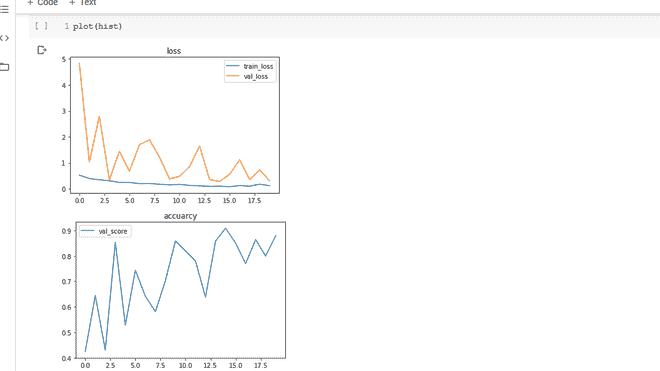
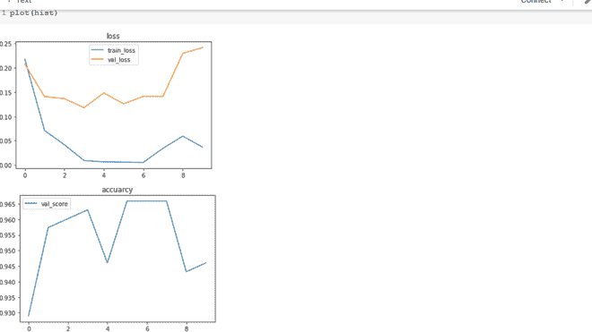
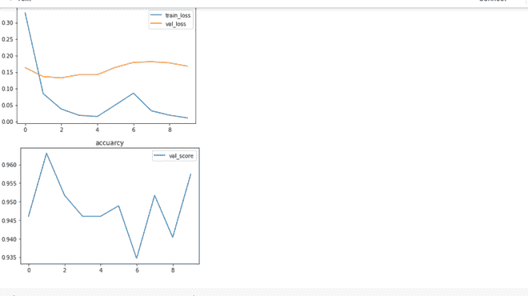
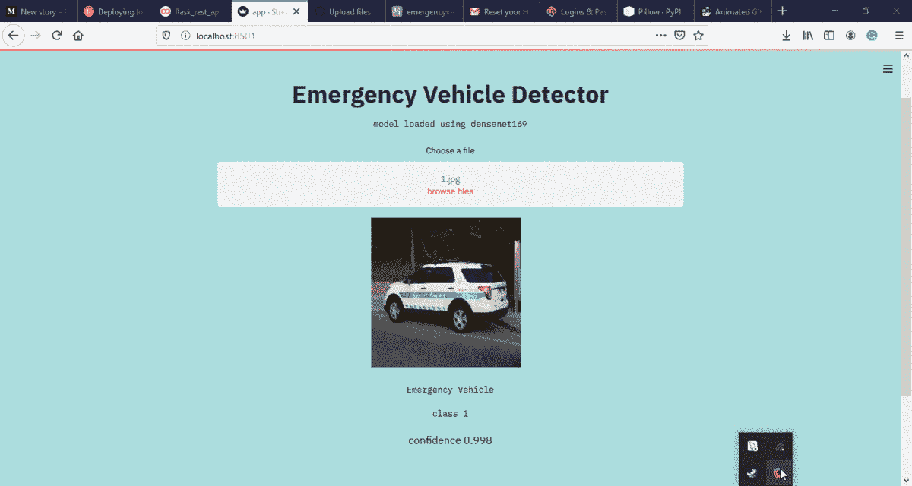

# 用网络 App 进行图像分类

> 原文:[https://www . geesforgeks . org/image-classing-with-web-app/](https://www.geeksforgeeks.org/image-classification-with-web-app/)

**使用 CNNs 检测应急车辆**


**动机:**最近参加了由 Analytics Vidhya 主持的 JanataHack:计算机视觉黑客马拉松。比赛的目的是创建一个二值图像分类器，可以区分非？-?应急车辆，如私人车辆。来自应急车辆(警车、救护车等)。

**问题陈述:**
我们需要创建一个能够区分紧急车辆和非紧急车辆的分类器。应急车辆标记为 1，非应急车辆标记为 0。在本文中，我将展示我创建一个模型所遵循的方法，该模型在 10000 个模型中排名第 147 位。

本文展示的模型是卷积神经网络。我已经尽力使代码尽可能简单。读者需要对神经网络有所了解。

**问题解决步骤:**

1.  加载和可视化数据
2.  数据清理
3.  建模
4.  迁移学习
5.  参数调整
6.  最终模型。

**代码:加载和可视化数据**

## 蟒蛇 3

```py
# imports
import numpy as np
import os
import matplotlib.pyplot as plt
from PIL import Image, ImageOps, ImageFilter, ImageEnhance
import pandas as pd

# importing pytorch library.
import torchvision.transforms as transforms
import torch.nn.functional as F
import torch.nn as nn
from torch.utils.data import Dataset, random_split, DataLoader
```

我们将使用:

*   **numpy** :将图像存储成数组，
*   **matplotlib** :将图像可视化，
*   **枕头**或(PIL):加载和转换图像的库
*   **Pytorch** :针对我们的深度学习框架。

**数据加载:**
上图显示了提供给我们的数据集列车和测试集的所有图像都存在于 images 文件夹中，列车和测试 CVS 文件包含图像的名称。

**代码:**

## 蟒蛇 3

```py
# name of the image folder
imagePaths = 'images'

# reading the train.csv file using pandas
trainImages = pd.read_csv('train.csv')
# reading the test.csv file using pandas
testImages = pd.read_csv('test.csv')
# reading the submission file using pandas
samples = pd.read_csv('sample_submission.csv')
```

**代码:将图像加载到 numpy 数组中**

## 蟒蛇 3

```py
# defining train and labels list to store images and labels respectively.
train = []
labels = []

for image, label in zip(trainImages.iloc[:, 0], trainImages.iloc[:, 1]):
    # create a image path and store in img_path variable
    imgPath = os.path.join(imagePaths, image)
    # Use PIl Image class to load the image
    img = Image.open(imgPath)

    # apply median filter to the image this helps in reduing noise
    img = img.filter(ImageFilter.MedianFilter)
    # convert the image to numpy array and store the loaded images into train
    train.append(np.asarray(img))
    # store the label into the labels list
    labels.append(label)
```

**代码:打开并显示图像。**

## 蟒蛇 3

```py
# create subplots using the plt.subplots function
# the number of subplots depend on the n_rows and n_cols
# all the subplots are stored in ax variables
_, ax = plt.subplots(nrows = 4, ncols = 7, figsize =(12, 12))

# iterate throught the ax variable by flattening it
for index, i in enumerate(ax.flatten()):
    # the imshow is used to show the image
    i.imshow(train[index])
    # set the title
    i.set_title(index)

    # this below lines makes the code better visualize.
    i.set_xticks([])
    i.set_yticks([])
```

**输出:**



上述单元格的输出。

现在我们已经将图像存储在火车中，将输出类存储在标签中，我们可以继续下一步了。

**数据清理**
在本节中，我们将查看未命中的分类标签和不正确的图像样本，通过移除这些图像，我的准确率将 val_score 提高了 2%。从 94%到 96%，有时甚至是 97%。

labelledImages 小姐:用于可视化数据的代码同上



未分类标签

**数据不当:仪表盘图像。**



通过移除这些图像，精度变得更加稳定(振荡更少)。这里需要注意的一点是，我能够删除这些仪表板图像，因为我在测试数据中没有发现任何类似的图像。

**定义 DatasetClass:** 对于从磁盘加载数据集的模型，pytorch 提供了一个 DatasetClass 使用这个我们不需要将整个模型装入内存。

**代码:**

## 蟒蛇 3

```py
# Creating a VehicleDataset class for loading the images and labels .
# the following class needs to extend from the Dataset class
# provided by pytorch framework and implement the __len__ and __getitem__ methods.

class VehicleDataset(Dataset):

    def __init__(self, csv_name, folder, transform = None, label = False):

        self.label = label

        self.folder = folder
        print(csv_name)
        self.dataframe = pd.read_csv(self.folder+'/'+csv_name+'.csv')
        self.tms = transform

    def __len__(self):
        return len(self.dataframe)

    def __getitem__(self, index):

        row = self.dataframe.iloc[index]

        imgIndex = row['image_names']

        imageFile = self.folder + '/' + img_index

        image = Image.open(image_file)

        if self.label:
            target = row['emergency_or_not']

            if target == 0:
                encode = torch.FloatTensor([1, 0])
            else:
                encode = torch.FloatTensor([0, 1])

            return self.tms(image), encode

        return self.tms(image)

# creating objects of VehicleDataset

# the deep learing models accepts the image to be in tensor format
# this is done using the transforms.ToTensor() methods

transform = transforms.Compose([transforms.ToTensor(),
                                ])

'''
arguments:
csv_name - name of the csv file in out case train.csv
folder - folder in which the images are stored
transform - transforms the image to tensor,
label - used to differentiate between train and test set.
''''

trainDataset = VehicleDataset('train', 'images', label = True, transform = transform)
```

现在我们已经准备好了数据管道，我们需要创建深度学习模型。

**CNN 模型:**
这篇文章假设你对神经网络有一些了解，因为解释这超出了本文的范围。我将使用一个 CNN(卷积神经网络)。该模型有 3 个主要层，分别命名为 conv2d 层、批处理 Norm 和最大池 2d。这里使用的激活函数是 relu:

**代码:**

## 计算机编程语言

```py
# the EmergencyCustomModel class defines our Neural Network
# It inherites from the ImageClassificationBase class which has heler methods
# for printing the loss and accuracy at each epochs.

class EmergencyCustomModel(ImageClassificationBase):
    def __init__(self):
        super().__init__()
        self.network = nn.Sequential(

            nn.Conv2d(3, 32, kernel_size = 3, padding = 1),
            nn.BatchNorm2d(32),
            nn.ReLU(),
            nn.MaxPool2d(2, 2),

            nn.Conv2d(32, 64, kernel_size = 3, stride = 1, padding = 1),
            nn.BatchNorm2d(64),
            nn.ReLU(),
            nn.MaxPool2d(2, 2),

            nn.Conv2d(64, 64, kernel_size = 3, stride = 1, padding = 1),
            nn.BatchNorm2d(64),
            nn.ReLU(),
            nn.MaxPool2d(2, 2),

            nn.Conv2d(64, 128, kernel_size = 3, stride = 1, padding = 1),
            nn.BatchNorm2d(128),
            nn.ReLU(),
            nn.MaxPool2d(2, 2),

            nn.Conv2d(128, 128, kernel_size = 3, stride = 1, padding = 1),
            nn.BatchNorm2d(128),
            nn.ReLU(),
            nn.MaxPool2d(2, 2),

            nn.Conv2d(128, 256, kernel_size = 3, stride = 1, padding = 1),
            nn.BatchNorm2d(256),
            nn.ReLU(),
            nn.AdaptiveAvgPool2d(1),

            nn.Flatten(),
            nn.Linear(256, 128),
            nn.ReLU(),
            nn.Linear(128, 64),
            nn.ReLU(),
            nn.Linear(64, 2),
            # nn.Sigmoid(),
        )
  def forward(self, xb):
        return self.network(xb)
```

**可以在我的**[**github repo**](https://github.com/evilc3/EmergencyVehicleDetector)
**训练功能中找到本笔记本的整个模型定义:**

**代码:以下功能用于训练岗位所有模型。**

## 蟒蛇 3

```py
# defining the training method.
# the evaluation method is used to calculate validation accuracy.

@torch.no_grad()
def evaluate(model, val_loader):
    model.eval()
    outputs = [model.validation_step(batch) for batch in val_loader]
    return model.validation_epoch_end(outputs)

# The fit method is used to train the model
# parametes
'''
epochs: no. of epochs the model trains
max_lr: maximum learning rate.
train_loader: here we pass the train dataset
val_loader: here we pass the val_dataset
opt_func : The learning algorithm that performs gradient descent.
model : the neural network to train on.
'''

def fit(epochs, max_lr, model, train_loader, val_loader,
        weight_decay = 0, grad_clip = None, opt_func = torch.optim.SGD):
    torch.cuda.empty_cache()
    history = []

    # Set up custom optimizer with weight decay
    optimizer = opt_func(model.parameters(), max_lr, weight_decay = weight_decay)

    # the loop iterates  from 0 to number of epochs.
    # the model needs to be set in the train model by calling the model.train.

    for epoch in range(epochs):
        # Training Phase
        model.train()
        train_losses = []

        for batch in train_loader:
            loss = model.training_step(batch)
            train_losses.append(loss)
            loss.backward()

            # Gradient clipping
            if grad_clip:
                nn.utils.clip_grad_value_(model.parameters(), grad_clip)

            optimizer.step()
            optimizer.zero_grad()

        # Validation phase
        result = evaluate(model, val_loader)
        result['train_loss'] = torch.stack(train_losses).mean().item()
        model.epoch_end(epoch, result)
        history.append(result)
    return history
```

在开始训练之前，我们需要将数据分成训练集和验证集。这样做是为了让模型在看不见的数据上很好地概括。我们将进行 80-20 分 80%的列车和 20%的测试。分割数据后，我们需要将数据集传递给 pytorch 提供的数据加载器。

**代码:拆分和创建数据加载器。**

## 蟒蛇 3

```py
# the batchSize is the number of images passes by the loader at a time.
# reduce this number if theres  an out of memory error.
batchSize = 32
valPct = 0.2

# code for splitting the data
# valPct variable is used to split dataset

valSize = int(valPct * len(trainDataset))
trainSize = len(trainDataset) - valSize
trainDs, valDs = random_split(trainDataset, [trainSize, valSize])

# Creating dataloaders.
train_loader = DataLoader(trainDs, batchSize)
val_loader = DataLoader(valDs, batchSize)
```

**现在我们准备通过调用 fit()方法开始训练。**

## 蟒蛇 3

```py
customModel = EmergencyCustomModel()
epochs = 10
lr = 0.01

# save the history to visualize later.
history = fit(epochs, lr, customModel, trainDl, valDl)
```

**输出上述代码:**



拟合函数的输出

整个代码可在 [**github repo**](https://github.com/evilc3/EmergencyVehicleDetector) **链接提供如下。**

**代码:绘图功能用于生成如下所示的损耗和精度图**

## 蟒蛇 3

```py
'''
parameters:
epochs = number of epochs the model was trained on
hist = the history returned by the fit function.

'''

def plot(hist, epochs = 10):
    trainLoss = []
    valLoss = []
    valScore = []
    for i in range(epochs):

        trainLoss.append(hist[i]['train_loss'])
        valLoss.append(hist[i]['val_loss'])
        valScore.append(hist[i]['val_score'])

    plt.plot(trainLoss, label ='train_loss')
    plt.plot(valLoss, label ='val_loss')
    plt.legend()
    plt.title('loss')

    plt.figure()
    plt.plot(valScore, label ='val_score')
    plt.legend()
    plt.title('accuracy')

    # calling the function
    plot(history)
```

**输出:绘制损耗和精度图。**



损耗和精度图

过拟合非常少，val _ 精准度在 90%时达到峰值。在这里，我想再次补充一下，当我在 keras 中创建了一个定制模型时，我能够实现的高度 val_score 是 83%，改变框架后，我们得到了 7%的增长。还有一件事是模式的大小，使用 pytorch 我可以使用一个超过 3 个 Conv2d 层的模型，而不会过度拟合。但是在 keras 中，我只能使用 2 层，不能超过 2 层，任何更高或更低的都会增加训练成本，而不会提高准确性。

**迁移学习:**
使用预先训练好的模型:我使用了 resnet 和 densenet 两种模型架构。有一点要注意的是 densenet 模型产生的结果几乎与 resnet 模型相似，它们具有较低的时代，最重要的是保存的模型占用了一半的内存空间。

**代码:**

## 蟒蛇 3

```py
# to use the pretrained model we make use of the torchvision.models library

class ResNet50(ImageClassificationBase):

    def __init__(self):
        super().__init__()
        # this following line adds the downloads the resnet50 model is it doent exits
        # and stores it in pretrainedModle
        self.pretrainedModel = models.resnet50(pretrained = True)
        # since this model was trained on ImageNet data which has 1000 classes but for
        # problem we have only 2 so will need to modify the final layer of the model
        feature_in = self.pretrainedModel.fc.inFeatures
        self.pretrainedModel.fc = nn.Linear(feature_in, 2)

    def forward(self, x):
        return self.pretrainedModel(x)

# Trainin the model.
# final Learning with
lr = 1e-4
epochs = 5
optFunc = torch.optim.Adam

# Here I have made use of the wd this is used as a regularization parameter
# It helps in preventing overfitting and helps our model to generalize.

bestWd = 1e-4

custom_model = to_device(ResNet50(), device)
hist = fit(epochs, lr, customModel, trainDl, valDl, bestWd, optFunc)
```

**输出:绘制损耗和精度图。**



在这里可以看到 val_score 中有很多过度拟合和改进。我决定尝试使用循环调度器训练策略，结果如下。我仍然需要用这种方法做更多的实验，但是正如你所看到的。我已经在一定程度上减少了过拟合，但是 val _ 精准度仍然很低。

**使用 densente 169:**密集网络类似于 Resnet，而是添加它所连接的跳过连接，因此这些块被称为密集块。

**代码:**

## 蟒蛇 3

```py
class Densenet169(ImageClassificationBase):

    def __init__(self):
        super().__init__()
        # the below statement is used to download and store the pretrained model.
        self.pretrained_model = models.densenet169(pretrained = True)

        feature_in = self.pretrained_model.classifier.in_features
        self.pretrained_model.classifier = nn.Linear(feature_in, 2)

    def forward(self, x):
        return self.pretrained_model(x)

Training the model
# final Learning with
lr = 1e-4
epochs = 5
optFunc = torch.optim.Adam
bestWd = 1e-4
customModel2 = Densenet169()

hist = fit(epochs, lr, customModel2, trainDl, valDl, bestWd, optFunc)
```

如果你看看损失和准确度图。过度拟合已经减少。val 精度更高，但这是在没有循环调度器的情况下完成的。

**代码:绘制损失和精度图。**



使用早期停止训练可以在 5 个时期停止。

**网络 APP:**



https://emervehicledetector.herokuapp.com/

**注意:**网页 app 只接受 jpg 图片。
**结论:**我能够在 10000 分中获得 200 分的排名，所以我使用上面的模型进入了前 2%。所有代码将在我的 github repo 中提供:[https://github.com/evilc3/EmergencyVehicleDetector](https://github.com/evilc3/EmergencyVehicleDetector)
**整个笔记本:**[https://colab . research . Google . com/drive/13En-V2A-w2o 4 uxudzk 0 ypktxzx9joxiy？usp =共享](https://colab.research.google.com/drive/13En-V2A-w2o4uXuDZk0ypktxzX9joXIY?usp=sharing)
**Web app 链接:**[https://emervehicledetector.herokuapp.com/](https://emervehicledetector.herokuapp.com/)