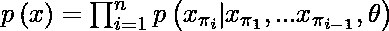
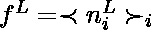

# 图片 GPT

> 哎哎哎:# t0]https://www . geeksforgeeks . org/image-GPT/

图像 GPT 是由 OpenAI 的研究人员在 2019 年提出的。本文尝试将类 GPT 变换应用于目标识别/目标检测任务。然而，作者面临一些挑战，如处理大尺寸图像等。

**架构:**

图像 GPT (iGPT)的架构类似于 GPT-2，即它由一个变压器解码器块组成。变压器解码器取离散记号的输入序列 x 1 ，…，x n ，并输出每个位置的 d 维嵌入。变压器可视为一堆大小为 *L* 的解码器，其第*L*产生 h1T10【L】T11 的嵌入。h n l 。之后，输入张量被传递到不同的层，如下所示:

*   *nl*= layer _ norm(*hl)*
*   a l = *h l* +多头注意力( *n l* )
*   h l+1 = a l + mlp(层定额(a l )

其中*层 _ 范数*为层归一化，MLP 层为多层感知器(人工神经网络)模型。以下是不同版本的列表

<figure class="table">

| 型号名称/变体 | 输入分辨力 | 参数(M) | 特征 |
| --- | --- | --- | --- |
| igpt-宽(l) | 32*32*3 | One thousand three hundred and sixty-two | One thousand five hundred and thirty-six |
| 48*48*3 |
| igbt-xl 系列 | 64*64*3 | Six thousand eight hundred and one | Three thousand and seventy-two |
| Fifteen thousand three hundred and sixty |

</figure>

**上下文缩减:**

因为使用密集注意力时，转换器解码器的内存需求与上下文长度成二次比例。这意味着训练一个单层变压器需要大量的计算。为了解决这个问题，作者将图像调整到较低的分辨率，称为输入分辨率。iGPT 车型采用 *32*32*3* 、 *48*48*3* 、 *64*64*3* 的 IRs。

**训练方法:**

图像 GPT 的模型训练包括两个步骤:

**预训练**

*   给定由高维数据 x = (x 1 ，…，x n 组成的未标记数据集 X，我们可以选取集合[1，n]的排列π，并自动回归地建模密度 p(x)如下:

*   对于图像，我们选取恒等式排列π i = i 表示 1 ≤ i ≤ n，也称为光栅顺序。该模型被训练成最小化负对数似然:

![L_{AR} = \mathbb{E}_{x \sim X} \left [ -log\left ( p(x) \right )\right ]](img/afeeccd90fbc580ead0f426997216b75.png "Rendered by QuickLaTeX.com")

*   作者还在 BERT 中使用了类似掩蔽语言建模的损失函数，该函数对子序列 *M ⊂ [1，n]* 进行采样，使得每个索引 *i* 独立地具有出现在 m 中的概率 0.15。

![L_{BERT} = \mathbb{E}_{x \sim X} \mathbb{E}_{M} \left [ -log\left ( p(x_i | x_{[1,n]\backslash M}) \right )\right ]](img/25c1d6ac8d28893e5727d8eea624d455.png "Rendered by QuickLaTeX.com")

*   在预训练期间，我们选择 L AR 或 L BERT 中的一个，并最小化预训练数据集的损失。

**微调:**

*   为了进行微调，作者在序列维度上执行平均池 n ^ 1，以提取每个示例的特征的 d 维向量，并从平均池层学习投影。作者使用这个投影来最小化交叉熵损失 L CLF 。这就构成了总目标函数

*   其中 L GEN 为 L AR 或 L BERT 。

作者还试验了类似于微调但没有任何平均汇集层的线性探测。

**结果:**

*   在 CIFAR-10 上，iGPT-L 的准确率达到 99.0%，在 CIFAR-100 上，经过微调后准确率达到 88.5%。iGPT-L 的性能优于自动调整，这是这些数据集上的最佳监督模型。
*   在 ImageNet 上，iGPT 在 MR(输入分辨率/内存分辨率) *32*32* 下微调后达到 66.3%的精度，比线性探测提高了 6%。当在磁共振 *48*48* 处微调时，该模型获得了 72.6%的精度，与线性探测相比提高了类似的 7%。

**参考文献:**

*   [iGPT 纸](https://cdn.openai.com/papers/Generative_Pretraining_from_Pixels_V2.pdf)