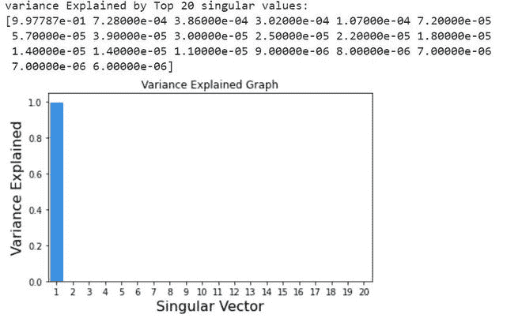
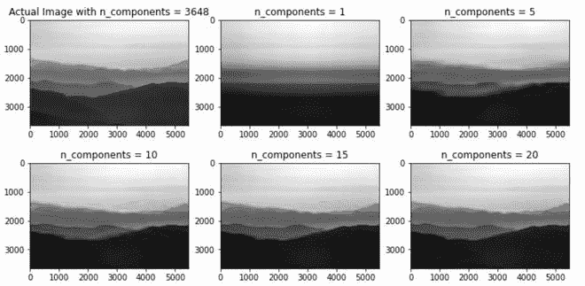

# 使用 Python 中的奇异值分解进行图像重建

> 原文:[https://www . geeksforgeeks . org/image-重构-使用-奇异值-分解-svd-in-python/](https://www.geeksforgeeks.org/image-reconstruction-using-singular-value-decomposition-svd-in-python/)

奇异值分解又称奇异值分解(SVD)是许多矩阵分解技术之一，它将矩阵分解成 3 个子矩阵，即 U、S、V，其中 U 是左特征向量，S 是奇异值的对角矩阵，V 称为右特征向量。我们可以使用 NumPy 模块的 **linalg.svd()** 方法重建图像的奇异值分解。

> **语法:**
> 
> 线性矩阵，全矩阵=真，计算紫外=真，埃尔米特=假
> 
> **参数:**
> 
> 1.  **矩阵:**一个真实的或复杂的矩阵大小> 2。
> 2.  **full _ matrix:**如果为 True，u 和 v 矩阵的大小为 m×n，如果为 False，则 u 和 v 矩阵的形状为 m×k，其中 k 仅为非零值。
> 3.  **compute_uv:** 取布尔值，计算 u 和 v 矩阵以及 s 矩阵。
> 4.  **埃尔米特:**默认情况下，如果矩阵包含实值，则假设它是埃尔米特矩阵，这在内部用于有效计算奇异值。

**使用的图像:**


## 蟒蛇 3

```
# import module
import requests
import cv2
import numpy as np
import matplotlib.pyplot as plt

# assign and open image
url = 'https://media.geeksforgeeks.org/wp-content/cdn-uploads/20210401173418/Webp-compressed.jpg'
response = requests.get(url, stream=True)

with open('image.png', 'wb') as f:
    f.write(response.content)

img = cv2.imread('image.png')

# Converting the image into gray scale for faster
# computation.
gray_image = cv2.cvtColor(img, cv2.COLOR_BGR2GRAY)

# Calculating the SVD
u, s, v = np.linalg.svd(gray_image, full_matrices=False)

# inspect shapes of the matrices
print(f'u.shape:{u.shape},s.shape:{s.shape},v.shape:{v.shape}')
```

**输出:**

```
u.shape:(3648, 3648),s.shape:(3648,),v.shape:(3648, 5472)
```

**说明:**

上面的输出形状表明在这个图像中有 3648 个线性独立的特征向量。

现在让我们用图形的方式来看一下奇异向量上所用图像的方差:

## 蟒蛇 3

```
# import module
import seaborn as sns

var_explained = np.round(s**2/np.sum(s**2), decimals=6)

# Variance explained top Singular vectors
print(f'variance Explained by Top 20 singular values:\n{var_explained[0:20]}')

sns.barplot(x=list(range(1, 21)),
            y=var_explained[0:20], color="dodgerblue")

plt.title('Variance Explained Graph')
plt.xlabel('Singular Vector', fontsize=16)
plt.ylabel('Variance Explained', fontsize=16)
plt.tight_layout()
plt.show()
```

**输出:**



方差解释图。

**解释:**上面的方差解释图清楚地表明，约 99.77 %的信息是由第一特征向量及其对应的特征值本身解释的。因此，仅用前几个特征向量本身重建图像是非常明智的。

在下面基于上述讨论的程序中，我们使用奇异值分解重建图像:

## 蟒蛇 3

```
# plot images with different number of components
comps = [3648, 1, 5, 10, 15, 20]
plt.figure(figsize=(12, 6))

for i in range(len(comps)):
    low_rank = u[:, :comps[i]] @ np.diag(s[:comps[i]]) @ v[:comps[i], :]

    if(i == 0):
        plt.subplot(2, 3, i+1),
        plt.imshow(low_rank, cmap='gray'),
        plt.title(f'Actual Image with n_components = {comps[i]}')

    else:
        plt.subplot(2, 3, i+1),
        plt.imshow(low_rank, cmap='gray'),
        plt.title(f'n_components = {comps[i]}')
```

**输出:**



用奇异值分解重建图像。

**说明:**

1.  尽管第一特征向量包含 99.77%的信息，但是仅从其重建图像并不能给出清晰的图像。
2.  使用前 15 个向量进行图像重建给出了足够好的近似。同样在 3648 个矢量中，计算量大幅度减少，并且它还压缩图像。