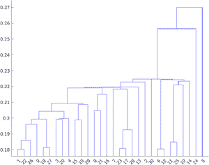
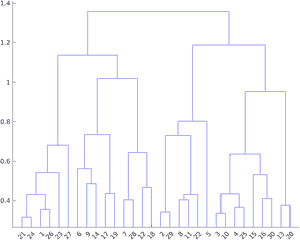
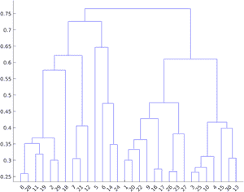
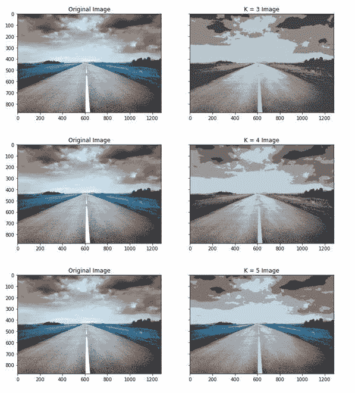
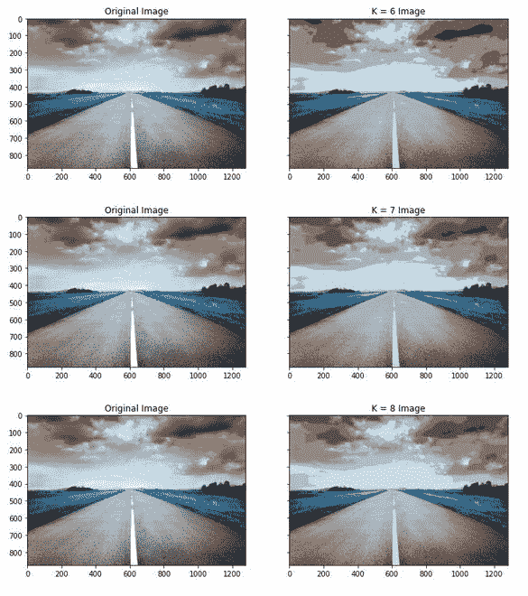
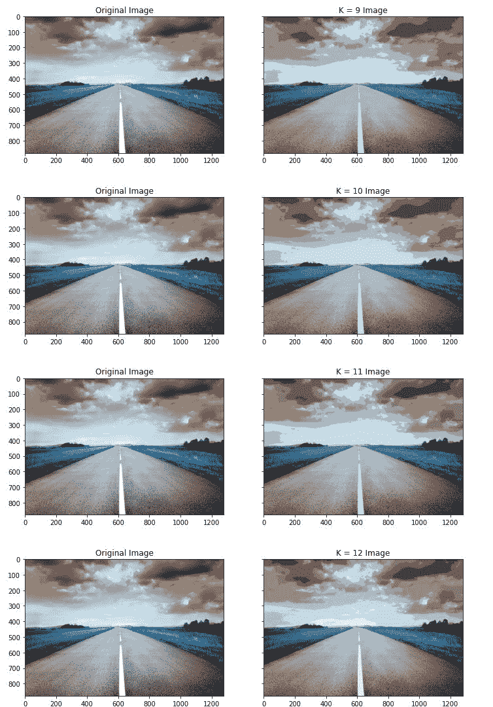

# 聚类图像分割

> 原文:[https://www . geeksforgeeks . org/image-按聚类分割/](https://www.geeksforgeeks.org/image-segmentation-by-clustering/)

**聚类分割**

这是一种像素分割的图像分割方法。在这种类型的分割中，我们尝试将像素聚集在一起。有两种通过聚类进行分割的方法。

*   合并聚类
*   用除法聚类

**通过合并或聚集聚类进行聚类:**

在这种方法中，我们遵循自下而上的方法，这意味着我们分配最接近聚类的像素。用于执行聚集聚类的算法如下:

*   将每个点作为一个单独的簇。
*   对于给定数量的时期或直到聚类令人满意。
    *   合并簇间距离最小的两个簇(WCSS)。
*   重复以上步骤

聚类由树图表示。可以通过 3 种方法来执行:通过选择最接近的对进行合并，通过选择最远的对进行合并，或者通过选择平均距离的对(既不是最近的也不是最远的)。代表这些聚类类型的树形图如下:



最近聚类



平均聚类



最远聚类

**通过分裂或分裂分裂进行聚类**

在这种方法中，我们遵循自上而下的方法，这意味着我们分配最接近聚类的像素。用于执行聚集聚类的算法如下:

*   构建包含所有点的单个聚类。
*   对于给定数量的时期或直到聚类令人满意。
    *   将群集拆分为两个群集间距离最大的群集。
*   重复以上步骤。

在本文中，我们将讨论如何执行 K-Means 聚类。

**K 均值聚类**

K-means 聚类是一种非常流行的聚类算法，适用于标签未知的数据集。目标是根据数据中与 k 代表的组数的某种相似性找到特定的组。该算法通常用于市场细分、客户细分、等领域。但是，它也可以用于基于像素值分割图像中的不同对象。

图像分割算法的工作原理如下:

1.  首先，我们需要在 K 均值聚类中选择 K 的值。
2.  为每个像素选择一个特征向量(颜色值，如 RGB 值，纹理等。).
3.  定义一个相似性度量 b/w 特征向量如欧氏距离来度量任意两点/像素的相似性 b/w。
4.  将 K-均值算法应用于聚类中心
5.  应用连通分量算法。
6.  将任何小于阈值的组件组合到与其相似的相邻组件中，直到无法组合更多组件。

以下是应用 K 均值聚类算法的步骤:

*   选择 K 个点，并为每个点分配一个聚类中心。
*   执行以下步骤，直到集群中心不会改变:
    *   将每个点分配给最近的集群中心，并确保每个集群中心有一个点。
    *   用分配给它的点的平均值替换聚类中心。
*   结束

#### K 的最优**值？**

对于某类聚类算法，有一个通常称为 K 的参数，它指定要检测的聚类数。我们可能有预定义的 K 值，如果我们有关于它包含多少类别的数据的领域知识。但是，在计算 K 的最优值之前，我们首先需要为上述算法定义目标函数。目标函数可由下式给出:

<center>


</center>

其中 j 是簇的数量，I 是属于第 j <sup>个</sup>簇的点。上述目标函数称为平方(WCSS)距离的簇内和。

找到 K 的最佳值的一个好方法是强行取一个较小范围的值(1-10)并绘制 WCSS 距离与 K 的关系图。图急剧向下弯曲的点可以被认为是 K 的最佳值。这种方法称为肘形法。

对于图像分割，我们绘制图像的直方图，并试图找到其中的峰、谷。然后，我们将对该直方图执行峰值测试。

### 履行

*   在这个实现中，我们将使用 K-Means 聚类来执行图像分割。我们将使用 OpenCV k-Means 应用编程接口来执行这种聚类。

## 蟒蛇 3

```py
# imports
import numpy as np
import cv2 as cv
import matplotlib.pyplot as plt

plt.rcParams["figure.figsize"] = (12,50)

# load image
img = cv.imread('road.jpg')
Z = img.reshape((-1,3))
# convert to np.float32
Z = np.float32(Z)

# define stopping criteria, number of clusters(K) and apply kmeans()
# TERM_CRITERIA_EPS : stop when the epsilon value is reached
# TERM_CRITERIA_MAX_ITER:  stop when Max iteration is reached
criteria = (cv.TERM_CRITERIA_EPS + cv.TERM_CRITERIA_MAX_ITER, 10, 1.0)

fig, ax = plt.subplots(10,2, sharey=True)
for i in range(10):
  K = i+3
  # apply K-means algorithm
  ret,label,center=cv.kmeans(Z,K,None,criteria,attempts = 10,
                             cv.KMEANS_RANDOM_CENTERS)
  # Now convert back into uint8, and make original image
  center = np.uint8(center)
  res = center[label.flatten()]
  res2 = res.reshape((img.shape))
  # plot the original image and K-means image
  ax[i, 1].imshow(res2)
  ax[i,1].set_title('K = %s Image'%K)
  ax[i, 0].imshow(img)
  ax[i,0].set_title('Original Image')
```

<center>Output:</center>

<center>


K=3，4，5 的图像分割



K=6，7，8 的图像分割



### 参考文献:

*   [T1】NYU 滑梯 T3】](https://people.csail.mit.edu/dsontag/courses/ml12/slides/lecture14.pdf)
*   [**OpenCV K-表示**](https://docs.opencv.org/master/d1/d5c/tutorial_py_kmeans_opencv.html)

</center>