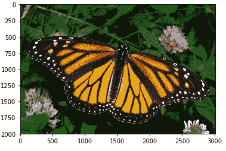
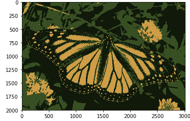
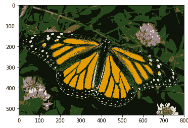

# 使用 K 均值聚类的图像分割

> 原文:[https://www . geeksforgeeks . org/image-segmentation-use-k-means-clustering/](https://www.geeksforgeeks.org/image-segmentation-using-k-means-clustering/)

**图像分割:**在计算机视觉中，图像分割是将一幅图像分割成多个片段的过程。分割图像的目标是将图像的表示形式改变为更有意义和更容易分析的形式。它通常用于定位对象和创建边界。

处理整个图像不是一个好主意，因为图像中的许多部分可能不包含任何有用的信息。因此，通过分割图像，我们可以仅利用重要的片段进行处理。

图像基本上是一组给定的像素。在图像分割中，具有相似属性的像素被分组在一起。图像分割为图像中的对象创建了像素级遮罩，这使我们能够更全面、更细致地了解对象。

**用途:**

1.  用于自动驾驶汽车。没有涉及分割的物体检测，自动驾驶是不可能的。
2.  用于医疗保健行业。有助于分割癌细胞和肿瘤，利用它们可以衡量其严重程度。

图像分割还有很多用途。

在本文中，我们将使用一种称为 K 均值聚类的聚类方法对帝王蝶的图像进行分割。

**K 均值聚类算法:**

k 均值是一种聚类算法。聚类算法是无监督算法，这意味着没有可用的标记数据。它用于根据数据的相似程度识别给定数据中的不同类别或聚类。同一组中的数据点比其他组中的数据点更类似于同一组中的其他数据点。

k 均值聚类是最常用的聚类算法之一。这里， **k** 代表簇的数量。

让我们看看 K 均值聚类是如何工作的–

1.  选择要查找的簇数，即 k。
2.  将数据点随机分配给 k 个集群中的任何一个。
3.  然后计算集群的中心。
4.  计算数据点距离每个聚类中心的距离。
5.  根据每个数据点与群集的距离，将数据点重新分配给最近的群集。
6.  再次计算新的集群中心。
7.  重复步骤 4、5 和 6，直到数据点不改变聚类，或者直到我们达到指定的迭代次数。

**要求:**

*   确保您安装了 Python、Numpy、Matplotlib 和 OpenCV。

**编码:读入图像，转换为 RGB 图像。**

## 蟒蛇 3

```
import numpy as np
import matplotlib.pyplot as plt
import cv2

%matplotlib inline

# Read in the image
image = cv2.imread('images/monarch.jpg')

# Change color to RGB (from BGR)
image = cv2.cvtColor(image, cv2.COLOR_BGR2RGB)

plt.imshow(image)
```



现在我们要准备 K 均值的数据。图像是一个三维形状，但要对其应用 k-means 聚类，我们需要将其重塑为二维数组。

**代码:**

## 蟒蛇 3

```
# Reshaping the image into a 2D array of pixels and 3 color values (RGB)
pixel_vals = image.reshape((-1,3))

# Convert to float type
pixel_vals = np.float32(pixel_vals)
```

现在我们将实现分割图像的 K 均值算法。

**代码:取 k = 3，表示算法会在图像中识别出 3 个聚类。**

## 蟒蛇 3

```
#the below line of code defines the criteria for the algorithm to stop running,
#which will happen is 100 iterations are run or the epsilon (which is the required accuracy)
#becomes 85%
criteria = (cv2.TERM_CRITERIA_EPS + cv2.TERM_CRITERIA_MAX_ITER, 100, 0.85)

# then perform k-means clustering wit h number of clusters defined as 3
#also random centres are initially choosed for k-means clustering
k = 3
retval, labels, centers = cv2.kmeans(pixel_vals, k, None, criteria, 10, cv2.KMEANS_RANDOM_CENTERS)

# convert data into 8-bit values
centers = np.uint8(centers)
segmented_data = centers[labels.flatten()]

# reshape data into the original image dimensions
segmented_image = segmented_data.reshape((image.shape))

plt.imshow(segmented_image)
```

**输出:**



现在，如果我们将 **k** 的值更改为 **6** ，我们将获得以下**输出:**



如您所见，随着 ***k*** 值的增加，图像变得更加清晰和清晰，因为 K-means 算法可以对更多类别/聚类的颜色进行分类。当我们有一个小数据集时，K-means 聚类效果很好。它可以分割图像中的对象，并给出更好的结果。但是当它应用于大型数据集(更多数量的图像)时，它会在一次迭代中查看所有样本，这将占用大量时间。