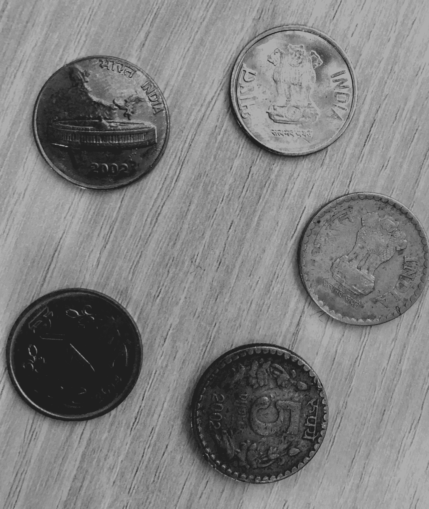
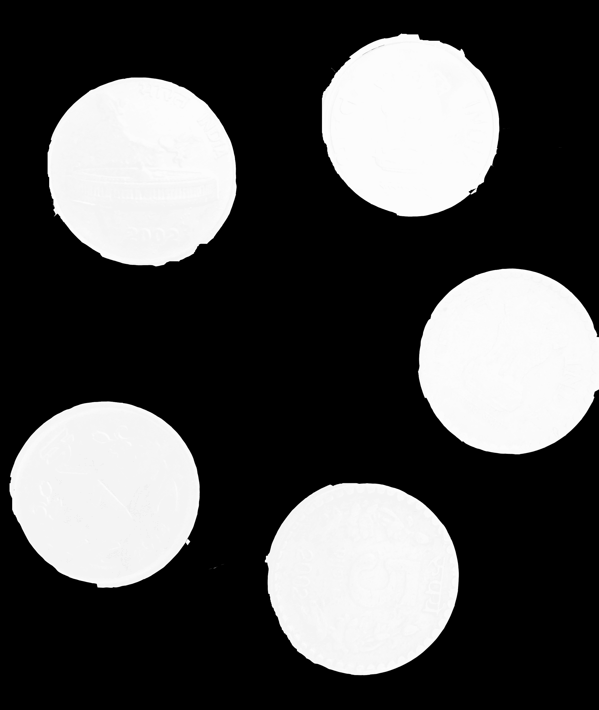

# Python 中使用形态学运算的图像分割

> 原文:[https://www . geeksforgeeks . org/image-segmentation-use-形态学-operation/](https://www.geeksforgeeks.org/image-segmentation-using-morphological-operation/)

如果我们想从图像的其余部分提取或定义一些东西，例如从背景中检测一个物体，我们可以将图像分割成片段，在其中我们可以做更多的处理。这通常被称为*分段*。

形态学操作是基于图像形状的一些简单操作。它通常在二进制图像上执行。两个基本的形态学操作符是侵蚀和膨胀。关于膨胀和侵蚀的基本理解，请参考本文。

为了进行处理，我们将使用 OTSU 的阈值算法，该算法消除了由于图像中的噪声或任何其他不规则性导致的过度分割结果，并使用 OpenCV 实现。

**进场:**

*   用一种颜色(或强度)标记我们确信是前景或物体的区域，用另一种颜色标记我们确信是背景或非物体的区域。
*   最后是我们不确定的区域，标记为 0。那是我们的标记。然后应用分水岭算法。
*   然后，我们的标记将使用我们给出的标签进行更新，对象的边界值将为-1。

让我们从一个例子开始，考虑硬币图像。

输入图像:


```
# Python program to transform an image using
# threshold.
import numpy as np
import cv2
from matplotlib import pyplot as plt

# Image operation using thresholding
img = cv2.imread('c4.jpg')

gray = cv2.cvtColor(img, cv2.COLOR_BGR2GRAY)

ret, thresh = cv2.threshold(gray, 0, 255,
                            cv2.THRESH_BINARY_INV +
                            cv2.THRESH_OTSU)
cv2.imshow('image', thresh)
```

输出:


该输出显示图像通过阈值操作进行变换，其中前景仍然包含一些噪声。

现在，我们需要去除图像中的任何小的白色噪声，即前景。为此，我们可以使用形态闭合。为了去除前景对象中的任何小孔，我们可以使用形态闭合。为了获得背景，我们放大图像。膨胀将对象边界增加到背景。

让我们看看代码:

```
# Noise removal using Morphological
# closing operation
kernel = np.ones((3, 3), np.uint8)
closing = cv2.morphologyEx(thresh, cv2.MORPH_CLOSE,
                            kernel, iterations = 2)

# Background area using Dialation
bg = cv2.dilate(closing, kernel, iterations = 1)

# Finding foreground area
dist_transform = cv2.distanceTransform(closing, cv2.DIST_L2, 0)
ret, fg = cv2.threshold(dist_transform, 0.02
                        * dist_transform.max(), 255, 0)

cv2.imshow('image', fg)
```

输出:



从输出图像中，我们可以得出结论，使用关闭操作去除小孔，并确保结果中前景的任何区域都是真正的前景。

参考:
[https://docs . opencv . org/3 . 3 . 1/D3/db4/tutorial _ py _ watershed . html](https://docs.opencv.org/3.3.1/d3/db4/tutorial_py_watershed.html)