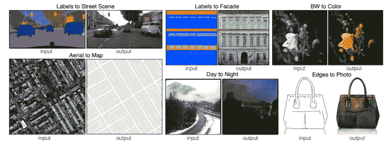
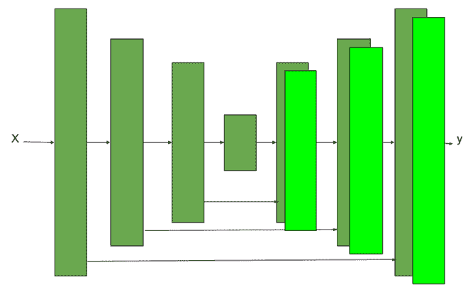
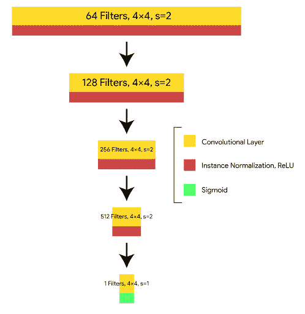
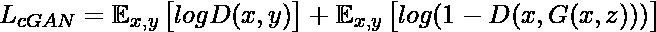
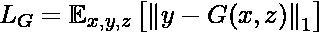
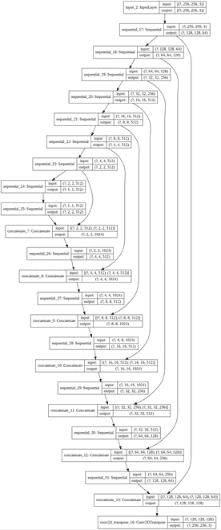
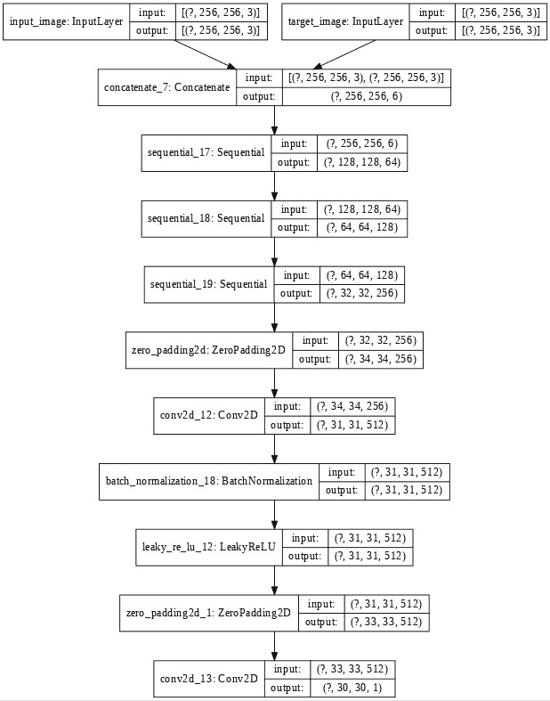
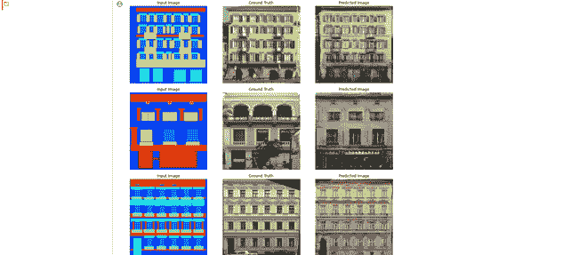
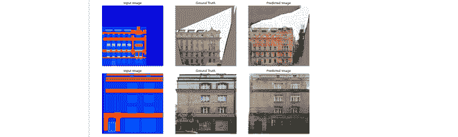

# 使用 Pix2Pix 进行图像到图像的转换

> 原文:[https://www . geesforgeks . org/image-to-image-translation-using-pix2pix/](https://www.geeksforgeeks.org/image-to-image-translation-using-pix2pix/)

pix2pix 是加州大学伯克利分校的研究人员于 2017 年提出的。它使用条件生成对抗网络来执行图像到图像的翻译任务(即，将一个图像转换成另一个图像，例如建筑物的立面和谷歌地图到谷歌地球等)。



## **架构**:

pix2pix 在其架构中使用条件生成对抗网络(条件-GAN)。其原因是，即使我们为特定的图像到图像的转换任务训练了一个具有简单 L1/L2 损失函数的模型，这也可能无法理解图像的细微差别。

**发电机:**

<center>

网络体系结构

</center>

生成器中使用的架构是 U-Net 架构。除了在编码器-解码器结构中使用跳跃连接之外，它与编码器-解码器结构相似。跳过连接的使用使得这一点

*   **编码器架构:**生成器网络的编码器网络有七个卷积块。每个卷积块都有一个卷积层，后跟一个 LeakyRelu 激活函数(文中斜率为 0.2)。除了第一卷积层之外，每个卷积块还具有批量归一化层。
*   **解码器架构:**生成器网络的解码器网络有七个转置卷积块。每个上采样卷积块(Dconv)都有一个上采样层，后面是卷积层、批处理归一化层和 ReLU 激活函数。
*   生成器体系结构包含每层 *i* 和层*n-I*之间的跳跃连接，其中 n 是总层数。每个跳跃连接简单地将第 *i* 层的所有通道与第*n I*层的通道连接起来

**鉴别器:**

[](https://media.geeksforgeeks.org/wp-content/uploads/20200605220731/Discriminator.jpg)

<center>[

Patch GAN 鉴频器](https://media.geeksforgeeks.org/wp-content/uploads/20200605220731/Discriminator.jpg) </center>

[](https://media.geeksforgeeks.org/wp-content/uploads/20200605220731/Discriminator.jpg)

鉴别器采用贴片 GAN 架构，也是采用 Style GAN 架构。这种 PatchGAN 体系结构包含许多转置卷积块。这种 PatchGAN 架构会获取图像的 NxN 部分，并尝试找出它是真的还是假的。该鉴别器在整个图像上卷积应用，对其求平均以产生鉴别器 d 的结果

鉴别器的每个块包含一个卷积层、批范数层和 LeakyReLU。该鉴别器接收两个输入:

*   输入图像和目标图像(哪个鉴别器应该归类为真实的)
*   输入图像和生成图像(鉴别器应将其归类为假图像)。

之所以使用 PatchGAN，是因为作者认为它将能够保留图像中的高频细节，低频细节可以通过 L1 损失来聚焦。

**发电机损耗:**

本文中使用的发生器损耗是生成图像、目标图像和我们上面定义的 GAN 损耗之间的 L1 损耗的线性组合。

<center></center>

我们产生的损失将是:

<center></center>

因此，我们对发电机的总损失

<center>![L_G = arg \underset{G}{min}\underset{D}{max}[L_{cGAN}\left ( G, D \right ) + \lambda L_{L1} \left ( G \right )]](img/5e61eb7f17ab8949e2aedd102534fda4.png "Rendered by QuickLaTeX.com")</center>

**鉴别器损耗**

鉴别器损失采用两个输入真实图像和生成图像:

*   real_loss 是真实图像和一组真实图像(因为这些是真实图像)的 sigmoid 交叉熵损失。
*   generated_loss 是一个 sigmoid 交叉熵损失的生成的图像和一个零数组(因为这些是假图像)
*   总损失是实际损失和产生的损失之和。

**实施:**

*   首先，我们下载并预处理图像数据集。我们将使用捷克技术大学提供并由 pix2pix 论文作者处理的 CMP Facade 数据集。我们将在训练前对数据集进行预处理。

**代码:**

```py
# import necessary packages
import tensorflow as tf

import os
import time

from matplotlib import pyplot as plt
from IPython import display
# install tenosrboard ! pip install -U tensorboard

# download dataset
URL = "https://people.eecs.berkeley.edu/~tinghuiz / projects / pix2pix / datasets / facades.tar.gz"

path_to_zip = tf.keras.utils.get_file('facades.tar.gz',
                                      origin = URL,
                                      extract = True)

PATH = os.path.join(os.path.dirname(path_to_zip), 'facades/')

# Define Training variable
BUFFER_SIZE = 400
BATCH_SIZE = 1
IMG_WIDTH = 256
IMG_HEIGHT = 256

# load the images from dataset
def load(image_file):
  image = tf.io.read_file(image_file)
  image = tf.image.decode_jpeg(image)

  w = tf.shape(image)[1]

  w = w // 2
  real_image = image[:, :w, :]
  input_image = image[:, w:, :]

  input_image = tf.cast(input_image, tf.float32)
  real_image = tf.cast(real_image, tf.float32)
  return input_image, real_image

# resize the images to provided width and hight
def resize(input_image, real_image, height, width):
  input_image = tf.image.resize(input_image, [height, width],
                                method = tf.image.ResizeMethod.NEAREST_NEIGHBOR)
  real_image = tf.image.resize(real_image, [height, width],
                               method = tf.image.ResizeMethod.NEAREST_NEIGHBOR)

  return input_image, real_image

"""
function to stack (input, real) images and apply random crop on them to crop 
to (256, 256)
"""
def random_crop(input_image, real_image):
  stacked_image = tf.stack([input_image, real_image], axis = 0)
  cropped_image = tf.image.random_crop(
      stacked_image, size =[2, IMG_HEIGHT, IMG_WIDTH, 3])

  return cropped_image[0], cropped_image[1]

"""
Before training, we need to perform random jittering on the dataset
According to the paper, this random jittering contains 3 steps
 --> Resize the image to bigger size
 --> Random crop the image to target size of model
 --> Random Flip on the images 

"""

@tf.function()
def random_jitter(input_image, real_image):
  # resizing to 286 x 286 x 3
  input_image, real_image = resize(input_image, real_image, 286, 286)

  # randomly cropping to 256 x 256 x 3
  input_image, real_image = random_crop(input_image, real_image)

  if tf.random.uniform(()) > 0.5:
    # random mirroring
    input_image = tf.image.flip_left_right(input_image)
    real_image = tf.image.flip_left_right(real_image)

  return input_image, real_image
```

*   现在，我们使用上面定义的函数加载训练和测试数据。

**代码:**

```py
# function to Load image from train data
"""
On train data, we performed random jitter and normalize,
but since we don't need any augmentation on test_data, we just resize it
"""
def load_image_train(image_file):
  input_image, real_image = load(image_file)
  input_image, real_image = random_jitter(input_image, real_image)
  input_image, real_image = normalize(input_image, real_image)

  return input_image, real_image
# function to Load images from test data
def load_image_test(image_file):
  input_image, real_image = load(image_file)
  input_image, real_image = resize(input_image, real_image,
                                   IMG_HEIGHT, IMG_WIDTH)
  input_image, real_image = normalize(input_image, real_image)

  return input_image, real_image

# apply the above load_images_train function on train data
train_dataset = tf.data.Dataset.list_files(PATH+'train/*.jpg')
train_dataset = train_dataset.map(load_image_train,
                                  num_parallel_calls = tf.data.experimental.AUTOTUNE)
train_dataset = train_dataset.shuffle(BUFFER_SIZE)
train_dataset = train_dataset.batch(BATCH_SIZE)

# apply the above load_images_test function on test data
test_dataset = tf.data.Dataset.list_files(PATH+'test/*.jpg')
test_dataset = test_dataset.map(load_image_test)
test_dataset = test_dataset.batch(BATCH_SIZE)
```

*   在执行数据处理之后，现在，我们为生成器架构编写代码。这个生成器块包含两部分:编码器块和解码器块。编码器块包含下采样卷积块，解码器块包含上采样转置卷积块。

<center>

发电机结构

</center>

*   现在我们为鉴别器定义我们的体系结构。鉴别器架构使用 PatchGAN 模型。对于这种架构，我们可以使用上面定义的下采样卷积块。鉴别器的损失是实损失(sigmoid 交叉熵 b/w 实图像和 1 的阵列)和生成损失(sigmoid 交叉熵 b/w 生成图像和 0 的阵列)的总和。

**代码:**

```py
# code for discriminator architecture
"""
FOr more details look into architecture section
"""
def Discriminator():
  initializer = tf.random_normal_initializer(0., 0.02)

  inp = tf.keras.layers.Input(shape =[256, 256, 3], name ='input_image')
  tar = tf.keras.layers.Input(shape =[256, 256, 3], name ='target_image')

  x = tf.keras.layers.concatenate([inp, tar]) # (batch_size, 256, 256, channels * 2)

  down1 = downsample(64, 4, False)(x) # (batch_size, 128, 128, 64)
  down2 = downsample(128, 4)(down1) # (batch_size, 64, 64, 128)
  down3 = downsample(256, 4)(down2) # (batch_size, 32, 32, 256)

  zero_pad1 = tf.keras.layers.ZeroPadding2D()(down3) # (batch_size, 34, 34, 256)
  conv = tf.keras.layers.Conv2D(512, 4, strides = 1,
                                kernel_initializer = initializer,
                                use_bias = False)(zero_pad1) # (batch_size, 31, 31, 512)

  batchnorm1 = tf.keras.layers.BatchNormalization()(conv)

  leaky_relu = tf.keras.layers.LeakyReLU()(batchnorm1)

  zero_pad2 = tf.keras.layers.ZeroPadding2D()(leaky_relu) # (batch_size, 33, 33, 512)

  last = tf.keras.layers.Conv2D(1, 4, strides = 1,
                                kernel_initializer = initializer)(zero_pad2) # (batch_size, 30, 30, 1)

  return tf.keras.Model(inputs =[inp, tar], outputs = last)

# define discriminator loss function
disc_ce_loss = tf.keras.losses.BinaryCrossentropy(from_logits = True)
def discriminator_loss(disc_real_output, disc_generated_output):
  real_loss = disc_ce_loss(tf.ones_like(disc_real_output), disc_real_output)

  generated_loss = disc_ce_loss(tf.zeros_like(disc_generated_output), disc_generated_output)

  total_disc_loss = real_loss + generated_loss

  return total_disc_loss

discriminator = Discriminator()
tf.keras.utils.plot_model(discriminator, show_shapes = True)
```

<center>

鉴别器体系结构

</center>

*   在这一步中，我们定义优化器和检查点。我们将在两个生成器鉴别器中使用 Adam 优化器。

**代码:**

```py
# define generator and discriminator architecture
generator_optimizer = tf.keras.optimizers.Adam(2e-4, beta_1 = 0.5)
discriminator_optimizer = tf.keras.optimizers.Adam(2e-4, beta_1 = 0.5)

# Create the model checkpoint
checkpoint_dir = './train_checkpoints'
checkpoint_prefix = os.path.join(checkpoint_dir, "ckpt")
checkpoint = tf.train.Checkpoint(generator_optimizer = generator_optimizer,
                                 discriminator_optimizer = discriminator_optimizer,
                                 generator = generator,
                                 discriminator = discriminator)
```

*   现在，我们定义培训程序。培训程序包括以下步骤:
    *   对于每个示例输入，我们将图像作为输入传递给生成器，以获得生成的图像。
    *   鉴别器接收 input_image 和生成的图像作为第一输入。第二个输入是输入图像和目标图像。
    *   接下来，我们计算发生器和鉴别器损耗。
    *   然后，我们计算发生器和鉴别器变量(输入)的损失梯度，并将其应用于优化器。

**代码:**

```py
# Define training procedure
EPOCHS = 30

import datetime
log_dir ="logs/"

summary_writer = tf.summary.create_file_writer(
  log_dir + "fit/" + datetime.datetime.now().strftime("% Y % m % d-% H % M % S"))

@tf.function
def train_step(input_image, target, epoch):
  with tf.GradientTape() as gen_tape, tf.GradientTape() as disc_tape:
    gen_output = generator(input_image, training = True)

    disc_real_output = discriminator([input_image, target], training = True)
    disc_generated_output = discriminator([input_image, gen_output], training = True)

    gen_total_loss, gen_gan_loss, gen_l1_loss = generator_loss(disc_generated_output, gen_output, target)
    disc_loss = discriminator_loss(disc_real_output, disc_generated_output)

  generator_gradients = gen_tape.gradient(gen_total_loss,
                                          generator.trainable_variables)
  discriminator_gradients = disc_tape.gradient(disc_loss,
                                               discriminator.trainable_variables)

  generator_optimizer.apply_gradients(zip(generator_gradients,
                                          generator.trainable_variables))
  discriminator_optimizer.apply_gradients(zip(discriminator_gradients,
                                              discriminator.trainable_variables))

  with summary_writer.as_default():
    tf.summary.scalar('gen_total_loss', gen_total_loss, step = epoch)
    tf.summary.scalar('gen_gan_loss', gen_gan_loss, step = epoch)
    tf.summary.scalar('gen_l1_loss', gen_l1_loss, step = epoch)
    tf.summary.scalar('disc_loss', disc_loss, step = epoch)

def fit(train_ds, epochs, test_ds):
  for epoch in range(epochs):
    % time

    for example_input, example_target in test_ds.take(1):
      generate_images(generator, example_input, example_target)
    print("Epoch: ", epoch)
    # Train
    for n, (input_image, target) in train_ds.enumerate():

      train_step(input_image, target, epoch)
    print()
    # saving (checkpoint) the model every 10 epochs
    if (epoch + 1) % 10 == 0:
      checkpoint.save(file_prefix = checkpoint_prefix)
  checkpoint.save(file_prefix = checkpoint_prefix)
fit(train_dataset, EPOCHS, test_dataset)
```

*   现在，我们在测试数据上使用训练模型的生成器来生成图像。

**代码:**

```py
# code to plot results
def generate_images(model, test_input, tar):
  prediction = model(test_input, training = True)
  plt.figure(figsize =(15, 15))

  display_list = [test_input[0], tar[0], prediction[0]]
  title = ['Input Image', 'Ground Truth', 'Predicted Image']

  for i in range(3):
    plt.subplot(1, 3, i + 1)
    plt.title(title[i])
    # getting the pixel values between [0, 1] to plot it.
    plt.imshow(display_list[i] * 0.5 + 0.5)
    plt.axis('off')
  plt.show()

for inputs, tar in test_dataset.take(5):
  generate_images(generator, inputs, tar)
```



<center>

结果

</center>

**参考文献:**

*   [Pix2Pix 纸](https://arxiv.org/pdf/1611.07004.pdf)
*   [Pix2pix 上的 TensorFlow 实现](https://www.tensorflow.org/tutorials/generative/pix2pix)