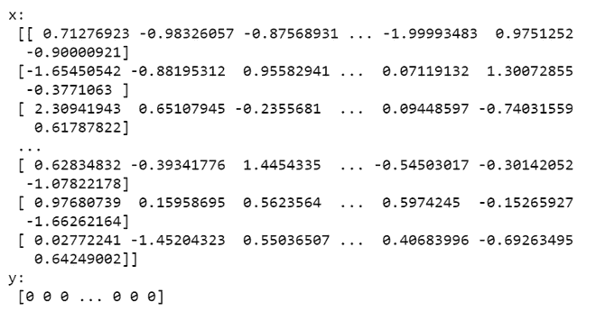
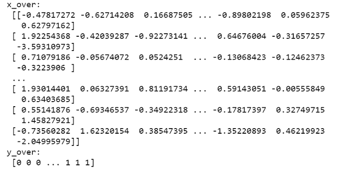
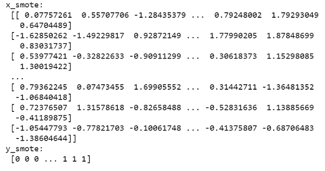
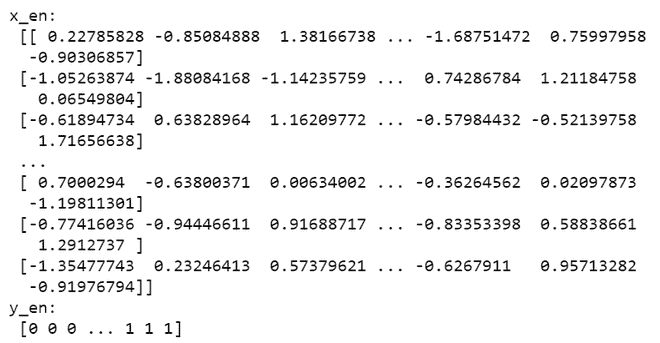
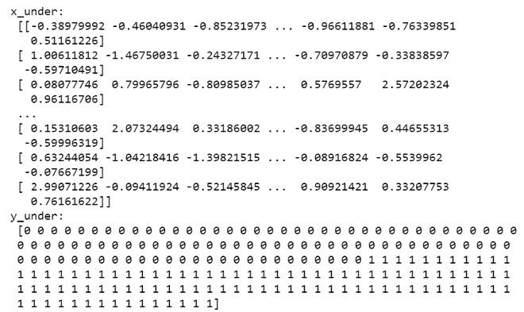

# Python 中的不平衡学习模块

> 原文:[https://www . geesforgeks . org/不平衡-python 中的学习模块/](https://www.geeksforgeeks.org/imbalanced-learn-module-in-python/)

不平衡学习是一个 Python 模块，有助于平衡高度倾斜或偏向某些类的数据集。因此，它有助于对过采样或未采样的类进行重采样。如果有更大的不平衡率，输出偏向于有更多例子的类。要使用不平衡学习，需要安装以下依赖项:

*   scipy(= 0.19.1)
*   numpy(>=1.13.3)
*   scikit-learn（>=0.23）
*   joblib(>=0.11)
*   硬 2（可选）
*   张量流（可选）

要安装不平衡学习，只需键入:

```py
pip install imbalanced-learn
```

数据的重采样分两部分进行:

**估计器:**它实现了一种拟合方法，该方法源自 *scikit-learn* 。数据和目标都是 2D 阵列的形式

```py
estimator = obj.fit(data, targets)
```

**重采样器:***fit _ resample*方法将数据和目标重采样到字典中，字典中的键值对为*data _ resample*和*targets _ resample*。

```py
data_resampled, targets_resampled = obj.fit_resample(data, targets)
```

不平衡学习模块有不同的过采样和欠采样算法:

我们将使用名为*make _ classing*数据集的内置数据集，该数据集返回

*   **x:**n 个样本*n 个特征的矩阵
*   **y:** 整数标签的数组。

点击[数据集](https://scikit-learn.org/stable/modules/generated/sklearn.datasets.make_classification.html)获取使用的数据集。

## 蟒蛇 3

```py
# import required modules
from sklearn.datasets import make_classification

# define dataset
x, y = make_classification(n_samples=10000, 
                           weights=[0.99], 
                           flip_y=0)
print('x:\n', X)
print('y:\n', y)
```

**输出:**



**以下是一些描述如何对数据集应用过采样和欠采样的程序:**

### **过采样**

*   **随机过采样:**这是一个天真的方法，生成实例少的类，然后随机重新采样。

**语法:**

> 来自 imblearn.over_sampling 导入 RandomOverSampler
> 
> **参数(可选):**采样策略= '自动'，返回指数=假，随机状态=无，比率=无
> 
> **实现:**
> 过采样=随机多采样(sampling_strategy= '少数派')
> X _ 过采样，Y _ 过采样=过采样. fit _ 重采样(X，Y)
> 
> **返回类型:**形状为 n 个样本*n 个特征的矩阵

**示例:**

## 蟒蛇 3

```py
# import required modules
from sklearn.datasets import make_classification
from imblearn.over_sampling import RandomOverSampler

# define dataset
x, y = make_classification(n_samples=10000, 
                           weights=[0.99], 
                           flip_y=0)

oversample = RandomOverSampler(sampling_strategy='minority')
x_over, y_over = oversample.fit_resample(x, y)

# print the features and the labels
print('x_over:\n', x_over)
print('y_over:\n', y_over)
```

**输出:**



*   **SMOTE、ADASYN:** 合成少数过采样技术(SMOTE)和自适应合成(ADASYN)是过采样中使用的两种方法。这些也产生低的例子，但是 ADASYN 考虑了分布密度以均匀分布数据点。

**语法:**

> 来自 imb learn . over _ sampling import SMOTE，ADASYN
> 
> **参数(可选):** *，sampling_strategy='auto '，random_state=None，n_neighbors=5，n_jobs=None
> 
> **实现:**
> smote = SMOTE(比率= '少数')
> X_smote，Y_smote=smote.fit_resample(X，Y)
> 
> **返回类型:**形状为 n 个样本*n 个特征的矩阵

**示例:**

## 蟒蛇 3

```py
# import required modules
from sklearn.datasets import make_classification
from imblearn.over_sampling import SMOTE

# define dataset
x, y = make_classification(n_samples=10000, weights=[0.99], flip_y=0)
smote = SMOTE()
x_smote, y_smote = smote.fit_resample(x, y)

# print the features and the labels
print('x_smote:\n', x_smote)
print('y_smote:\n', y_smote)
```

**输出:**



### **欠采样**

*   **编辑的最近邻:**该算法移除标签与其相邻类的标签不同的任何样本。

**语法:**

> 来自 imblearn.under_sampling 导入编辑最近的邻居
> 
> **参数(可选):** sampling_strategy='auto '，return _ indices = False，random_state=None，n_neighbors=3，kind_sel='all '，n_jobs=1，ratio=None
> 
> **实施:**
> en =编辑近邻()
> X_en，Y_en=en.fit_resample(X，y)
> 
> **返回类型:**形状为 n 个样本*n 个特征的矩阵

**示例:**

## 蟒蛇 3

```py
# import required modules
from sklearn.datasets import make_classification
from imblearn.under_sampling import EditedNearestNeighbours

# define dataset
x, y = make_classification(n_samples=10000, weights=[0.99], flip_y=0)
en = EditedNearestNeighbours()
x_en, y_en = en.fit_resample(x, y)

# print the features and the labels
print('x_en:\n', x_en)
print('y_en:\n', y_en)
```

**输出:**



*   **随机欠采样:**包括对任意随机类进行采样，有无替换。

**语法:**

> 来自 imblearn.under_sampling 导入 RandomUnderSampler
> **参数(可选):** sampling_strategy='auto '，return _ indices = False，random_state=None，replacement=False，ratio=None
> 
> **实现:**
> 欠采样= RandomUnderSampler()
> X _ under，y_under =欠采样. fit_resample(X，y)
> 
> **返回类型:**形状为 n 个样本*n 个特征的矩阵

**示例:**

## 蟒蛇 3

```py
# import required modules
from sklearn.datasets import make_classification
from imblearn.under_sampling import RandomUnderSampler

# define dataset
x, y = make_classification(n_samples=10000, 
                           weights=[0.99], 
                           flip_y=0)
undersample = RandomUnderSampler()
x_under, y_under = undersample.fit_resample(x, y)

# print the features and the labels
print('x_under:\n', x_under)
print('y_under:\n', y_under)
```

**输出:**

