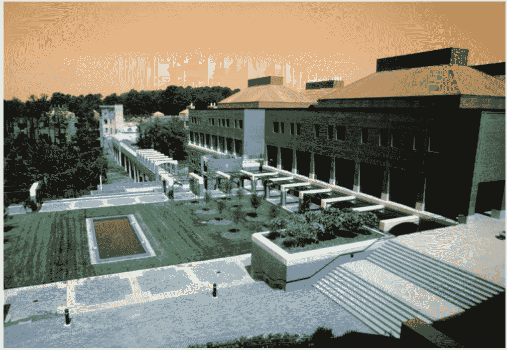
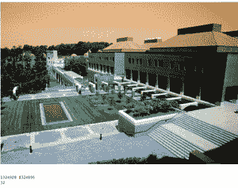

# 图像扁平化的影响

> 原文:[https://www.geeksforgeeks.org/impact-of-image-flattening/](https://www.geeksforgeeks.org/impact-of-image-flattening/)

展平是一种用于将多维数组转换为一维数组的技术，它通常用于深度学习，同时将一维数组信息馈送到分类模型。

**图像扁平化的需求是什么？**

多维数组占用更多内存，而一维数组占用更少内存，这是我们在处理/向我们的模型馈送信息之前展平**图像数组**的最重要原因。在大多数情况下，我们将处理包含大量图像的数据集，因此扁平化有助于减少内存以及减少训练模型的时间。

**步骤 1:导入必要的库**

## 蟒蛇 3

```py
import numpy as np
import pandas as pd
import cv2 as cv
from google.colab.patches import cv2_imshow
from skimage import io
from PIL import Image
import matplotlib.pylab as plt
from numpy import array
from sys import getsizeof
```

**第二步:通过网页获取随机图片**

## 蟒蛇 3

```py
#Fetching the url and showing the image using cv2_imshow
urls=["https://iiif.lib.ncsu.edu/iiif/0052574/full/800,/0/default.jpg"]
for url in urls:
  image = io.imread(url)
  cv2_imshow(image)
  print('\n')
```

<center>

</center>

**第三步:将图像变换成多维阵列**

## 蟒蛇 3

```py
#Getting the multi-dimensional array from the image
array1 = array(image)
#Memory occupied by the multi-dimensional array
size1 = getsizeof(array1)
print(array1)
```

**第四步:现在使用扁平化()功能**扁平化多维数组

## 蟒蛇 3

```py
#Using Flatten function on array 1 to convert the multi-dimensional 
# array to 1-D array
array2 = array1.flatten()
#Memory occupied by array 2
size2 = getsizeof(array2)
#displaying the 1-D array
print(array2)
```

**第五步:展平结果**

## 蟒蛇 3

```py
#Print's the two different size's of the array
print(f"Size of Multidimensional Image : {size1}")
print(f"Size of Flattened Image : {size2}")
difference = size1 - size2
#Print's the difference of memory between the size of Multidimensional & 1-D array
print("Size difference in the images: ", difference)
```

```py
Size of Multidimensional Image : 1324928 
Size of Flattened Image : 1324896
Size difference in the images: 32
```

**第六步:全代码**

## 蟒蛇 3

```py
#importing libraries
import numpy as np
import pandas as pd
import cv2 as cv
from google.colab.patches import cv2_imshow
from skimage import io
from PIL import Image
import matplotlib.pylab as plt
from numpy import array
from sys import getsizeof

#Fetching the url and showing the image using cv2_imshow
urls=["https://iiif.lib.ncsu.edu/iiif/0052574/full/800,/0/default.jpg"]
for url in urls:
  image = io.imread(url)
  cv2_imshow(image)
  print('\n')

#Getting the multi-dimensional array from the image
array1 = array(image)
#Memory occupied by the multi-dimensional array
size1 = getsizeof(array1)
print(array1)

#Using Flatten function on array 1 to convert the multi-dimensional 
# array to 1-D array
array2 = array1.flatten()
#Memory occupied by array 2
size2 = getsizeof(array2)
#displaying the 1-D array
print(array2)

#Print's the two different size's of the array
print(f"Size of Multidimensional Image : {size1}")
print(f"Size of Flattened Image : {size2}")
difference = size1 - size2
#Print's the difference of memory between the size of Multidimensional & 1-D array
print(difference)
```



**结论:**

**运行完整个代码后，我们看到多维图像数组和扁平化数组使用的内存并没有很大的区别。然后人们可能会问，为什么我们在效果可以忽略不计的情况下做扁平化。在大型数据集中，当我们处理成千上万的图像时，由于所有图像的累积而节省的净内存量相当大。**