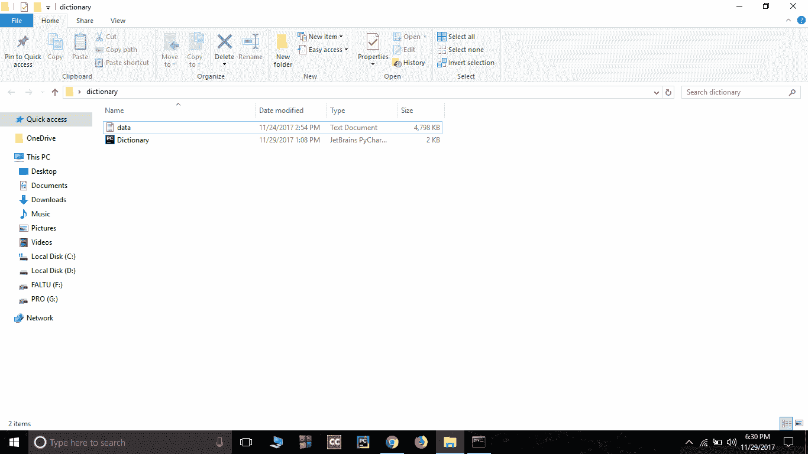
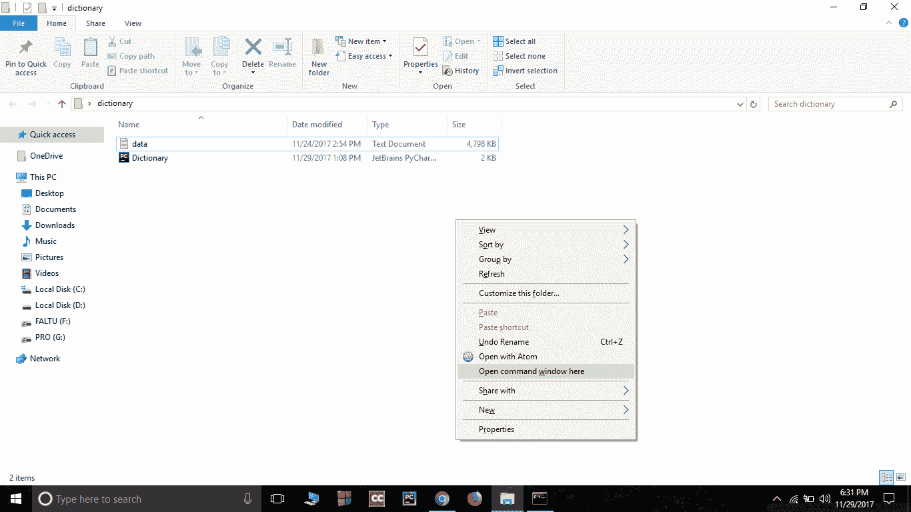
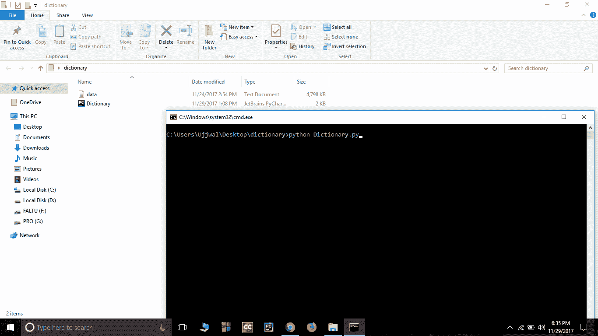
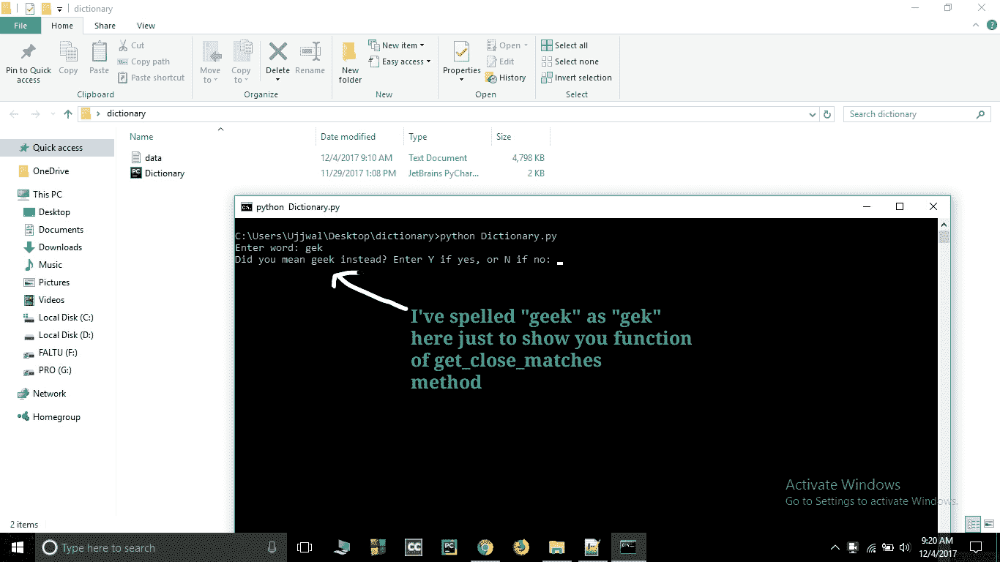
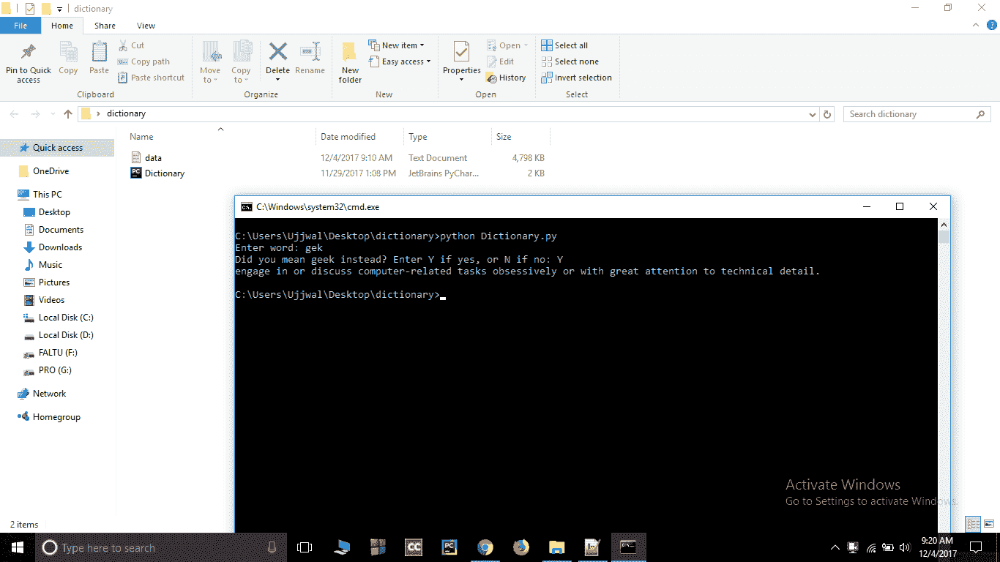

# 如何用 Python3 实现字典？

> 原文:[https://www.geeksforgeeks.org/implement-dictionary-python3/](https://www.geeksforgeeks.org/implement-dictionary-python3/)

这个程序使用 python 的名为[字典](https://www.geeksforgeeks.org/python-dictionary-comprehension/)的容器(在字典中，一个键与一些信息相关联)。这个程序将把一个单词作为输入，并返回该单词的含义。
Python3 应该安装在您的系统中。如果没有安装，从这个[链接](https://www.python.org/downloads/)安装。始终尝试安装最新版本。

我制作了一个文本文件，其中单词及其含义以 python 的字典格式
**存储，示例:**

```py
data = {"geek" : "engage in or discuss computer-related tasks 
obsessively or with great attention to technical detail."}

```

在这里，如果我们从数据中称之为“极客”，那么这将回到它的意思“痴迷地参与或讨论与计算机相关的任务，或者非常关注技术细节。”。

这个 python 程序允许你获取这个文本文件的数据并给出含义。

```py
# Python3 Code for implementing
# dictionary

# importing json library
import json

# importing get_close_matches function from difflib library
from difflib import get_close_matches

# loading data
data = json.load(open("data.txt"))

# defining function meaning
def meaning(w):

    # converting all the letters of "w" to lower case
    w = w.lower()

    # checking if "w" is in data
    if w in data:
        return data[w]

    # if word is not in data then get close match of the word
    elif len(get_close_matches(w, data.keys())) > 0:

        # asking user for his feedback
        # get_close_matches returns a list of the best 
        # “good enough” matches choosing first close 
        # match "get_close_matches(w, data.keys())[0]"
        yn = input("Did you mean % s instead? Enter Y if yes, or N if no:
        " % get_close_matches(w, data.keys())[0])

        if yn == "Y":
            return data[get_close_matches(w, data.keys())[0]]
        elif yn == "N":
            return "The word doesn't exist in our data."
        else:
            return "We didn't understand your entry."
    else:
        return "The word doesn't exist in our data."

# asking word from user to get the meaning
word = input("Enter word: ")

# storing return value in "output"
output = meaning(word)

# if output type is list then print all element of the list
if type(output) == list:
    for item in output:
        print(item)

# if output type is not "list" then print output only
else:
    print(output)
```

****怎么跑？****

1.  **下载[这个](https://drive.google.com/file/d/1KcHgWT5NF_GY63yDQ_NVGuiEKyAGszFT/view?usp=sharing)数据文件，并保存在保存 python 代码文件的同一个文件夹中。**
2.  **确保文件(数据文件和代码文件)都在同一个文件夹中。
    **
3.  **在该文件夹中打开命令提示符，按 shift 键，然后右键单击鼠标。
    **
4.  **使用 cmd(命令提示符)运行 python 代码。
    **
5.  **输入要搜索其含义的单词。
    **

*   **Output will be your result.

    **视频演示**

    <video class="wp-video-shortcode" id="video-166239-1" width="665" height="373" preload="metadata" controls=""><source type="video/mp4" src="https://media.geeksforgeeks.org/wp-content/uploads/ujjuDictionary-1.mp4?_=1">[https://media.geeksforgeeks.org/wp-content/uploads/ujjuDictionary-1.mp4](https://media.geeksforgeeks.org/wp-content/uploads/ujjuDictionary-1.mp4)</video>**