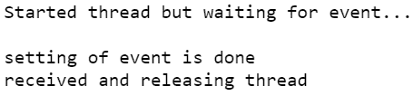
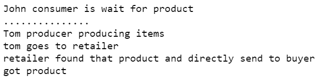

# 用 Python 中的 Event()方法实现线程间通信

> 原文:[https://www . geesforgeks . org/implement-线程间-python 中的事件方法通信/](https://www.geeksforgeeks.org/implement-inter-thread-communication-with-event-method-in-python/)

这里我们将从什么是线程间通信的基础知识开始？**线程间通信**是一个线程与另一个线程之间传递需求的过程。简单地说，有时可能需要一个线程根据需求与另一个线程通信。这被认为是**线程间通信**。

**Event()方法:**这里我们说一下 **Event()** 方法，Event 对象被认为或推荐为任何线程之间最简单的通信过程或系统。本系统在两种情况下工作，事件对象为*启用*表示**设置()**或*禁用*表示**清除()**。

**语法:**

> event_object =线程。事件()

在内部**事件中**管理将在内部工作的流程，可以使用事件对象上的方法对其进行**设置(** *启用* **)** 或**清除(** *禁用* **)** 。如果线程被设置，那么所有的线程都将被执行，但是如果线程被清除，那么通常所有的线程都将等待执行。

**示例:**

我们举一个例子来说明事件方法在线程间通信的实现中是如何使用的:

## 蟒蛇 3

```
#import modules
import threading
import time

if __name__ == '__main__':

    # initializing the event object
    event_object = threading.Event()

# defining task
def task():

    print("\nStarted thread but waiting for event...")
    event_set = event_object.wait(4)

    if event_set:
        print("\nreceived and releasing thread")
    else:
        print("\ntime is gone...")

# assigning task
thread1 = threading.Thread(target=task)

# starting thread
thread1.start()

time.sleep(3)
event_object.set()
print("\nsetting of event is done")
```

**输出:**



在上面的程序中，我们创建了事件对象，然后我们创建了一个线程并启动它，现在线程用****set()**方法设置了事件对象，在函数 **task()** 中，线程处于等待状态，如果事件被设置为，线程将执行下一条指令，如果没有设置，则程序终止，仍然有一条指令要执行。**

****以下是**事件类中**使用的一些通用方法:-****

*   ****clear()方法:**这个方法与 **set()** 方法完全相反，但是这个方法也作为条件改变器，如果条件变成 **False** 那么哪个线程没有运行或者已经在等待，那么它们仍然处于等待状态，不继续在那里执行。**
*   ****set()方法:**在 **set()** 方法中，我们将其用作线程之间的条件转换器，如果条件为**真**，则有许多线程处于等待状态，它们将继续执行。**
*   ****isSet()方法:**这个 **isSet()** 方法顾名思义**是设置**的，这个方法简化了我们创建的以下事件是**设置**还是**不设置**。**
*   ****wait( time)方法:**用简单的话来描述 **wait()** 方法我们可以说线程等待直到 **set()** 方法的执行没有完成。我们可以在其中使用时间，如果我们设置了某个时间，那么执行将会停止，直到时间结束，之后它将仍然执行事件的 **set()** 。**

**这里我们将举一个简单的例子来解释如何在整个程序中使用上述方法:**

## **蟒蛇 3**

```
# import time module
import time

# import threading module
import threading

class product:

  def buyer(self):
    print('John consumer is wait for product')   
    print('...............')
    event_object.wait()    
    print('got product')       

  def seller(self):   
    time.sleep(5)
    print('Tom producer producing items')  
    print('tom goes to retailer')
    event_object.wait()

  def retailer(self):
    time.sleep(10)
    print('retailer found that product and directly send to buyer')
    event_object.set()

# class object      
class_obj = product()

# setting event object
if __name__=='__main__':
  event_object = threading.Event()

# creating  threads
T1 = threading.Thread(target=class_obj.buyer)
T2 = threading.Thread(target=class_obj.seller)
T3 = threading.Thread(target=class_obj.retailer)

# starting threads
T1.start()
T2.start()
T3.start()
```

****输出:****

****

**这是一个简单的例子来解释**事件()**类及其方法在线程间通信中的使用。这里我们用一个买卖双方和零售商的例子，首先我们导入了两个模块，线程模块和时间模块，然后我们创建了一个类产品，其中第一个函数是**买方()**，它有几个指令。首先 **T3** 线程将为**零售商()**功能执行，但是 T3 将等待 10sec，因为在此之后 T2 将执行的计时器，但同样在这里 **T2** 也必须等待 5 秒， 在此之后，现在 T1 将为买方()执行买方函数中的函数，当执行 wait()方法时，线程 **T1** 必须等待，直到设置了一个事件()，现在 T2 将执行它们的指令，其中它也有 **wait()** 方法当执行 **wait()** 时，线程 T2 停止它们的执行，直到调用 **set()** 方法。 现在该调用 **set()** 方法中的线程 T3 了，该方法将所有等待线程从等待状态中释放出来，像 T2 和 T1 这样的线程继续执行。**