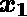
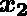

# 2 位二进制输入与门的人工神经网络实现

> 原文:[https://www . geeksforgeeks . org/2 位二进制输入逻辑门人工神经网络的实现/](https://www.geeksforgeeks.org/implementation-of-artificial-neural-network-for-and-logic-gate-with-2-bit-binary-input/)

人工神经网络是基于动物大脑生物神经网络的计算模型。人工神经网络由三种类型的层建模:输入层、隐藏层(一个或多个)和输出层。每一层都包括被称为人工神经元的节点(如生物神经元)。所有节点都通过两层之间的加权边(就像生物大脑中的突触)连接在一起。最初，利用前向传播函数，预测输出。然后，通过反向传播，更新节点的权重和偏差，以最小化预测误差，从而在确定最终输出时实现成本函数的收敛。
**2 位二进制变量 的逻辑函数真值表，即输入向量和相应的输出–**

<figure class="table">

|  |  |  |
| --- | --- | --- |
| Zero | Zero | Zero |
| Zero | one | Zero |
| one | Zero | Zero |
| one | one | one |

</figure>

> ****方法:**
> **步骤 1:** 导入所需的 Python 库
> **步骤 2:** 定义激活函数:Sigmoid 函数
> **步骤 3:** 初始化神经网络参数(权重、偏差)
> 并定义模型超参数(迭代次数、学习率)
> **步骤 4:** 前向传播
> **步骤 5:** 后向传播
> **步骤 6:****

******Python 实现:****** 

## ****蟒蛇 3****

```
**# import Python Libraries
import numpy as np
from matplotlib import pyplot as plt

# Sigmoid Function
def sigmoid(z):
    return 1 / (1 + np.exp(-z))

# Initialization of the neural network parameters
# Initialized all the weights in the range of between 0 and 1
# Bias values are initialized to 0
def initializeParameters(inputFeatures, neuronsInHiddenLayers, outputFeatures):
    W1 = np.random.randn(neuronsInHiddenLayers, inputFeatures)
    W2 = np.random.randn(outputFeatures, neuronsInHiddenLayers)
    b1 = np.zeros((neuronsInHiddenLayers, 1))
    b2 = np.zeros((outputFeatures, 1))

    parameters = {"W1" : W1, "b1": b1,
                  "W2" : W2, "b2": b2}
    return parameters

# Forward Propagation
def forwardPropagation(X, Y, parameters):
    m = X.shape[1]
    W1 = parameters["W1"]
    W2 = parameters["W2"]
    b1 = parameters["b1"]
    b2 = parameters["b2"]

    Z1 = np.dot(W1, X) + b1
    A1 = sigmoid(Z1)
    Z2 = np.dot(W2, A1) + b2
    A2 = sigmoid(Z2)

    cache = (Z1, A1, W1, b1, Z2, A2, W2, b2)
    logprobs = np.multiply(np.log(A2), Y) + np.multiply(np.log(1 - A2), (1 - Y))
    cost = -np.sum(logprobs) / m
    return cost, cache, A2

# Backward Propagation
def backwardPropagation(X, Y, cache):
    m = X.shape[1]
    (Z1, A1, W1, b1, Z2, A2, W2, b2) = cache

    dZ2 = A2 - Y
    dW2 = np.dot(dZ2, A1.T) / m
    db2 = np.sum(dZ2, axis = 1, keepdims = True)

    dA1 = np.dot(W2.T, dZ2)
    dZ1 = np.multiply(dA1, A1 * (1- A1))
    dW1 = np.dot(dZ1, X.T) / m
    db1 = np.sum(dZ1, axis = 1, keepdims = True) / m

    gradients = {"dZ2": dZ2, "dW2": dW2, "db2": db2,
                 "dZ1": dZ1, "dW1": dW1, "db1": db1}
    return gradients

# Updating the weights based on the negative gradients
def updateParameters(parameters, gradients, learningRate):
    parameters["W1"] = parameters["W1"] - learningRate * gradients["dW1"]
    parameters["W2"] = parameters["W2"] - learningRate * gradients["dW2"]
    parameters["b1"] = parameters["b1"] - learningRate * gradients["db1"]
    parameters["b2"] = parameters["b2"] - learningRate * gradients["db2"]
    return parameters

# Model to learn the AND truth table
X = np.array([[0, 0, 1, 1], [0, 1, 0, 1]]) # AND input
Y = np.array([[0, 0, 0, 1]]) # AND output

# Define model parameters
neuronsInHiddenLayers = 2 # number of hidden layer neurons (2)
inputFeatures = X.shape[0] # number of input features (2)
outputFeatures = Y.shape[0] # number of output features (1)
parameters = initializeParameters(inputFeatures, neuronsInHiddenLayers, outputFeatures)
epoch = 100000
learningRate = 0.01
losses = np.zeros((epoch, 1))

for i in range(epoch):
    losses[i, 0], cache, A2 = forwardPropagation(X, Y, parameters)
    gradients = backwardPropagation(X, Y, cache)
    parameters = updateParameters(parameters, gradients, learningRate)

# Evaluating the performance
plt.figure()
plt.plot(losses)
plt.xlabel("EPOCHS")
plt.ylabel("Loss value")
plt.show()

# Testing
X = np.array([[1, 1, 0, 0], [0, 1, 0, 1]]) # AND input
cost, _, A2 = forwardPropagation(X, Y, parameters)
prediction = (A2 > 0.5) * 1.0
# print(A2)
print(prediction)**
```

******Output:** 

```
[[ 0\.  1\.  0\.  0.]]
```**** 

****这里，根据真值表，每个测试输入的模型预测输出与“与”逻辑门常规输出()精确匹配，并且成本函数也在不断收敛。
因此，它表示用于与门的人工神经网络被正确实现。****