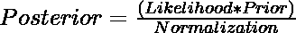
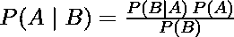
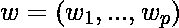
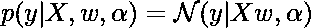
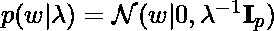

# 贝叶斯回归的实现

> 原文:[https://www . geeksforgeeks . org/实现贝叶斯回归/](https://www.geeksforgeeks.org/implementation-of-bayesian-regression/)

回归是一项机器学习任务，用于预测连续值(实数)，而分类则用于预测分类(离散)值。要了解更多回归的基础知识，可以关注[这个](https://www.geeksforgeeks.org/types-of-regression-techniques/)链接。

当你听到“贝叶斯”这个词时，你可能会想到朴素贝叶斯。然而，贝叶斯原理也可以用于执行回归。在本文中，我们将讨论并实现**贝叶斯岭回归**，这与常规岭回归不同。要了解更多关于常规岭回归的信息，可以关注[这个](https://www.geeksforgeeks.org/ml-ridge-regressor-using-sklearn/)链接。

首先，你必须明白贝叶斯只是一种定义和估计统计模型的方法。当数据集中的数据不足或数据分布不均匀时，贝叶斯回归非常有用。与常规回归技术相比，贝叶斯回归模型的输出是从概率分布中获得的，常规回归技术的输出只是从每个属性的单个值中获得的。输出“y”是由正态分布(均值和方差归一化)生成的。贝叶斯线性回归的目的不是寻找模型参数，而是寻找模型参数的“**后验**”分布。不仅仅是输出 y，模型参数也假设来自一个分布。后验概率的表达式是:

<center></center>

在哪里

*   **后验:**是事件发生的概率；假设另一个事件；比方说，E 已经发生了。即 P(H | E)。
*   先验:是一个事件 H 发生在另一个事件之前的概率。即 P(H)
*   可能性:它是一个可能性函数，其中一些参数变量被边缘化。

这实际上相当于贝叶斯定理，

<center></center>

其中 A 和 B 是事件，P(A)是 A 发生的概率，P(A|B)是假设事件 B 已经发生，A 发生的概率。P(B)，事件 B 发生的概率不能为 0，因为它已经发生了。如果你想了解更多关于常规朴素贝叶斯和贝叶斯定理的知识，可以关注[这个](https://www.geeksforgeeks.org/naive-bayes-classifiers/)链接。

看上面的公式，我们可以看到，与普通最小二乘法(OLS)相反，我们有一个模型参数的后验分布，它与数据的似然性乘以参数的先验概率成正比。随着数据点数量的增加，似然值将增加，并将变得比先前的值大得多。在无限数量的数据点的情况下，参数的值收敛到从 OLS 获得的值。因此，我们从初始估计值(先验值)开始回归过程。随着我们开始覆盖更多的数据点，我们的模型变得**更少出错**。因此对于贝叶斯岭回归来说，需要大量的训练数据来使模型准确。

现在，让我们对事物的数学方面有一个简短的概述。在**线性模型**中，如果‘y’是预测值，那么

其中，‘w’是向量 w. w 由 w <sub>0</sub> 、w <sub>1</sub> 、…。“x”是权重的值。

因此，现在对于贝叶斯回归来说，为了获得完全概率模型，假设输出‘y’是围绕 X <sub>w</sub> 的高斯分布，如下所示:

，其中*α*是伽马分布先验的超参数。它被视为根据数据估计的随机变量。下面给出了贝叶斯岭回归的实现。贝叶斯岭回归的数学表达式为:

，其中*α是α参数之前的γ分布的*形状参数，*λ*是λ参数之前的γ分布的形状参数。

这只是贝叶斯岭回归背后的数学的简单介绍。本文的目标是向您简要介绍贝叶斯回归的高级概述；何时使用它，优点，缺点，并向您展示如何实现它。那么，我们刚刚给大家简单介绍了贝叶斯回归和贝叶斯岭回归背后的数学。我们不会深入探讨数学是如何工作的。
**贝叶斯回归的优势:**

*   当数据集很小时非常有效。
*   特别适合基于在线的学习(实时接收数据)，相比之下，基于批处理的学习，在开始训练模型之前，我们手上有整个数据集。这是因为贝叶斯回归不需要存储数据。
*   贝叶斯方法是一种屡试不爽的方法，在数学上非常稳健。因此，人们可以在没有任何关于数据集的额外先验知识的情况下使用它。

**贝叶斯回归的缺点:**

*   模型的推断可能很耗时。
*   如果我们的数据集中有大量数据可用，贝叶斯方法就不值得，而常规的频繁方法可以做得更有效

**使用 Python 实现贝叶斯回归:**
在本例中，我们将执行**贝叶斯岭回归**。然而，贝叶斯方法可以用于任何回归技术，如线性回归、套索回归等。我们将使用 scikit-learn 库来实现贝叶斯岭回归。我们将使用波士顿房屋数据集，该数据集包含波士顿某一地区房屋的中值信息。你可以在这里了解更多关于这个数据集[的信息。对于评估，我们将使用 r2 分数。r2 分数的最佳可能值是 1.0。如果模型进行不考虑属性的持续预测，r2 得分的值为 0。对于更差的型号，r2 分数也可能为负值。想了解更多关于 r2 的分数，可以点击这里](https://www.cs.toronto.edu/~delve/data/boston/bostonDetail.html)的链接。

但是在我们进入代码之前，您必须了解贝叶斯岭回归器的重要参数:

*   **n_iter** :迭代次数。默认值= 100。
*   **tol** :假设模型已经收敛，何时停止算法。默认值= 1e-3。
*   **α_ 1**:α参数上回归线的形状参数(伽马分布)(用于正则化)。默认值= 1e-6。
*   **α_ 2**:α参数上伽马分布的逆标度参数。默认值= 1e-6。
*   **λ_ 1**:λ参数上伽马分布的形状参数。默认值= 1e-6。
*   **λ_ 2**:γ分布在λ参数上的逆标度参数。默认值= 1e-6。

注意:此代码可能无法在联机集成开发环境中工作。在谷歌 Colab 或本地机器上运行。

**代码:**

```
# Importing modeules that are required
from sklearn.datasets import load_boston
from sklearn.model_selection import train_test_split
from sklearn.metrics import r2_score
from sklearn.linear_model import BayesianRidge

# Loading dataset
dataset = load_boston()
X, y = dataset.data, dataset.target

# Splitting dataset into training and testing sets
X_train, X_test, y_train, y_test = train_test_split(X, y, test_size = 0.15, random_state = 42)

# Creating and training model
model = BayesianRidge()
model.fit(X_train, y_train)

# Model making a prediction on test data
prediction = model.predict(X_test)

# Evaluation of r2 score of the model against the test set
print(f"r2 Score Of Test Set : {r2_score(y_test, prediction)}")
```

**输出:**

```
r2 Score Of Test Set : 0.7943355984883815

```

在测试集上，我们使用带有所有默认参数的贝叶斯岭回归器获得了大约 0.7934 的 r2 得分。这是一个可以接受的分数。但是，您可以更改上面讨论的*α*和*λ*参数，以便为数据集获得更好的结果。
**结论:**
所以现在你已经知道贝叶斯回归器是如何工作的，以及什么时候使用它，下次你想执行回归任务时应该尝试使用它，尤其是数据集很小的时候。
**参考文献:**

*   [scikit-学习文档](https://scikit-learn.org/stable/modules/linear_model.html#bayesian-regression)。