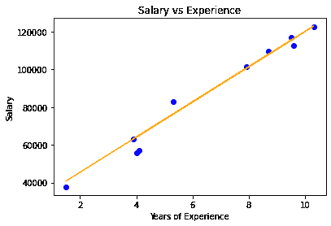

# 从头开始实施弹性网络回归

> 原文:[https://www . geeksforgeeks . org/实现-弹性-网络-从头回归/](https://www.geeksforgeeks.org/implementation-of-elastic-net-regression-from-scratch/)

#### 先决条件:

1.  线性回归
2.  梯度下降
3.  套索&岭回归

#### 导言:

弹性网络回归是线性回归的一种改进，它具有相同的预测假设函数。线性回归的成本函数用 *J* 表示。

<center></center>

```
Here, m is the total number of training examples in the dataset.
*h(x<sup>(i)</sup>)* represents the hypothetical function for prediction.
*y<sup>(i)</sup>* represents the value of target variable for ith training example.

```

线性回归存在过拟合问题，不能处理共线数据。当数据集中有许多特征，甚至其中一些特征与预测模型无关时。这使得模型更加复杂，对测试集的预测过于不准确(或过度拟合)。这种高方差的模型不能推广到新的数据上。因此，为了处理这些问题，我们同时包括了 L-2 和 L-1 范数正则化，以同时获得 Ridge 和 Lasso 的好处。得到的模型比套索有更好的预测能力。它执行特征选择，也使假设更简单。弹性网络回归的修正成本函数如下:

<center>![\frac{1}{m}\left[\sum_{l=1}^{m}\left(y^{(i)}-h\left(x^{(i)}\right)\right)^{2}+\lambda_{1} \sum_{j=1}^{n} w_{j}+\lambda_{2} \sum_{j=1}^{n} w_{j}^{2}\right]](img/6f084ae3bc381c720fcb4a4d402dac51.png "Rendered by QuickLaTeX.com")</center>

```
Here, *w<sub>(j)</sub>* represents the weight for jth feature.  
*n* is the number of features in the dataset.
*lambda1* is the regularization strength for L-1 norm.
*lambda2* is the regularization strength for L-2 norm.
```

#### 数学直觉:

在代价函数的梯度下降优化过程中，增加的 L-2 惩罚项导致模型的权值降低到接近于零。由于权重的惩罚，假设变得更简单，更一般化，并且不太容易过度拟合。增加了 L1 罚收缩权重接近零或零。那些缩小到零的权重消除了假设函数中存在的特征。因此，无关的特征不参与预测模型。权重的这种惩罚使得假设更具预测性，这鼓励了稀疏性(具有很少参数的模型)。

λ1 和λ2 调谐值的不同情况。

1.  如果λ1 和λ2 设置为 0，弹性网络回归等于线性回归。
2.  如果λ1 设置为 0，弹性网回归等于岭回归。
3.  如果λ2 设置为 0，弹性网回归等于套索回归。
4.  如果λ1 和λ2 设置为无穷大，则所有权重都将收缩为零

因此，我们应该将λ1 和λ2 设置在 0 和无穷大之间。

#### 实施:

本实现中使用的数据集可以从[链接](https://github.com/mohit-baliyan/References.)下载。

它有两栏—“T0”年经验“T2】工资”一个公司 30 个员工。因此，在本文中，我们将训练一个弹性网络回归模型来学习每个员工的经验年限和他们各自的工资之间的相关性。一旦模型经过训练，我们就能够根据员工多年的经验来预测他的工资。

**代码:**

```
# Importing libraries

import numpy as np

import pandas as pd

from sklearn.model_selection import train_test_split

import matplotlib.pyplot as plt

# Elastic Net Regression

class ElasticRegression() :

    def __init__( self, learning_rate, iterations, l1_penality, l2_penality ) :

        self.learning_rate = learning_rate

        self.iterations = iterations

        self.l1_penality = l1_penality

        self.l2_penality = l2_penality

    # Function for model training

    def fit( self, X, Y ) :

        # no_of_training_examples, no_of_features

        self.m, self.n = X.shape

        # weight initialization

        self.W = np.zeros( self.n )

        self.b = 0

        self.X = X

        self.Y = Y

        # gradient descent learning

        for i in range( self.iterations ) :

            self.update_weights()

        return self

    # Helper function to update weights in gradient descent

    def update_weights( self ) :

        Y_pred = self.predict( self.X )

        # calculate gradients  

        dW = np.zeros( self.n )

        for j in range( self.n ) :

            if self.W[j] > 0 :

                dW[j] = ( - ( 2 * ( self.X[:,j] ).dot( self.Y - Y_pred ) ) + 

                         self.l1_penality + 2 * self.l2_penality * self.W[j] ) / self.m

            else :

                dW[j] = ( - ( 2 * ( self.X[:,j] ).dot( self.Y - Y_pred ) ) 

                         - self.l1_penality + 2 * self.l2_penality * self.W[j] ) / self.m

        db = - 2 * np.sum( self.Y - Y_pred ) / self.m 

        # update weights

        self.W = self.W - self.learning_rate * dW

        self.b = self.b - self.learning_rate * db

        return self

    # Hypothetical function  h( x ) 

    def predict( self, X ) :

        return X.dot( self.W ) + self.b

# Driver Code

def main() :

    # Importing dataset

    df = pd.read_csv( "salary_data.csv" )

    X = df.iloc[:,:-1].values

    Y = df.iloc[:,1].values

    # Splitting dataset into train and test set

    X_train, X_test, Y_train, Y_test = train_test_split( X, Y, 

                                             test_size = 1/3, random_state = 0 )

    # Model training

    model = ElasticRegression( iterations = 1000, 

                      learning_rate = 0.01, l1_penality = 500, l2_penality = 1 )

    model.fit( X_train, Y_train )

    # Prediction on test set

    Y_pred = model.predict( X_test )

    print( "Predicted values ", np.round( Y_pred[:3], 2 ) ) 

    print( "Real values      ", Y_test[:3] )

    print( "Trained W        ", round( model.W[0], 2 ) )

    print( "Trained b        ", round( model.b, 2 ) )

    # Visualization on test set 

    plt.scatter( X_test, Y_test, color = 'blue' )

    plt.plot( X_test, Y_pred, color = 'orange' )

    plt.title( 'Salary vs Experience' )

    plt.xlabel( 'Years of Experience' )

    plt.ylabel( 'Salary' )

    plt.show()

if __name__ == "__main__" : 

    main()
```

#### 输出:

```
Predicted values  [ 40837.61 122887.43  65079.6 ]
Real values       [ 37731 122391  57081]
Trained W         9323.84
Trained b         26851.84

```

<center>

弹性网模型可视化

</center>

**注:** Elastic-Net 回归自动执行模型选择的某些部分，并导致降维，这使得它成为一个计算效率高的模型。