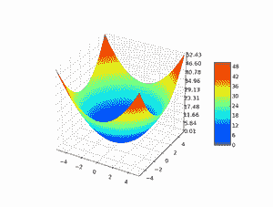

# 灰狼优化(GWO)算法的实现

> 原文:[https://www . geesforgeks . org/implementation-of-grey-wolf-optimization-gwo-algorithm/](https://www.geeksforgeeks.org/implementation-of-grey-wolf-optimization-gwo-algorithm/)

往期文章[灰狼优化-简介](https://www.geeksforgeeks.org/grey-wolf-optimization-introduction/)讲了灰狼优化的启发，以及它的数学建模和算法。在本文中，我们将针对两个适应度函数–[拉斯特里金函数](https://en.wikipedia.org/wiki/Rastrigin_function#:~:text=In%20mathematical%20optimization%2C%20the%20Rastrigin,has%20been%20generalized%20by%20Rudolph.)和球面函数实现灰狼优化(PSO)。灰狼优化算法的目标是寻找适应度函数的最小值。

### 健身功能:

1) Rastrigin 函数:Rastrigin 函数是一个非凸函数，用作优化算法的性能测试问题。

**函数方程:**


[](https://upload.wikimedia.org/wikipedia/commons/thumb/8/8b/Rastrigin_function.png/450px-Rastrigin_function.png)

图 1 两个变量的 Rastrigin 函数

Rastrigin 函数是优化问题中最具挑战性的函数之一。在平面上有很多余弦振荡会引入无数的局部极小值，粒子会被卡住。

2)球面函数:球面函数被用作优化算法的性能测试问题。

**函数方程:**




图 2:两个变量的球函数

### 超参数的选择

*   **问题参数:**
    *   尺寸数量( **d** ) = **3**
    *   下限( **minx** ) = **-10.0**
    *   上限( **maxx** ) = **10.0**
*   **算法的超参数:**
    *   灰狼数量( **N** ) = **50**
    *   最大迭代次数( **max_iter** ) = **100**
*   **输入:**
    *   健身功能
    *   问题参数(如上所述)
    *   群体大小( **N** )和最大迭代次数( **max_iter** )
    *   算法特定超参数(灰太狼算法中无)

### 伪代码:

```py
Step1: Randomly initialize Grey wolf population of N particles Xi ( i=1, 2, …, n)
Step2: Calculate the fitness value of each individuals
           sort grey wolf population based on fitness values
           alpha_wolf = wolf with least fitness value
           beta_wolf  = wolf with second least fitness value
           gamma_wolf = wolf with third least fitness value
Step 3: For Iter in range(max_iter):  # loop max_iter times  
            calculate the value of a
                a = 2*(1 - Iter/max_iter)
            For i in range(N):  # for each wolf
               a. Compute the value of A1, A2, A3 and C1, C2, C3
                     A1 = a*(2*r1 -1), A2 = a*(2*r2 -1), A3 = a*(2*r3 -1)
                     C1 = 2*r1, C2 = 2*r2, C3 = 2*r3

               b. Computer X1, X2, X3 
                       X1 = alpha_wolf.position - 
                             A1*abs(C1*alpha_wolf_position - ith_wolf.position)
                       X2 = beta_wolf.position - 
                             A2*abs(C2*beta_wolf_position - ith_wolf.position)
                       X3 = gamma_wolf.position - 
                             A3*abs(C3*gamma_wolf_position - ith_wolf.position)

               c. Compute new solution and it's fitness
                       Xnew = (X1 + X2 + X3) / 3 
                       fnew = fitness( Xnew) 

               d. Update the ith_wolf greedily
                     if( fnew < ith_wolf.fitness)
                         ith_wolf.position = Xnew
                         ith_wolf.fitness = fnew    
             End-for

             # compute new alpha, beta and gamma
                   sort grey wolf population based on fitness values
                   alpha_wolf = wolf with least fitness value
                   beta_wolf  = wolf with second least fitness value
                   gamma_wolf = wolf with third least fitness value      
         End -for
Step 4: Return best wolf in the population
```

### 实施:

## 蟒蛇 3

```py
# python implementation of Grey wolf optimization (GWO)
# minimizing rastrigin and sphere function

import random
import math    # cos() for Rastrigin
import copy    # array-copying convenience
import sys     # max float

#-------fitness functions---------

# rastrigin function
def fitness_rastrigin(position):
  fitness_value = 0.0
  for i in range(len(position)):
    xi = position[i]
    fitness_value += (xi * xi) - (10 * math.cos(2 * math.pi * xi)) + 10
  return fitness_value

#sphere function
def fitness_sphere(position):
    fitness_value = 0.0
    for i in range(len(position)):
        xi = position[i]
        fitness_value += (xi*xi);
    return fitness_value;
#-------------------------

# wolf class
class wolf:
  def __init__(self, fitness, dim, minx, maxx, seed):
    self.rnd = random.Random(seed)
    self.position = [0.0 for i in range(dim)]

    for i in range(dim):
      self.position[i] = ((maxx - minx) * self.rnd.random() + minx)

    self.fitness = fitness(self.position) # curr fitness

# grey wolf optimization (GWO)
def gwo(fitness, max_iter, n, dim, minx, maxx):
    rnd = random.Random(0)

    # create n random wolves
    population = [ wolf(fitness, dim, minx, maxx, i) for i in range(n)]

    # On the basis of fitness values of wolves
    # sort the population in asc order
    population = sorted(population, key = lambda temp: temp.fitness)

    # best 3 solutions will be called as
    # alpha, beta and gaama
    alpha_wolf, beta_wolf, gamma_wolf = copy.copy(population[: 3])

    # main loop of gwo
    Iter = 0
    while Iter < max_iter:

        # after every 10 iterations
        # print iteration number and best fitness value so far
        if Iter % 10 == 0 and Iter > 1:
            print("Iter = " + str(Iter) + " best fitness = %.3f" % alpha_wolf.fitness)

        # linearly decreased from 2 to 0
        a = 2*(1 - Iter/max_iter)

        # updating each population member with the help of best three members
        for i in range(n):
            A1, A2, A3 = a * (2 * rnd.random() - 1), a * (
              2 * rnd.random() - 1), a * (2 * rnd.random() - 1)
            C1, C2, C3 = 2 * rnd.random(), 2*rnd.random(), 2*rnd.random()

            X1 = [0.0 for i in range(dim)]
            X2 = [0.0 for i in range(dim)]
            X3 = [0.0 for i in range(dim)]
            Xnew = [0.0 for i in range(dim)]
            for j in range(dim):
                X1[j] = alpha_wolf.position[j] - A1 * abs(
                  C1 - alpha_wolf.position[j] - population[i].position[j])
                X2[j] = beta_wolf.position[j] - A2 * abs(
                  C2 -  beta_wolf.position[j] - population[i].position[j])
                X3[j] = gamma_wolf.position[j] - A3 * abs(
                  C3 - gamma_wolf.position[j] - population[i].position[j])
                Xnew[j]+= X1[j] + X2[j] + X3[j]

            for j in range(dim):
                Xnew[j]/=3.0

            # fitness calculation of new solution
            fnew = fitness(Xnew)

            # greedy selection
            if fnew < population[i].fitness:
                population[i].position = Xnew
                population[i].fitness = fnew

        # On the basis of fitness values of wolves
        # sort the population in asc order
        population = sorted(population, key = lambda temp: temp.fitness)

        # best 3 solutions will be called as
        # alpha, beta and gaama
        alpha_wolf, beta_wolf, gamma_wolf = copy.copy(population[: 3])

        Iter+= 1
    # end-while

    # returning the best solution
    return alpha_wolf.position

#----------------------------

# Driver code for rastrigin function

print("\nBegin grey wolf optimization on rastrigin function\n")
dim = 3
fitness = fitness_rastrigin

print("Goal is to minimize Rastrigin's function in " + str(dim) + " variables")
print("Function has known min = 0.0 at (", end="")
for i in range(dim-1):
  print("0, ", end="")
print("0)")

num_particles = 50
max_iter = 100

print("Setting num_particles = " + str(num_particles))
print("Setting max_iter    = " + str(max_iter))
print("\nStarting GWO algorithm\n")

best_position = gwo(fitness, max_iter, num_particles, dim, -10.0, 10.0)

print("\nGWO completed\n")
print("\nBest solution found:")
print(["%.6f"%best_position[k] for k in range(dim)])
err = fitness(best_position)
print("fitness of best solution = %.6f" % err)

print("\nEnd GWO for rastrigin\n")

print()
print()

# Driver code for Sphere function
print("\nBegin grey wolf optimization on sphere function\n")
dim = 3
fitness = fitness_sphere

print("Goal is to minimize sphere function in " + str(dim) + " variables")
print("Function has known min = 0.0 at (", end="")
for i in range(dim-1):
  print("0, ", end="")
print("0)")

num_particles = 50
max_iter = 100

print("Setting num_particles = " + str(num_particles))
print("Setting max_iter    = " + str(max_iter))
print("\nStarting GWO algorithm\n")

best_position = gwo(fitness, max_iter, num_particles, dim, -10.0, 10.0)

print("\nGWO completed\n")
print("\nBest solution found:")
print(["%.6f"%best_position[k] for k in range(dim)])
err = fitness(best_position)
print("fitness of best solution = %.6f" % err)

print("\nEnd GWO for sphere\n")
```

### 输出:

```py
Begin grey wolf optimization on rastrigin function

Goal is to minimize Rastrigin's function in 3 variables
Function has known min = 0.0 at (0, 0, 0)
Setting num_particles = 50
Setting max_iter    = 100

Starting GWO algorithm

Iter = 10 best fitness = 2.996
Iter = 20 best fitness = 2.749
Iter = 30 best fitness = 0.470
Iter = 40 best fitness = 0.185
Iter = 50 best fitness = 0.005
Iter = 60 best fitness = 0.001
Iter = 70 best fitness = 0.001
Iter = 80 best fitness = 0.001
Iter = 90 best fitness = 0.000

GWO completed

Best solution found:
['0.000706', '-0.000746', '-0.000526']
fitness of best solution = 0.000264

End GWO for rastrigin

Begin grey wolf optimization on sphere function

Goal is to minimize sphere function in 3 variables
Function has known min = 0.0 at (0, 0, 0)
Setting num_particles = 50
Setting max_iter    = 100

Starting GWO algorithm

Iter = 10 best fitness = 0.001
Iter = 20 best fitness = 0.001
Iter = 30 best fitness = 0.000
Iter = 40 best fitness = 0.000
Iter = 50 best fitness = 0.000
Iter = 60 best fitness = 0.000
Iter = 70 best fitness = 0.000
Iter = 80 best fitness = 0.000
Iter = 90 best fitness = 0.000

GWO completed

Best solution found:
['-0.000064', '0.000879', '-0.000934']
fitness of best solution = 0.000002

End GWO for sphere
```

### 参考文献:

*   **研究论文** : [灰狼优化器*【Seyedali 等，2014】*](https://www.sciencedirect.com/science/article/pii/S0965997813001853#:~:text=A%20new%20meta%2Dheuristic%20called,the%20superior%20exploitation%20of%20GWO)
*   [作者官方实现(MATLAB 代码)](https://in.mathworks.com/matlabcentral/fileexchange/44974-grey-wolf-optimizer-gwo)