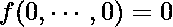

# 实施亨利气体溶解度优化

> 原文:[https://www . geeksforgeeks . org/implementation-of-Henry-gas-solution-optimization/](https://www.geeksforgeeks.org/implementation-of-henry-gas-solubility-optimization/)

文[亨利气体溶解度优化](https://www.geeksforgeeks.org/henry-gas-solubility-optimization/) (HGSO)谈到了亨利气体溶解度优化的启示，其数学建模和算法。在本文中，我们将为球体适应度函数实现亨利气体溶解度优化。

## 球体适应度函数

球面函数是评估优化算法性能的标准函数。

函数方程:





球体适应度函数

### 算法的参数和超参数

1.  下限(磅)= [-10.0]
2.  上限(ub) = [10.0]
3.  人口规模(人口规模)= 50
4.  最大迭代次数(纪元)= 20

请查看文章[亨利气体溶解度优化](https://www.geeksforgeeks.org/henry-gas-solubility-optimization/)了解亨利气体溶解度优化伪代码。

### 代码:

## 蟒蛇 3

```py
import numpy as np
from numpy.random import uniform
from copy import deepcopy

def Sphere_func(x):
    fitness = 0.0
    for i in range(len(x)):
        fitness += (x[i]*x[i])
    return fitness

class HGSO():

    ID_MIN_PROB = 0  # min problem
    ID_MAX_PROB = -1  # max problem
    ID_POS = 0  # Position
    ID_FIT = 1  # Fitness

    def __init__(self, obj_func=None, lb=None, ub=None,
                 verbose=True, epoch=750, pop_size=100,
                 n_clusters=2, **kwargs):
        self.epoch = epoch
        self.pop_size = pop_size
        self.n_clusters = n_clusters
        self.n_elements = int(self.pop_size / self.n_clusters)
        self.lb = lb
        self.ub = ub
        self.verbose = verbose
        self.T0 = 298.15
        self.K = 1.0
        self.beta = 1.0
        self.alpha = 1
        self.epxilon = 0.05
        self.obj_func = obj_func
        self.l1 = 5E-2
        self.l2 = 100.0
        self.l3 = 1E-2
        self.H_j = self.l1 * uniform()
        self.P_ij = self.l2 * uniform()
        self.C_j = self.l3 * uniform()
        self.solution, self.loss_train = None, []

    def get_fitness_position(self, position=None, minmax=0):
        return self.obj_func(position) if minmax == 0 else 1.0 / (
          self.obj_func(position) + 10E-10)

    def get_fitness_solution(self, solution=None, minmax=0):
        return self.get_fitness_position(solution[self.ID_POS], minmax)

    def get_global_best_solution(self, pop=None, id_fit=None, id_best=None):

        # Sort a copy of population and return the copy of
        # the best position
        sorted_pop = sorted(pop, key=lambda temp: temp[id_fit])
        return deepcopy(sorted_pop[id_best])

    def update_global_best_solution(self, pop=None, id_best=None, g_best=None):

        # Sort the copy of population and update the current best
        # position. Return the new current best position """
        sorted_pop = sorted(pop, key=lambda temp: temp[self.ID_FIT])
        current_best = sorted_pop[id_best]
        return deepcopy(current_best) if current_best[self.ID_FIT] <\
      g_best[self.ID_FIT] else deepcopy(g_best)

    def create_population__(self, minmax=0, n_clusters=0):
        pop = []
        group = []

        for i in range(n_clusters):
            team = []

            for j in range(self.n_elements):
                solution = uniform(self.lb, self.ub)
                fitness = self.obj_func(
                    solution) if minmax == 0 else 1.0 / (
                  self.obj_func(solution) + 10E-10)

                team.append([solution, fitness, i])
                pop.append([solution, fitness, i])
            group.append(team)
        return pop, group

    def get_best_solution_in_team(self, group=None):
        list_best = []

        for i in range(len(group)):
            sorted_team = sorted(group[i], key=lambda temp: temp[self.ID_FIT])
            list_best.append(deepcopy(sorted_team[self.ID_MIN_PROB]))
        return list_best

    def train(self):
        pop, group = self.create_population__(
            self.ID_MIN_PROB, self.n_clusters)

        # single element
        g_best = self.get_global_best_solution(
            pop, self.ID_FIT, self.ID_MIN_PROB)

        # multiple element
        p_best = self.get_best_solution_in_team(
            group)

        # Loop iterations
        for epoch in range(self.epoch):

            # Loop based on the number of cluster in swarm
            # number of gases type)
            for i in range(self.n_clusters):

                # Loop based on the number of individual in
                # each gases type
                for j in range(self.n_elements):

                    F = -1.0 if uniform() < 0.5 else 1.0

                    # Based on Eq. 8, 9, 10
                    self.H_j = self.H_j * \
                        np.exp(-self.C_j *
                               (1.0/np.exp(-epoch/self.epoch) - 1.0/self.T0))
                    S_ij = self.K * self.H_j * self.P_ij
                    gamma = self.beta * \
                        np.exp(- ((p_best[i][self.ID_FIT] + self.epxilon) /
                                  (group[i][j][self.ID_FIT] + self.epxilon)))

                    X_ij = group[i][j][self.ID_POS] + F * uniform() * gamma * \
                    (p_best[i][self.ID_POS] - group[i][j][self.ID_POS]) + \
                        F * uniform() * self.alpha * \
                        (S_ij * g_best[self.ID_POS] - group[i][j][self.ID_POS])

                    fit = self.get_fitness_position(X_ij, self.ID_MIN_PROB)
                    group[i][j] = [X_ij, fit, i]
                    pop[i*self.n_elements + j] = [X_ij, fit, i]

            # Update Henry's coefficient using Eq.8
            self.H_j = self.H_j * \
                np.exp(-self.C_j * (1.0 / np.exp(-epoch / self.epoch) - 1.0 / self.T0))

            # Update the solubility of each gas using Eq.9
            S_ij = self.K * self.H_j * self.P_ij

            # Rank and select the number of worst agents using Eq. 11
            N_w = int(self.pop_size * (uniform(0, 0.1) + 0.1))

            # Update the position of the worst agents using Eq. 12
            sorted_id_pos = np.argsort([x[self.ID_FIT] for x in pop])

            for item in range(N_w):
                id = sorted_id_pos[item]
                j = id % self.n_elements
                i = int((id-j) / self.n_elements)
                X_new = uniform(self.lb, self.ub)
                fit = self.get_fitness_position(X_new, self.ID_MIN_PROB)
                pop[id] = [X_new, fit, i]
                group[i][j] = [X_new, fit, i]

            p_best = self.get_best_solution_in_team(group)
            g_best = self.update_global_best_solution(
                pop, self.ID_MIN_PROB, g_best)
            self.loss_train.append(g_best[self.ID_FIT])

            if self.verbose:
                print("Epoch: {}, Best fitness value: {}".format(
                    epoch + 1, g_best[self.ID_FIT]))
        self.solution = g_best
        return g_best[self.ID_POS], g_best[self.ID_FIT], self.loss_train

lb = [-10]
ub = [10]
epoch = 100
verbose = True
pop_size = 50
obj = HGSO(Sphere_func, lb, ub, verbose, epoch, pop_size)
obj.train()
```

### 输出:

```py
Epoch: 1, Best fitness value: 0.0007128933455975314
Epoch: 2, Best fitness value: 0.0007128933455975314
Epoch: 3, Best fitness value: 0.0007128933455975314
Epoch: 4, Best fitness value: 0.0007128933455975314
Epoch: 5, Best fitness value: 0.0007128933455975314
Epoch: 6, Best fitness value: 0.0007128933455975314
Epoch: 7, Best fitness value: 0.0007128933455975314
Epoch: 8, Best fitness value: 0.0007128933455975314
Epoch: 9, Best fitness value: 0.0007128933455975314
Epoch: 10, Best fitness value: 0.0007128933455975314
Epoch: 11, Best fitness value: 0.0007128933455975314
Epoch: 12, Best fitness value: 0.0007128933455975314
Epoch: 13, Best fitness value: 0.0007128933455975314
Epoch: 14, Best fitness value: 0.0007128933455975314
Epoch: 15, Best fitness value: 0.0007128933455975314
Epoch: 16, Best fitness value: 0.0007128933455975314
Epoch: 17, Best fitness value: 0.0007128933455975314
Epoch: 18, Best fitness value: 0.0007128933455975314
Epoch: 19, Best fitness value: 0.0007128933455975314
Epoch: 20, Best fitness value: 0.0007128933455975314
Best fitness: 0.0007128933455975314, Best position: [0.02670006]
```

这就是亨利气体溶解度优化的实现。