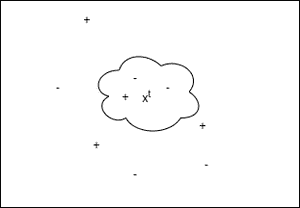

# 使用 Python 从头开始实现 K 近邻

> 原文:[https://www . geeksforgeeks . org/实现-k-近邻-从头开始-使用-python/](https://www.geeksforgeeks.org/implementation-of-k-nearest-neighbors-from-scratch-using-python/)

#### 基于实例的学习

k 近邻分类是基于实例学习的分类技术之一。基于基于实例的学习的模型来概括训练示例之外的内容。为此，他们首先存储培训示例。当它遇到一个新实例(或测试实例)时，它们立即在存储的训练实例和这个新实例之间建立关系，为这个新实例分配一个目标函数值。基于实例的方法有时被称为懒惰学习方法，因为它们推迟学习，直到遇到新的实例进行预测。

这些方法不是对整个空间估计一次假设函数(或目标函数)，而是对每个要预测的新实例进行局部和不同的估计。

#### k 近邻分类器学习

基本假设:

1.  所有实例都对应于 n 维空间中的点，其中 n 表示任何实例中的特征数量。
2.  实例的最近邻居是根据欧几里得距离定义的。

```py
An instance can be represented by < x1, x2, .............., xn >.
Euclidean distance between two instances xa and xb is given by d( xa, xb ) :

```

<center></center>

**它是如何工作的？**

k 近邻分类器首先存储训练样本。在预测过程中，当它遇到要预测的新实例(或测试实例)时，它会找到 K 个最接近这个新实例的训练实例。然后将 K-最近的训练实例中最常见的类分配给这个测试实例。

K 的最佳选择是验证测试数据的误差。k 也可以通过 m 的平方根来选择，其中 m 是数据集中的示例数。



KNN 图形工作表示

在上图中，“+”表示标记为 1 的训练实例。“-”表示带有 0 的训练实例。这里，我们将测试实例 x <sup>t</sup> 分类为与它最近的 K 个训练实例中最常见的类。这里我们选择 K = 3，所以 x <sup>t</sup> 被归类为“-”或 0。

#### 伪代码:

1.  存储所有培训示例。
2.  对每个测试示例重复步骤 3、4 和 5。
3.  找到与当前测试示例最接近的 K 个训练示例。
4.  *y_pred* 对于当前测试实例= K-near 训练实例中最常见的类。
5.  转到步骤 2。

#### 实施:

本次实施使用的糖尿病数据集可从[链接](https://github.com/mohit-baliyan/References)下载。

它有 8 个特征栏，如*“年龄”、“葡萄糖”*心电图，以及 108 名患者的目标变量“结果”。因此，在这方面，我们将创建一个[链接](https://github.com/mohit-baliyan/References)邻居分类器模型来预测有这种信息的患者是否患有糖尿病。

```py
# Importing libraries

import pandas as pd

import numpy as np

from sklearn.model_selection import train_test_split

from scipy.stats import mode

from sklearn.neighbors import KNeighborsClassifier

# K Nearest Neighbors Classification

class K_Nearest_Neighbors_Classifier() : 

    def __init__( self, K ) :

        self.K = K

    # Function to store training set

    def fit( self, X_train, Y_train ) :

        self.X_train = X_train

        self.Y_train = Y_train

        # no_of_training_examples, no_of_features

        self.m, self.n = X_train.shape

    # Function for prediction

    def predict( self, X_test ) :

        self.X_test = X_test

        # no_of_test_examples, no_of_features

        self.m_test, self.n = X_test.shape

        # initialize Y_predict

        Y_predict = np.zeros( self.m_test )

        for i in range( self.m_test ) :

            x = self.X_test[i]

            # find the K nearest neighbors from current test example

            neighbors = np.zeros( self.K )

            neighbors = self.find_neighbors( x )

            # most frequent class in K neighbors

            Y_predict[i] = mode( neighbors )[0][0]    

        return Y_predict

    # Function to find the K nearest neighbors to current test example

    def find_neighbors( self, x ) :

        # calculate all the euclidean distances between current 
        # test example x and training set X_train

        euclidean_distances = np.zeros( self.m )

        for i in range( self.m ) :

            d = self.euclidean( x, self.X_train[i] )

            euclidean_distances[i] = d

        # sort Y_train according to euclidean_distance_array and 
        # store into Y_train_sorted

        inds = euclidean_distances.argsort()

        Y_train_sorted = self.Y_train[inds]

        return Y_train_sorted[:self.K]

    # Function to calculate euclidean distance

    def euclidean( self, x, x_train ) :

        return np.sqrt( np.sum( np.square( x - x_train ) ) )

# Driver code

def main() :

    # Importing dataset

    df = pd.read_csv( "diabetes.csv" )

    X = df.iloc[:,:-1].values

    Y = df.iloc[:,-1:].values

    # Splitting dataset into train and test set

    X_train, X_test, Y_train, Y_test = train_test_split( 
      X, Y, test_size = 1/3, random_state = 0 )

    # Model training

    model = K_Nearest_Neighbors_Classifier( K = 3 )

    model.fit( X_train, Y_train )

    model1 = KNeighborsClassifier( n_neighbors = 3 )

    model1.fit( X_train, Y_train )

    # Prediction on test set

    Y_pred = model.predict( X_test )

    Y_pred1 = model1.predict( X_test )

    # measure performance

    correctly_classified = 0

    correctly_classified1 = 0

    # counter

    count = 0

    for count in range( np.size( Y_pred ) ) :

        if Y_test[count] == Y_pred[count] :

            correctly_classified = correctly_classified + 1

        if Y_test[count] == Y_pred1[count] :

            correctly_classified1 = correctly_classified1 + 1

        count = count + 1

    print( "Accuracy on test set by our model       :  ", ( 
      correctly_classified / count ) * 100 )
    print( "Accuracy on test set by sklearn model   :  ", ( 
      correctly_classified1 / count ) * 100 )

if __name__ == "__main__" : 

    main()
```

#### 输出:

```py
Accuracy on test set by our model       :   63.888888888888886
Accuracy on test set by sklearn model   :   63.888888888888886

```

我们的模型和 sklearn 达到的精度是相等的，这表明我们模型的正确实现。

**注:**以上实现是为了从头开始创建模型，不是为了提高糖尿病数据集的精度。

#### k 最近邻回归:

k 近邻回归首先存储训练示例。在预测过程中，当它遇到要预测的新实例(或测试实例)时，它会找到 K 个最接近这个新实例的训练实例。然后通过计算这些最近邻居的目标值的平均值来预测该实例的目标值。

K 的最佳选择是验证测试数据的误差。k 也可以通过 m 的平方根来选择，其中 m 是数据集中的示例数。

#### 伪代码:

1.  存储所有培训示例。
2.  对每个测试示例重复步骤 3、4 和 5。
3.  找到与当前测试示例最接近的 K 个训练示例。
4.  当前测试示例的 y _ pred 这些 K 个邻居的真实目标值的平均值。
5.  转到步骤 2。

#### 实施:

本实现使用的数据集可以从[链接](https://github.com/mohit-baliyan/References)下载

它有两栏—“T0”年经验“T2】工资”一个公司 30 个员工。所以在这里，我们将创建一个 K 近邻回归模型来学习每个员工的经验年限和他们各自的工资之间的相关性。

我们创建的模型预测的值与 sklearn 模型为测试集预测的值相同。

## 蟒蛇 3

```py
# Importing libraries

import pandas as pd

import numpy as np

from sklearn.model_selection import train_test_split

from sklearn.neighbors import KNeighborsRegressor

# K Nearest Neighbors Regression

class K_Nearest_Neighbors_Regressor() : 

    def __init__( self, K ) :

        self.K = K

    # Function to store training set

    def fit( self, X_train, Y_train ) :

        self.X_train = X_train

        self.Y_train = Y_train

        # no_of_training_examples, no_of_features

        self.m, self.n = X_train.shape

    # Function for prediction

    def predict( self, X_test ) :

        self.X_test = X_test

        # no_of_test_examples, no_of_features

        self.m_test, self.n = X_test.shape

        # initialize Y_predict

        Y_predict = np.zeros( self.m_test )

        for i in range( self.m_test ) :

            x = self.X_test[i]

            # find the K nearest neighbors from current test example

            neighbors = np.zeros( self.K )

            neighbors = self.find_neighbors( x )

            # calculate the mean of K nearest neighbors

            Y_predict[i] = np.mean( neighbors )

        return Y_predict

    # Function to find the K nearest neighbors to current test example

    def find_neighbors( self, x ) :

        # calculate all the euclidean distances between current test
        # example x and training set X_train

        euclidean_distances = np.zeros( self.m )

        for i in range( self.m ) :

            d = self.euclidean( x, self.X_train[i] )

            euclidean_distances[i] = d

        # sort Y_train according to euclidean_distance_array and 
        # store into Y_train_sorted

        inds = euclidean_distances.argsort()

        Y_train_sorted = self.Y_train[inds]

        return Y_train_sorted[:self.K]

    # Function to calculate euclidean distance

    def euclidean( self, x, x_train ) :

        return np.sqrt( np.sum( np.square( x - x_train ) ) )

# Driver code

def main() :

    # Importing dataset

    df = pd.read_csv( "salary_data.csv" )

    X = df.iloc[:,:-1].values

    Y = df.iloc[:,1].values

    # Splitting dataset into train and test set

    X_train, X_test, Y_train, Y_test = train_test_split( 
      X, Y, test_size = 1/3, random_state = 0 )

    # Model training

    model = K_Nearest_Neighbors_Regressor( K = 3 )

    model.fit( X_train, Y_train )

    model1 = KNeighborsRegressor( n_neighbors = 3 )

    model1.fit( X_train, Y_train )

    # Prediction on test set

    Y_pred = model.predict( X_test )

    Y_pred1 =  model1.predict( X_test )

    print( "Predicted values by our model     :  ", np.round( Y_pred[:3], 2 ) ) 

    print( "Predicted values by sklearn model :  ", np.round( Y_pred1[:3], 2 ) )

    print( "Real values                       :  ", Y_test[:3] )

if __name__ == "__main__" : 

    main()
```

#### 输出:

```py
Predicted values by our model     :   [ 43024.33 113755.33  58419\.  ]
Predicted values by sklearn model :   [ 43024.33 113755.33  58419\.  ]
Real values                       :   [ 37731 122391  57081]
```

**缺点:**实例学习模型的计算成本非常高，因为所有计算都是在预测期间完成的。它还会考虑所有训练示例来预测每个测试示例。