# 套索、脊线、弹性网的实现

> 原文:[https://www . geesforgeks . org/implementation-of-lasso-ridge-and-elastic-net/](https://www.geeksforgeeks.org/implementation-of-lasso-ridge-and-elastic-net/)

在本文中，我们将研究不同正则化技术的实现。首先，我们将从多元线性回归开始。为此，我们需要预装 sci-kit learn 和 pandas 的 python3 环境。我们也可以使用谷歌合作或任何其他 jupyter 笔记本环境。
首先，我们需要将一些包导入我们的环境中。

## 蟒蛇 3

```
import pandas as pd
import numpy as np
import matplotlib.pyplot as plt
from sklearn import datasets
from sklearn.model_selection import train_test_split
from sklearn.linear_model import LinearRegression
```

我们将使用波士顿房屋预测数据集。该数据集存在于 sklearn (scikit-learn)库的**数据集**模块中。我们可以按如下方式导入该数据集。

## 蟒蛇 3

```
# Loading pre-defined Boston Dataset
boston_dataset = datasets.load_boston()
print(boston_dataset.DESCR)
```

**输出:**

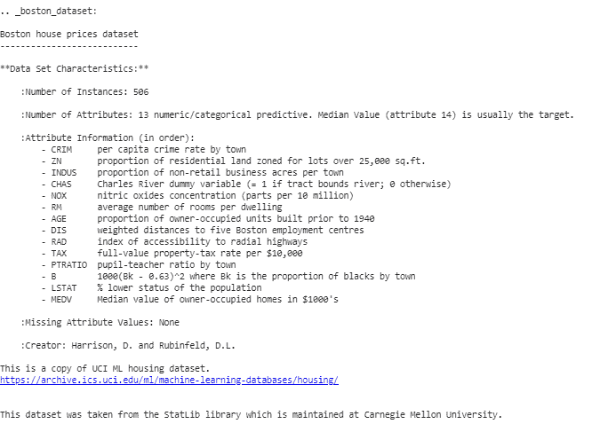

从上面的描述我们可以得出结论，我们有 13 个自变量和一个因变量(房价)。现在我们需要检查自变量和因变量之间的相关性。对此我们可以使用散点图/corrplot。

## 蟒蛇 3

```
# Generate scatter plot of independent vs Dependent variable
plt.style.use('ggplot')
fig = plt.figure(figsize = (18, 18))

for index, feature_name in enumerate(boston_dataset.feature_names):
    ax = fig.add_subplot(4, 4, index + 1)
    ax.scatter(boston_dataset.data[:, index], boston_dataset.target)
    ax.set_ylabel('House Price', size = 12)
    ax.set_xlabel(feature_name, size = 12)

plt.show()
```

上面代码产生不同独立变量与目标变量的散点图，如下所示

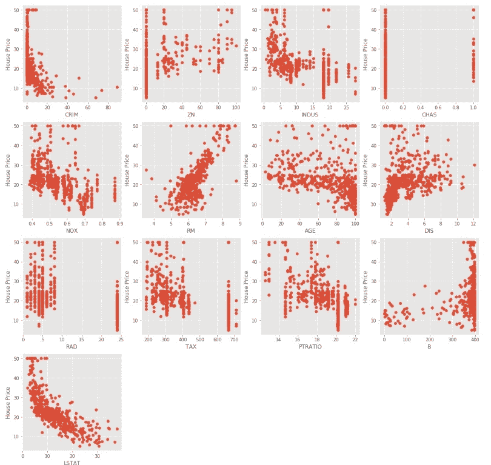

我们可以从上面的散点图中观察到，一些自变量与目标变量没有太大的相关性(正相关或负相关)。这些变量的系数将在正则化中减少。
**代码:对数据进行预处理的 Python 代码。**T3】

## 蟒蛇 3

```
# Load the dataset into Pandas Dataframe
boston_pd = pd.DataFrame(boston_dataset.data)
boston_pd.columns = boston_dataset.feature_names
boston_pd_target = np.asarray(boston_dataset.target)
boston_pd['House Price'] = pd.Series(boston_pd_target)

# input
X = boston_pd.iloc[:, :-1]

#output
Y = boston_pd.iloc[:, -1]

print(boston_pd.head())
```

现在，我们应用 train-test split 将数据集分成两部分，一部分用于训练，另一部分用于测试。我们将使用 25%的数据进行测试。

## 蟒蛇 3

```
x_train, x_test, y_train, y_test = train_test_split(
    boston_pd.iloc[:, :-1], boston_pd.iloc[:, -1],
    test_size = 0.25)

print("Train data shape of X = % s and Y = % s : "%(
    x_train.shape, y_train.shape))

print("Test data shape of X = % s and Y = % s : "%(
    x_test.shape, y_test.shape))
```

**多元(线性)回归**
现在是测试模型的时候了。我们将首先使用多元线性回归。我们在训练数据上训练模型，并在测试中计算均方误差。

## 蟒蛇 3

```
# Apply multiple Linear Regression Model
lreg = LinearRegression()
lreg.fit(x_train, y_train)

# Generate Prediction on test set
lreg_y_pred = lreg.predict(x_test)

# calculating Mean Squared Error (mse)
mean_squared_error = np.mean((lreg_y_pred - y_test)**2)
print("Mean squared Error on test set : ", mean_squared_error)

# Putting together the coefficient and their corresponding variable names
lreg_coefficient = pd.DataFrame()
lreg_coefficient["Columns"] = x_train.columns
lreg_coefficient['Coefficient Estimate'] = pd.Series(lreg.coef_)
print(lreg_coefficient)
```

**输出:**

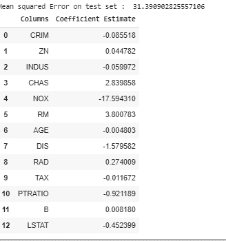

让我们使用 matplotlib 绘图库绘制上述系数的条形图。

## 蟒蛇 3

```
# plotting the coefficient score
fig, ax = plt.subplots(figsize =(20, 10))

color =['tab:gray', 'tab:blue', 'tab:orange',
'tab:green', 'tab:red', 'tab:purple', 'tab:brown',
'tab:pink', 'tab:gray', 'tab:olive', 'tab:cyan',
'tab:orange', 'tab:green', 'tab:blue', 'tab:olive']

ax.bar(lreg_coefficient["Columns"],
lreg_coefficient['Coefficient Estimate'],
color = color)

ax.spines['bottom'].set_position('zero')

plt.style.use('ggplot')
plt.show()
```

**输出:**

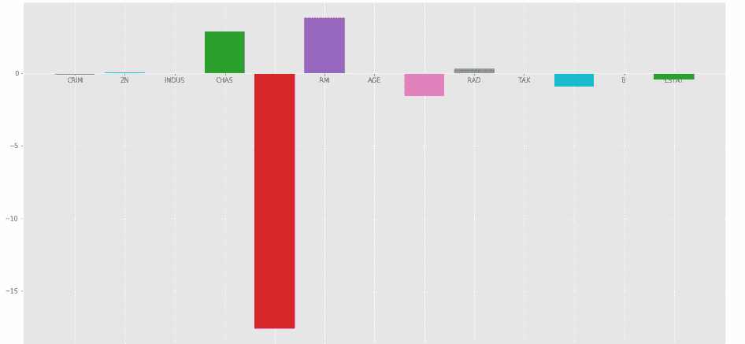

正如我们可以观察到的，许多变量都有一个无关紧要的系数，这些系数对模型的贡献不大，需要调整甚至消除其中的一些变量。

**岭回归:**
岭回归在普通最小二乘误差函数中增加了一个正则化变量系数值的项。这个项是系数的平方和乘以参数。增加这个项的目的是惩罚与目标变量不太相关的系数对应的变量。这个术语叫做 **L <sub>2</sub>** 正则化。
**代码:Python 代码使用岭回归**

## 蟒蛇 3

```
# import ridge regression from sklearn library
from sklearn.linear_model import Ridge

# Train the model
ridgeR = Ridge(alpha = 1)
ridgeR.fit(x_train, y_train)
y_pred = ridgeR.predict(x_test)

# calculate mean square error
mean_squared_error_ridge = np.mean((y_pred - y_test)**2)
print(mean_squared_error_ridge)

# get ridge coefficient and print them
ridge_coefficient = pd.DataFrame()
ridge_coefficient["Columns"]= x_train.columns
ridge_coefficient['Coefficient Estimate'] = pd.Series(ridgeR.coef_)
print(ridge_coefficient)
```

**输出:**均方误差值和带脊线系数的数据帧。

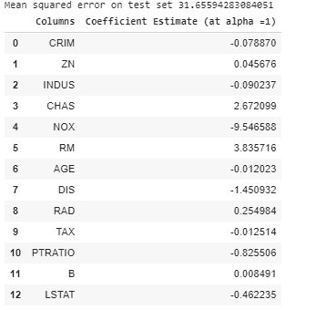

上述数据的柱状图为:

[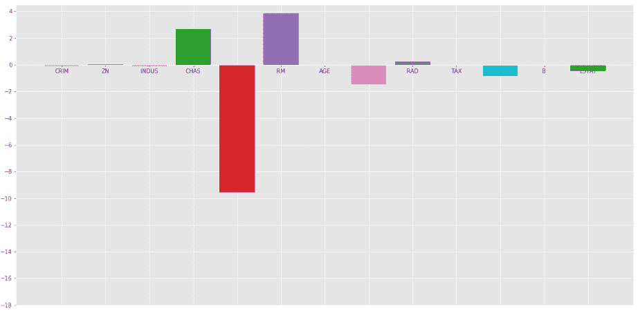](https://media.geeksforgeeks.org/wp-content/uploads/20200228165206/rigdgeatAlpha1.png)

处的岭回归=1

在上图中，我们取 = 1。
我们来看看另一个带有 = 10
的酒吧地块

[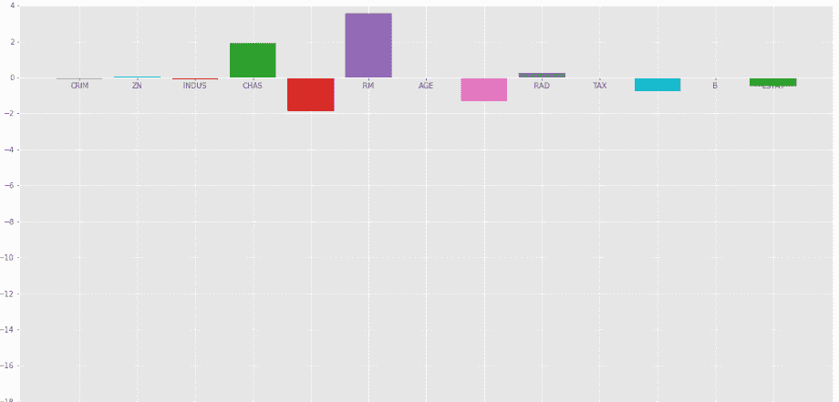](https://media.geeksforgeeks.org/wp-content/uploads/20200228170029/ridgeatalpha10.png)

处的岭回归= 10

从上面的图中我们可以观察到有助于正则化系数，使它们更快收敛。
请注意，上面的图表可能会误导人，因为它显示一些系数变为零。在岭正则化中，系数永远不能为 0，它们太小，无法在上面的图中观察到。

**套索回归:**
套索回归类似于岭回归，只是这里我们用系数的平均绝对值代替了均方值。与岭回归不同，套索回归可以通过将其系数值降低到 0 来完全消除变量。我们给普通最小二乘(OLS)增加的新术语叫做**L<sub>1</sub>T10】正则化。
**代码:实现套索回归的 Python 代码**** 

## 蟒蛇 3

```
# import Lasso regression from sklearn library
from sklearn.linear_model import Lasso

# Train the model
lasso = Lasso(alpha = 1)
lasso.fit(x_train, y_train)
y_pred1 = lasso.predict(x_test)

# Calculate Mean Squared Error
mean_squared_error = np.mean((y_pred1 - y_test)**2)
print("Mean squared error on test set", mean_squared_error)
lasso_coeff = pd.DataFrame()
lasso_coeff["Columns"] = x_train.columns
lasso_coeff['Coefficient Estimate'] = pd.Series(lasso.coef_)

print(lasso_coeff)
```

**输出:**均方误差值和带有套索系数的数据帧。

[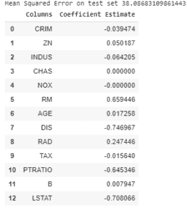](https://media.geeksforgeeks.org/wp-content/uploads/20200228175828/lassowithalpaha11.png)

套索回归 = 1

上述系数的柱状图:

[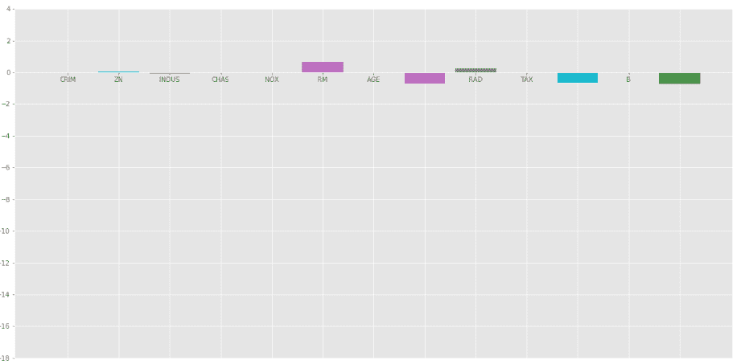](https://media.geeksforgeeks.org/wp-content/uploads/20200228173913/lassowithalpha1.png)

套索回归 =1

当我们增加的值时，套索回归给出了与岭回归相同的结果。再来看看 = 10 的另一个剧情。

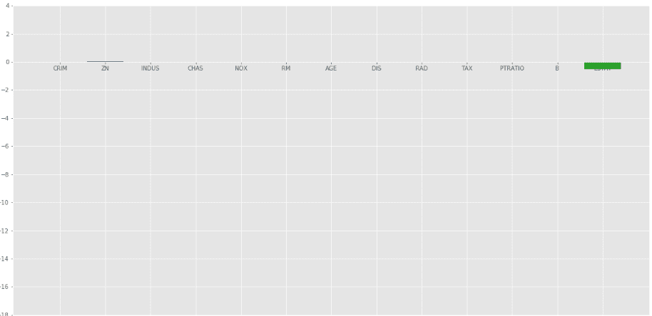

**弹性网:**
在弹性网正则化中，我们加入了 L <sub>1</sub> 和 L <sub>2</sub> 两个项，得到最终的损失函数。这就导致我们减少了以下损耗函数:
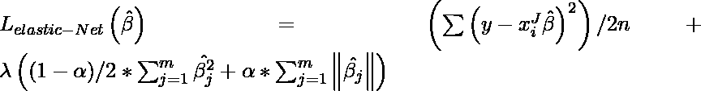
，其中在 0 和 1 之间。当 = 1 时，将罚项减为 L <sub>1</sub> 罚项，若 = 0，将罚项减为 L <sub>2</sub> 
罚项。
**代码:实现弹性网的 Python 代码**

## 蟒蛇 3

```
# import model
from sklearn.linear_model import ElasticNet

# Train the model
e_net = ElasticNet(alpha = 1)
e_net.fit(x_train, y_train)

# calculate the prediction and mean square error
y_pred_elastic = e_net.predict(x_test)
mean_squared_error = np.mean((y_pred_elastic - y_test)**2)
print("Mean Squared Error on test set", mean_squared_error)

e_net_coeff = pd.DataFrame()
e_net_coeff["Columns"] = x_train.columns
e_net_coeff['Coefficient Estimate'] = pd.Series(e_net.coef_)
e_net_coeff
```

**输出:**

<figure class="image">

<figcaption>Elastic_Net</figcaption>

</figure>

**上述系数的柱状图:**

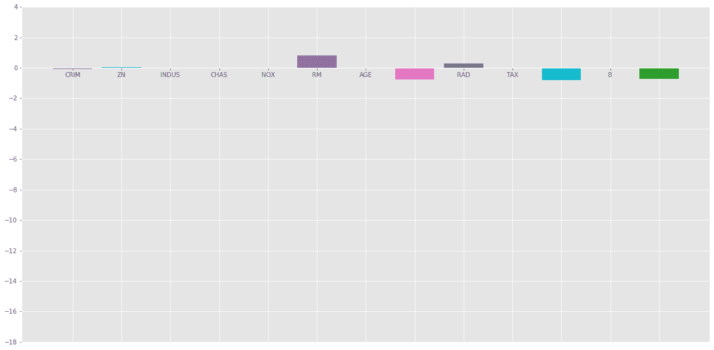

**结论:**
从以上分析我们可以得出以下关于不同正则化方法的结论:

*   正则化用于通过向损失函数添加惩罚项来减少对任何特定独立变量的依赖。这个术语防止自变量的系数取极值。

*   岭回归在损失函数中加入 L <sub>2</sub> 正则化惩罚项。这个项减少了系数，但没有使它们为 0，因此没有完全消除任何独立变量。它可以用来衡量不同自变量的影响。

*   Lasso 回归将 L <sub>1</sub> 正则化惩罚项加入损失函数。这一项减少了系数，使其为 0，从而有效地完全消除了相应的自变量。它可以用于特征选择等。

*   弹性网是上述两种正则化的组合。它包含 L <sub>1</sub> 和 L <sub>2</sub> 作为其惩罚项。在大多数测试用例中，它的性能优于岭回归和套索回归。