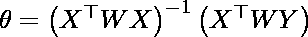
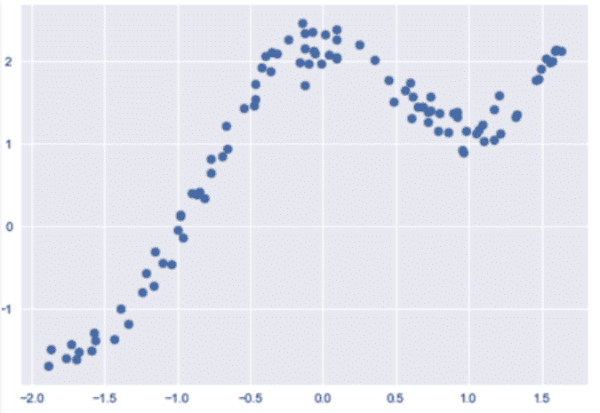

# 局部加权线性回归的实现

> 原文:[https://www . geeksforgeeks . org/局部加权线性回归的实现/](https://www.geeksforgeeks.org/implementation-of-locally-weighted-linear-regression/)

黄土或 [LOWESS](https://www.geeksforgeeks.org/ml-locally-weighted-linear-regression/) 是非参数回归方法，在基于 k 最近邻的元模型中组合多个回归模型。黄土结合了线性最小二乘回归的简单性和非线性回归的灵活性。它通过将简单的模型拟合到数据的局部子集来建立一个函数，逐点描述数据的变化。

*   该算法用于在特征之间存在非线性关系时进行预测。
*   局部加权线性回归是一种监督学习算法。
*   它是非参数算法。
*   完成不存在培训阶段。所有工作都是在测试阶段/进行预测时完成的。

假设我们想要在某个查询点 x 评估假设函数 h。对于线性回归，我们将执行以下操作:


】对于局部加权线性回归，我们将改为执行以下操作:


其中 w(i)是与训练点 x(i)相关联的非负“权重”。位于 x 附近的训练集中的点比远离 x 的点具有更高的“偏好”。因此，对于更靠近查询点 x 的 x(i)，w(i)的值大，而对于远离 x 的 x(i)，w(i)的值小。
w(i)可选择为–

直接使用**闭形解**查找参数-

**代码:导入库:**

## 大蟒

```py
import numpy as np
import matplotlib.pyplot as plt
import pandas as pd

plt.style.use("seaborn")
```

**代码:加载数据:**

## 大蟒

```py
# Loading CSV files from local storage
dfx = pd.read_csv('weightedX_LOWES.csv')
dfy = pd.read_csv('weightedY_LOWES.csv')
# Getting data from DataFrame Object and storing in numpy n-dim arrays
X = dfx.values
Y = dfy.values
```

**输出:**



**代码:计算权重矩阵的函数:**

## 大蟒

```py
# function to calculate W weight diagonal Matrix used in calculation of predictions
def get_WeightMatrix_for_LOWES(query_point, Training_examples, Bandwidth):
  # M is the No of training examples
  M = Training_examples.shape[0]
  # Initialising W with identity matrix
  W = np.mat(np.eye(M))
  # calculating weights for query points
  for i in range(M):
    xi = Training_examples[i]
    denominator = (-2 * Bandwidth * Bandwidth)
    W[i, i] = np.exp(np.dot((xi-query_point), (xi-query_point).T)/denominator)
    return W
```

**代码:进行预测:**

## 大蟒

```py
# function to make predictions
def predict(training_examples, Y, query_x, Bandwidth):
  M = Training_examples.shape[0]
  all_ones = np.ones((M, 1))
  X_ = np.hstack((training_examples, all_ones))
  qx = np.mat([query_x, 1])
  W = get_WeightMatrix_for_LOWES(qx, X_, Bandwidth)
  # calculating parameter theta
  theta = np.linalg.pinv(X_.T*(W * X_))*(X_.T*(W * Y))
  # calculating predictions
  pred = np.dot(qx, theta)
  return theta, pred
```

**代码:可视化预测:**

## 大蟒

```py
# visualise predicted values with respect
# to original target values

Bandwidth = 0.1
X_test = np.linspace(-2, 2, 20)
Y_test = []
for query in X_test:
  theta, pred = predict(X, Y, query, Bandwidth)
  Y_test.append(pred[0][0])
horizontal_axis = np.array(X)
vertical_axis = np.array(Y)
plt.title("Tau / Bandwidth Param %.2f"% Bandwidth)
plt.scatter(horizontal_axis, vertical_axis)
Y_test = np.array(Y_test)
plt.scatter(X_test, Y_test, color ='red')
plt.show()
```

