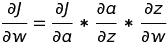

# 使用 Python 从头开始实现逻辑回归

> 原文:[https://www . geeksforgeeks . org/实现-逻辑回归-从头开始-使用-python/](https://www.geeksforgeeks.org/implementation-of-logistic-regression-from-scratch-using-python/)

#### 导言:

逻辑回归是一种有监督的学习算法，在目标变量是分类的时候使用。线性回归的假设函数 h(x)预测无界值。但是在逻辑回归的情况下，目标变量是分类的，我们必须严格控制预测值的范围。考虑一个分类问题，我们需要对电子邮件是否是垃圾邮件进行分类。因此，这里不能使用线性回归的假设函数来预测，因为它预测的是自由值，但我们必须预测 0 或 1。

为此，我们将 sigmoid 激活函数应用于线性回归的假设函数。逻辑回归的假设函数如下:

```
h( x ) = sigmoid( wx + b )

Here, w is the weight vector.
x is the feature vector. 
b is the bias.

sigmoid( z ) = 1 / ( 1 + e( - z ) )

```

#### 数学直觉:

线性回归的成本函数(或均方误差)不能用于逻辑回归，因为它是权重的非凸函数。像梯度下降这样的优化算法只能将凸函数收敛到全局最小值。

所以，我们使用的简化成本函数:

```
J = - ylog( h(x) ) - ( 1 - y )log( 1 - h(x) )

here, y is the real target value

h( x ) = sigmoid( wx + b )

For y = 0,

J = - log( 1 - h(x) )

and y = 1,

J = - log( h(x) )

```

这个代价函数是因为我们训练的时候，需要通过最小化损失函数来最大化概率。

**梯度下降计算:**

```
repeat until convergence  {
       tmpi = wi - alpha * dwi
       wi = tmpi         
}
where alpha is the learning rate.

```

链式法则用于计算梯度，例如 dw。



dw 的链规则

```
here, a = sigmoid( z ) and z = wx + b.

```

#### 实施:

本次实施使用的糖尿病数据集可从[链接](https://github.com/mohit-baliyan/References)下载。

它有 8 个特征栏，如“*年龄*”、“*葡萄糖*”心电图，以及 108 名患者的目标变量“结果”。因此，在本文中，我们将训练一个逻辑回归分类器模型来预测有这种信息的患者是否存在糖尿病。

```
# Importing libraries
import numpy as np
import pandas as pd
from sklearn.model_selection import train_test_split
import warnings
warnings.filterwarnings( "ignore" )

# to compare our model's accuracy with sklearn model
from sklearn.linear_model import LogisticRegression
# Logistic Regression
class LogitRegression() :
    def __init__( self, learning_rate, iterations ) :        
        self.learning_rate = learning_rate        
        self.iterations = iterations

    # Function for model training    
    def fit( self, X, Y ) :        
        # no_of_training_examples, no_of_features        
        self.m, self.n = X.shape        
        # weight initialization        
        self.W = np.zeros( self.n )        
        self.b = 0        
        self.X = X        
        self.Y = Y

        # gradient descent learning

        for i in range( self.iterations ) :            
            self.update_weights()            
        return self

    # Helper function to update weights in gradient descent

    def update_weights( self ) :           
        A = 1 / ( 1 + np.exp( - ( self.X.dot( self.W ) + self.b ) ) )

        # calculate gradients        
        tmp = ( A - self.Y.T )        
        tmp = np.reshape( tmp, self.m )        
        dW = np.dot( self.X.T, tmp ) / self.m         
        db = np.sum( tmp ) / self.m 

        # update weights    
        self.W = self.W - self.learning_rate * dW    
        self.b = self.b - self.learning_rate * db

        return self

    # Hypothetical function  h( x ) 

    def predict( self, X ) :    
        Z = 1 / ( 1 + np.exp( - ( X.dot( self.W ) + self.b ) ) )        
        Y = np.where( Z > 0.5, 1, 0 )        
        return Y

# Driver code

def main() :

    # Importing dataset    
    df = pd.read_csv( "diabetes.csv" )
    X = df.iloc[:,:-1].values
    Y = df.iloc[:,-1:].values

    # Splitting dataset into train and test set
    X_train, X_test, Y_train, Y_test = train_test_split(
      X, Y, test_size = 1/3, random_state = 0 )

    # Model training    
    model = LogitRegression( learning_rate = 0.01, iterations = 1000 )

    model.fit( X_train, Y_train )    
    model1 = LogisticRegression()    
    model1.fit( X_train, Y_train)

    # Prediction on test set
    Y_pred = model.predict( X_test )    
    Y_pred1 = model1.predict( X_test )

    # measure performance    
    correctly_classified = 0    
    correctly_classified1 = 0

    # counter    
    count = 0    
    for count in range( np.size( Y_pred ) ) :  

        if Y_test[count] == Y_pred[count] :            
            correctly_classified = correctly_classified + 1

        if Y_test[count] == Y_pred1[count] :            
            correctly_classified1 = correctly_classified1 + 1

        count = count + 1

    print( "Accuracy on test set by our model       :  ", ( 
      correctly_classified / count ) * 100 )
    print( "Accuracy on test set by sklearn model   :  ", ( 
      correctly_classified1 / count ) * 100 )

if __name__ == "__main__" :     
    main()
```

#### 输出:

```
Accuracy on test set by our model       :   58.333333333333336
Accuracy on test set by sklearn model   :   61.111111111111114

```

**注:**以上训练的模型是为了实现数学直觉，而不仅仅是为了提高精度。