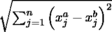
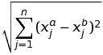
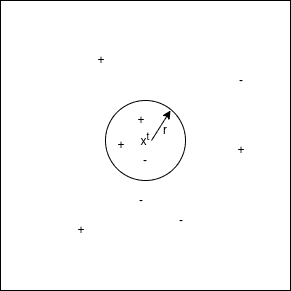

# 在 Python 中从头开始实现半径邻居

> 原文:[https://www . geeksforgeeks . org/实现-半径邻居-从-sratch-in-python/](https://www.geeksforgeeks.org/implementation-of-radius-neighbors-from-sratch-in-python/)

Radius 邻居也是基于实例学习的技术之一。基于实例学习的模型超越了训练实例。为此，他们首先存储培训示例。当它遇到一个新实例(或测试实例)时，它们立即在存储的训练实例和这个新实例之间建立关系，为这个新实例分配一个目标函数值。基于实例的方法有时被称为懒惰学习方法，因为它们推迟学习，直到遇到新的实例进行预测。

这些方法不是对整个空间估计一次假设函数(或目标函数)，而是对每个要预测的新实例进行局部和不同的估计。

#### 半径邻居分类器:

基本假设

1.  所有实例都对应于 n 维空间中的点，其中 n 表示任何实例中的特征数量。
2.  实例的邻居是根据欧几里得距离定义的。

```
An instance can be represented by < x1, x2, .............., xn >.
Euclidean distance between two instances xa and xb is given by d( xa, xb ) : 
```





欧几里得距离

**它是如何工作的？**

半径邻居分类器首先存储训练示例。在预测过程中，当遇到要预测的新实例(或测试实例)时，它会从测试实例中心 *r* 的固定半径内的训练实例中找到邻居的数量，其中 r 是用户指定的浮点值。然后将该半径内训练实例中最常见的类分配给测试实例。

r 的最佳选择是验证测试数据的误差。



半径邻域分类图形表示

在上图中，“+”表示标记为 1 的训练实例。“-”表示带有 0 的训练实例。在这里，我们将测试实例 xt 分类为这个循环中训练实例中最常见的类。这里，r 是用户指定的选项。上图中，圆圈内正例居多，所以 x <sup>t</sup> 归类为“+”或 1。

#### 伪代码:

1.  存储所有培训实例。
2.  对每个测试实例重复步骤 3、4 和 5。
3.  从位于测试实例中心的 *r* 固定半径内的训练实例中查找邻居的数量。
4.  *y_pred* 对于当前测试示例=一个圆内的训练实例中最常见的类。
5.  转到步骤 2。

#### 履行

本次实施使用的糖尿病数据集可从[链接](https://github.com/mohit baliyan/References)下载。

它有 8 个特征栏，如“年龄”、“血糖”心电图和 108 名患者的目标变量“结果”。因此，在本文中，我们将创建一个 K 近邻分类器模型来预测有这种信息的患者是否患有糖尿病。

## 蟒蛇 3

```
# Importing libraries

import pandas as pd

import numpy as np

from sklearn.model_selection import train_test_split

from scipy.stats import mode

from sklearn.neighbors import RadiusNeighborsClassifier

# Radius Nearest Neighbors Classification

class Radius_Nearest_Neighbors_Classifier() :

    def __init__( self, r ) :

        self.r = r

    # Function to store training set

    def fit( self, X_train, Y_train ) :

        self.X_train = X_train

        self.Y_train = Y_train

        # no_of_training_examples, no_of_features

        self.m, self.n = X_train.shape

    # Function for prediction

    def predict( self, X_test ) :

        self.X_test = X_test

        # no_of_test_examples, no_of_features

        self.m_test, self.n = X_test.shape

        # initialize Y_predict

        Y_predict = np.zeros( self.m_test )

        for i in range( self.m_test ) :

            x = self.X_test[i]

            # find the number of neighbors within a fixed
            # radius r of current training example

            neighbors = self.find_neighbors( x )

            # most frequent class in the circle drawn by current
            # training example of fixed radius r

            Y_predict[i] = mode( neighbors )[0][0]

        return Y_predict

    # Function to find the number of neighbors within a fixed radius
    # r of current training example

    def find_neighbors( self, x ) :

        # list to store training examples which will fall in the circle

        inside = []

        for i in range( self.m ) :

            d = self.euclidean( x, self.X_train[i] )

            if d <= self.r :

                inside.append( self.Y_train[i] )

        inside_array = np.array( inside )

        return inside_array

    # Function to calculate euclidean distance

    def euclidean( self, x, x_train ) :

        return np.sqrt( np.sum( np.square( x - x_train ) ) )

 # driver code

def main() :

    # Create dataset

    df = pd.read_csv( "diabetes.csv" )

    X = df.iloc[:,:-1].values

    Y = df.iloc[:,-1:].values

    # Splitting dataset into train and test set

    X_train, X_test, Y_train, Y_test = train_test_split(
      X, Y, test_size = 1/3, random_state = 0 )

    # Model training

    model = Radius_Nearest_Neighbors_Classifier( r = 550 )

    model.fit( X_train, Y_train )

    model1 = RadiusNeighborsClassifier( radius = 550 )

    model1.fit( X_train, Y_train )

    # Prediction on test set

    Y_pred = model.predict( X_test )

    Y_pred1 = model1.predict( X_test )

    # measure performance

    correctly_classified = 0

    correctly_classified1 = 0

    # counter

    count = 0

    for count in range( np.size( Y_pred ) ) :

        if Y_test[count] == Y_pred[count] :

            correctly_classified = correctly_classified + 1

        if Y_test[count] == Y_pred1[count] :

            correctly_classified1 = correctly_classified1 + 1

        count = count + 1

    print("Accuracy on test set by our model     : ", (
      correctly_classified / count ) * 100 )

    print("Accuracy on test set by sklearn model : ", (
      correctly_classified / count ) * 100 )

if __name__ == "__main__" :

    main()
```

#### 输出:

```
Accuracy on test set by our model     :  61.111111111111114
Accuracy on test set by sklearn model :  61.111111111111114
```

我们的模型和 sklearn 达到的精度是相等的，这表明我们模型的正确实现。

**注:**以上实现是为了从头开始创建模型，不是为了提高糖尿病数据集的精度。

#### 半径邻居回归器:

半径邻居回归器首先存储训练示例。在预测过程中，当遇到要预测的新实例(或测试实例)时，它会从测试实例中心 **r** 的固定半径内的训练实例中找到邻居的数量，其中 r 是用户指定的浮点值。然后将该半径内训练实例的平均值分配给测试实例。

r 的最佳选择是验证测试数据的误差。

#### 伪代码:

1.  存储所有培训实例。
2.  对每个测试实例重复步骤 3、4 和 5。
3.  从位于测试实例中心的 **r** 固定半径内的训练实例中查找邻居的数量。
4.  当前测试示例的 y _ pred 一个圆内训练实例的平均值。
5.  转到步骤 2。

#### 实施:

本实现使用的数据集可以从[链接](https://github.com/mohit-baliyan/References)下载。

它有两栏—“T0”年经验“T2】工资”一个公司 30 个员工。因此，在本文中，我们将创建一个 Radius 邻居回归模型，以了解每个员工的经验年限与其各自工资之间的相关性。

我们创建的模型预测的值与 sklearn 模型为测试集预测的值相同。

**代码:**

## 蟒蛇 3

```
# Importing libraries

import pandas as pd
import numpy as np
from sklearn.model_selection import train_test_split
from sklearn.neighbors import RadiusNeighborsRegressor

# Radius Nearest Neighbors Regression

class Radius_Nearest_Neighbors_Regression() :

    def __init__( self, r ) :

        self.r = r

    # Function to store training set

    def fit( self, X_train, Y_train ) :

        self.X_train = X_train

        self.Y_train = Y_train

        # no_of_training_examples, no_of_features

        self.m, self.n = X_train.shape

    # Function for prediction

    def predict( self, X_test ) :

        self.X_test = X_test

        # no_of_test_examples, no_of_features

        self.m_test, self.n = X_test.shape

        # initialize Y_predict

        Y_predict = np.zeros( self.m_test )

        for i in range( self.m_test ) :

            x = self.X_test[i]

            # find the number of neighbors within a fixed
            # radius r of current training example

            neighbors = self.find_neighbors( x )

            # mean of the neighbors in the circle drawn by
            # current training example of fixed radius r

            Y_predict[i] = np.mean( neighbors )

        return Y_predict

    # Function to find the number of neighbors within a fixed
    # radius r of current training example

    def find_neighbors( self, x ) :

        # list to store training examples which will fall in the circle

        inside = []

        for i in range( self.m ) :

            d = self.euclidean( x, self.X_train[i] )

            if d <= self.r :

                inside.append( self.Y_train[i] )

        inside_array = np.array( inside )

        return inside_array

    # Function to calculate euclidean distance

    def euclidean( self, x, x_train ) :

        return np.sqrt( np.sum( np.square( x - x_train ) ) )

# driver code

def main() :

    # Importing dataset

    df = pd.read_csv( "salary_data.csv" )

    X = df.iloc[:,:-1].values

    Y = df.iloc[:,1].values

    # Splitting dataset into train and test set

    X_train, X_test, Y_train, Y_test = train_test_split(
      X, Y, test_size = 1/3, random_state = 0 )

    # Model training

    model = Radius_Nearest_Neighbors_Regression( r = 550 )

    model.fit( X_train, Y_train )

    model1 = RadiusNeighborsRegressor( radius = 550 )

    model1.fit( X_train, Y_train )

    # Prediction on test set

    Y_pred = model.predict( X_test )

    Y_pred1 = model1.predict( X_test )

    print( "Real values                         : ", Y_test[:3] )

    print( "Predicted values by our model       : ", np.round( Y_pred[:3], 2 ) )

    print( "Predicted values by sklearn model   : ", np.round( Y_pred1[:3], 2 ) )

if __name__ == "__main__" :

    main()
```

**输出:**

```
Real values                         :  [ 37731 122391  57081]
Predicted values by our model       :  [71022.5 71022.5 71022.5]
Predicted values by sklearn model   :  [71022.5 71022.5 71022.5]
```