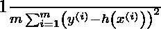
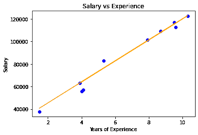

# 使用 Python 从头开始实现岭回归

> 原文:[https://www . geeksforgeeks . org/使用 python 从头开始实现岭回归/](https://www.geeksforgeeks.org/implementation-of-ridge-regression-from-scratch-using-python/)

**先决条件:**

1.  线性回归
2.  梯度下降

**简介:**
岭回归(或 L2 正则化)是线性回归的变种。在线性回归中，它最小化残差平方和(或 RSS 或成本函数)，以尽可能完美地拟合训练示例。成本函数也用`J`表示。

**线性回归的成本函数:**

<center></center>

这里，`h(x<sup>(i)</sup>)`代表用于预测的假设函数。`y<sup>(i)</sup>` 代表目标变量值，例如。
`m`是给定数据集中训练示例的总数。

线性回归平等地对待所有特征，并找到无偏权重以最小化成本函数。这可能会出现过度拟合的问题(或者模型在新数据上表现不佳)。线性回归也不能处理共线数据(共线是指特征高度相关时的事件)。简而言之，线性回归是一个高方差的模型。所以，岭回归来拯救。在岭回归中，线性回归的成本函数中增加了 l2 惩罚(权重大小的平方)。这样做是为了使模型不会过度填充数据。岭回归的修正成本函数如下:

<center>![$\frac{1}{m}\left[\sum_{i=1}^{m}\left(y^{(i)}-h\left(x^{(i)}\right)\right)^{2}+\lambda \sum_{j=1}^{n} w_{j}^{2}\right]$](img/c742af4e356a28069d20869ecc54ff1f.png "Rendered by QuickLaTeX.com")</center>

这里，`w<sub>j</sub>`代表 jth 特征的权重。
`n`是数据集中要素的数量。

**数学直觉:**
在对其代价函数进行梯度下降优化时，加入`l2`惩罚项导致模型的权值降至零或接近零。由于权重的惩罚，我们的假设变得更简单，更一般化，更不容易过度拟合。所有权重都减少了相同的因子λ。我们可以通过超参数λ来控制正则化的强度。

调谐λ值的不同情况。

1.  如果λ设置为 0，岭回归等于线性回归
2.  如果λ设置为无穷大，则所有权重都将收缩为零。

所以，我们应该把λ设置在 0 到无穷大之间。

**从零开始实施:**
该实施中使用的数据集可以从[链接](https://github.com/mohit-baliyan/References)
下载，它有 2 列—“T6”年经验“T8”工资一个公司 30 名员工。因此，在本文中，我们将训练一个岭回归模型来学习每个员工的经验年限和他们各自的工资之间的相关性。一旦模型得到训练，我们将能够根据员工的多年经验来预测他的工资。

**代码:**

```
# Importing libraries

import numpy as np
import pandas as pd
from sklearn.model_selection import train_test_split
import matplotlib.pyplot as plt

# Ridge Regression

class RidgeRegression() :

    def __init__( self, learning_rate, iterations, l2_penality ) :

        self.learning_rate = learning_rate        
        self.iterations = iterations        
        self.l2_penality = l2_penality

    # Function for model training            
    def fit( self, X, Y ) :

        # no_of_training_examples, no_of_features        
        self.m, self.n = X.shape

        # weight initialization        
        self.W = np.zeros( self.n )

        self.b = 0        
        self.X = X        
        self.Y = Y

        # gradient descent learning

        for i in range( self.iterations ) :            
            self.update_weights()            
        return self

    # Helper function to update weights in gradient descent

    def update_weights( self ) :           
        Y_pred = self.predict( self.X )

        # calculate gradients      
        dW = ( - ( 2 * ( self.X.T ).dot( self.Y - Y_pred ) ) +               
               ( 2 * self.l2_penality * self.W ) ) / self.m     
        db = - 2 * np.sum( self.Y - Y_pred ) / self.m 

        # update weights    
        self.W = self.W - self.learning_rate * dW    
        self.b = self.b - self.learning_rate * db        
        return self

    # Hypothetical function  h( x ) 
    def predict( self, X ) :    
        return X.dot( self.W ) + self.b

# Driver code

def main() :

    # Importing dataset    
    df = pd.read_csv( "salary_data.csv" )
    X = df.iloc[:, :-1].values
    Y = df.iloc[:, 1].values    

    # Splitting dataset into train and test set
    X_train, X_test, Y_train, Y_test = train_test_split( X, Y, 

                                          test_size = 1 / 3, random_state = 0 )

    # Model training    
    model = RidgeRegression( iterations = 1000,                             
                            learning_rate = 0.01, l2_penality = 1 )
    model.fit( X_train, Y_train )

    # Prediction on test set
    Y_pred = model.predict( X_test )    
    print( "Predicted values ", np.round( Y_pred[:3], 2 ) )     
    print( "Real values      ", Y_test[:3] )    
    print( "Trained W        ", round( model.W[0], 2 ) )    
    print( "Trained b        ", round( model.b, 2 ) )

    # Visualization on test set     
    plt.scatter( X_test, Y_test, color = 'blue' )    
    plt.plot( X_test, Y_pred, color = 'orange' )    
    plt.title( 'Salary vs Experience' )    
    plt.xlabel( 'Years of Experience' )    
    plt.ylabel( 'Salary' )    
    plt.show()

if __name__ == "__main__" : 
    main()
```

**输出:**

```
Predicted values  [ 40831.44 122898.14  65078.42]
Real values       [ 37731 122391  57081]
Trained W         9325.76
Trained b         26842.8

```

<center>

形象化

</center>

**Note:** Ridge regression leads to dimensionality reduction which makes it a computationally efficient model.