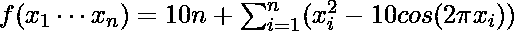
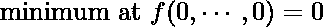
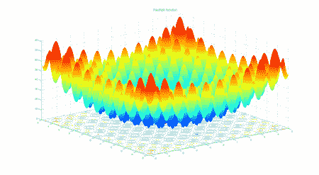
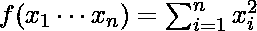
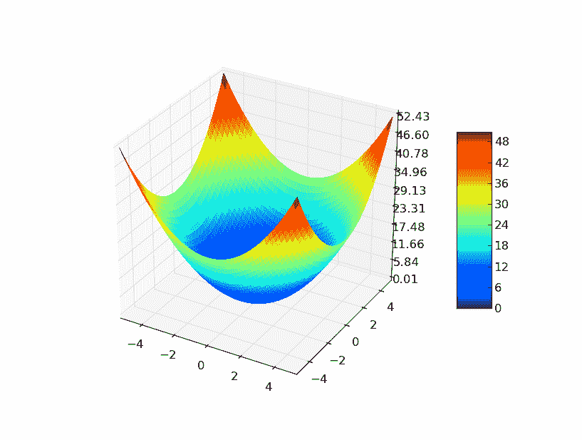

# 实施基于教学的学习优化

> 原文:[https://www . geeksforgeeks . org/实施基于教学的优化/](https://www.geeksforgeeks.org/implementation-of-teaching-learning-based-optimization/)

上一篇[基于学习的优化教学(TLBO)](https://www.geeksforgeeks.org/teaching-learning-based-optimization-tlbo/) 讲了基于学习的优化教学的启示，它的数学建模和算法。在本文中，我们将针对两个适应度函数 1) [拉斯特金函数](https://en.wikipedia.org/wiki/Rastrigin_function#:~:text=In%20mathematical%20optimization%2C%20the%20Rastrigin,has%20been%20generalized%20by%20Rudolph.) 2)球面函数实现基于教学学习的优化。该算法将运行预定次数的最大迭代，并试图找到这些适应度函数的最小值。

## 健身功能

### 1) [Rastrigin 功能](https://en.wikipedia.org/wiki/Rastrigin_function#:~:text=In%20mathematical%20optimization%2C%20the%20Rastrigin,has%20been%20generalized%20by%20Rudolph.)

Rastrigin 函数是一个非凸函数，经常被用作优化算法的性能测试问题。

#### 函数方程:







图 1:两个变量的 Rastrigin 函数

对于优化算法来说，rastrigin 函数是一个非常具有挑战性的函数。它的复杂行为导致优化算法经常陷入局部极小值。平面上有很多余弦振荡会给这个函数带来复杂的行为。

### 2)球面函数

球面函数是评估优化算法性能的标准函数。

#### 函数方程:






图 2:两个变量的球函数

## 超参数的选择

### 问题参数:

*   尺寸数量( **d** ) = 3
*   下限( **minx** ) = -10.0
*   上限( **maxx** ) = 10.0

### 算法的超参数:

*   粒子数( **N** ) = 50
*   最大迭代次数( **max_iter** ) = 100

### 输入

*   健身功能
*   问题参数(如上所述)
*   群体大小( **N** )和最大迭代次数( **max_iter** )
*   算法特定超参数(基于教学的优化中无)

## 伪代码

基于教-学的优化的伪代码已经在[之前的文章](https://www.geeksforgeeks.org/teaching-learning-based-optimization-tlbo/#:~:text=Inspiration%20of%20the%20algorithm%3A,in%202011.)中描述过了。还讨论了存储学生的数据结构以及存储特定于学生个人的数据的数据结构。

## 履行

## 蟒蛇 3

```
# python implementation of Teaching learning based optimization (TLBO)
# minimizing rastrigin and sphere function

import random
import math    # cos() for Rastrigin
import copy    # array-copying convenience
import sys     # max float

#-------fitness functions---------

# rastrigin function
def fitness_rastrigin(position):
  fitness_value = 0.0
  for i in range(len(position)):
    xi = position[i]
    fitness_value += (xi * xi) - (10 * math.cos(2 * math.pi * xi)) + 10
  return fitness_value

#sphere function
def fitness_sphere(position):
    fitness_value = 0.0
    for i in range(len(position)):
        xi = position[i]
        fitness_value += (xi*xi);
    return fitness_value;
#-------------------------

#Student class
class Student:
  def __init__(self, fitness, dim, minx, maxx, seed):
    self.rnd = random.Random(seed)

    # a list of size dim
    # with 0.0 as value of all the elements
    self.position = [0.0 for i in range(dim)]

    # loop dim times and randomly select value of decision var
    # value should be in between minx and maxx
    for i in range(dim):
      self.position[i] = ((maxx - minx) *
        self.rnd.random() + minx)

    # compute the fitness of student
    self.fitness = fitness(self.position)

# Teaching learning based optimization
def tlbo(fitness, max_iter, n, dim, minx, maxx):
  rnd = random.Random(0)

  # create n random students
  classroom = [Student(fitness, dim, minx, maxx, i) for i in range(n)]

  # compute the value of best_position and best_fitness in the classroom
  Xbest = [0.0 for i in range(dim)]
  Fbest = sys.float_info.max       

  for i in range(n): # check each Student
    if classroom[i].fitness < Fbest:
      Fbest = classroom[i].fitness
      Xbest = copy.copy(classroom[i].position)

  # main loop of tlbo
  Iter = 0
  while Iter < max_iter:

    # after every 10 iterations
    # print iteration number and best fitness value so far
    if Iter % 10 == 0 and Iter > 1:
      print("Iter = " + str(Iter) + " best fitness = %.3f" % Fbest)

    # for each student of classroom
    for i in range(n):

      ### Teaching phase of ith student

      # compute the mean of all the students in the class
      Xmean = [0.0 for i in range(dim)]
      for k in range(n):
          for j in range(dim):
              Xmean[j]+= classroom[k].position[j]

      for j in range(dim):
          Xmean[j]/= n;

      # initialize new solution
      Xnew = [0.0 for i in range(dim)]

      # teaching factor (TF)
      # either 1 or 2 ( randomly chosen)
      TF = random.randint(1, 3)

      # best student of the class is teacher
      Xteacher = Xbest

      # compute new solution
      for j in range(dim):
          Xnew[j] = classroom[i].position[j] + rnd.random()*(Xteacher[j] - TF*Xmean[j])

      # if Xnew < minx OR Xnew > maxx
      # then clip it
      for j in range(dim):
          Xnew[j] = max(Xnew[j], minx)
          Xnew[j] = min(Xnew[j], maxx)

      # compute fitness of new solution
      fnew = fitness(Xnew)

      # if new solution is better than old
      # replace old with new solution
      if(fnew < classroom[i].fitness):
          classroom[i].position = Xnew
          classroom[i].fitness = fnew

      # update best student
      if(fnew < Fbest):
          Fbest = fnew
          Xbest = Xnew

      ### learning phase of ith student

      # randomly choose a solution from classroom
      # chosen solution should not be ith student
      p = random.randint(0, n-1)
      while(p==i):
          p = random.randint(0, n-1)

      # partner solution
      Xpartner = classroom[p]

      Xnew = [0.0 for i in range(dim)]
      if(classroom[i].fitness < Xpartner.fitness):
          for j in range(dim):
              Xnew[j] = classroom[i].position[j] + rnd.random()*(classroom[i].position[j] - Xpartner.position[j])
      else:
          for j in range(dim):
              Xnew[j] = classroom[i].position[j] - rnd.random()*(classroom[i].position[j] - Xpartner.position[j])

      # if Xnew < minx OR Xnew > maxx
      # then clip it
      for j in range(dim):
          Xnew[j] = max(Xnew[j], minx)
          Xnew[j] = min(Xnew[j], maxx)

      # compute fitness of new solution
      fnew = fitness(Xnew)

      # if new solution is better than old
      # replace old with new solution
      if(fnew < classroom[i].fitness):
          classroom[i].position = Xnew
          classroom[i].fitness = fnew

      # update best student
      if(fnew < Fbest):
          Fbest = fnew
          Xbest = Xnew

    Iter += 1
  # end-while

  # return best student from classroom
  return Xbest
# end pso

#----------------------------
# Driver code for rastrigin function

print("\nBegin  teaching learning based optimization on rastrigin function\n")
dim = 3
fitness = fitness_rastrigin

print("Goal is to minimize Rastrigin's function in " + str(dim) + " variables")
print("Function has known min = 0.0 at (", end="")
for i in range(dim-1):
  print("0, ", end="")
print("0)")

num_particles = 50
max_iter = 100

print("Setting num_particles = " + str(num_particles))
print("Setting max_iter    = " + str(max_iter))
print("\nStarting TLBO algorithm\n")

best_position = tlbo(fitness, max_iter, num_particles, dim, -10.0, 10.0)

print("\nTLBO completed\n")
print("\nBest Student found:")
print(["%.6f"%best_position[k] for k in range(dim)])
fitness_value = fitness(best_position)
print("fitness of best Student = %.6f" % fitness_value)

print("\nEnd TLBO for rastrigin function\n")

print()
print()

# Driver code for Sphere function
print("\nBegin teaching learning based optimization on sphere function\n")
dim = 3
fitness = fitness_sphere

print("Goal is to minimize sphere function in " + str(dim) + " variables")
print("Function has known min = 0.0 at (", end="")
for i in range(dim-1):
  print("0, ", end="")
print("0)")

num_particles = 50
max_iter = 100

print("Setting num_particles = " + str(num_particles))
print("Setting max_iter    = " + str(max_iter))
print("\nStarting TLBO algorithm\n")

best_position = tlbo(fitness, max_iter, num_particles, dim, -10.0, 10.0)

print("\nTLBO completed\n")
print("\nBest Student found:")
print(["%.6f"%best_position[k] for k in range(dim)])
fitness_value = fitness(best_position)
print("fitness of best Student = %.6f" % fitness_value)

print("\nEnd TLBO for sphere function\n")
```

## 输出

```
Begin  teaching learning based optimization on rastrigin function

Goal is to minimize Rastrigin's function in 3 variables
Function has known min = 0.0 at (0, 0, 0)
Setting num_particles = 50
Setting max_iter    = 100

Starting TLBO algorithm

Iter = 10 best fitness = 3.662
Iter = 20 best fitness = 0.389
Iter = 30 best fitness = 0.389
Iter = 40 best fitness = 0.389
Iter = 50 best fitness = 0.200
Iter = 60 best fitness = 0.132
Iter = 70 best fitness = 0.051
Iter = 80 best fitness = 0.003
Iter = 90 best fitness = 0.001

TLBO completed

Best Student found:
['0.000593', '-0.000040', '-0.000461']
fitness of best Student = 0.000112

End TLBO for rastrigin function

Begin teaching learning based optimization on sphere function

Goal is to minimize sphere function in 3 variables
Function has known min = 0.0 at (0, 0, 0)
Setting num_particles = 50
Setting max_iter    = 100

Starting TLBO algorithm

Iter = 10 best fitness = 0.009
Iter = 20 best fitness = 0.000
Iter = 30 best fitness = 0.000
Iter = 40 best fitness = 0.000
Iter = 50 best fitness = 0.000
Iter = 60 best fitness = 0.000
Iter = 70 best fitness = 0.000
Iter = 80 best fitness = 0.000
Iter = 90 best fitness = 0.000

TLBO completed

Best Student found:
['0.000000', '-0.000000', '-0.000000']
fitness of best Student = 0.000000

End TLBO for sphere function
```

### 参考

**研究论文:** R. V. Rao，V. J. Savsani & J. Balic (2012)基于教学-学习的无约束和有约束实参数优化问题的优化算法，工程优化，44:12，1447-1462，DOI:10.1080/0305215 x . 2011 . 652100003

**实施的启示:**https://www . mathworks . com/matlabcentral/file exchange/65628-教-学-基-优#:~:text = Teaching % 20 learning % 20 based % 20 optimization % 20 is，教师% 20 和% 20 学生% 20 阶段。