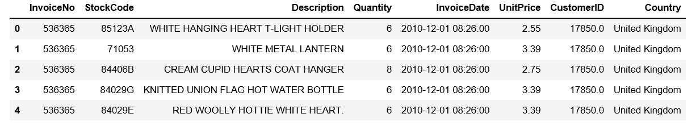
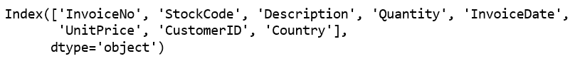
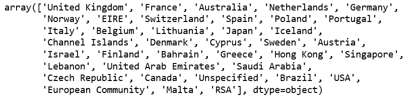
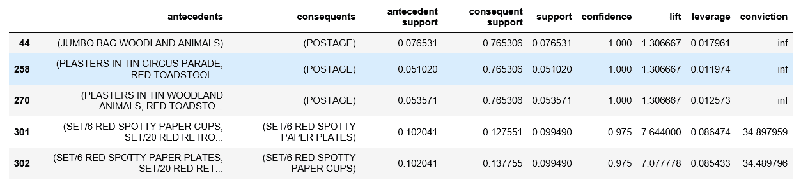
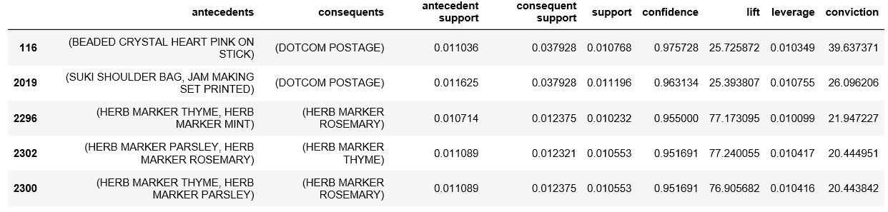
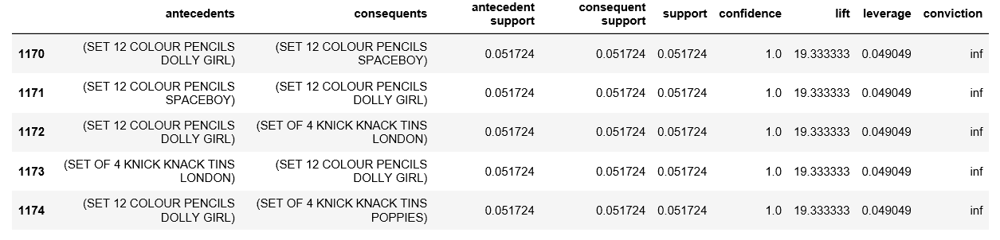
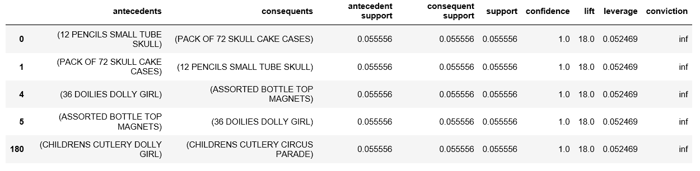

# 在 Python 中实现 Apriori 算法

> 原文:[https://www . geeksforgeeks . org/impering-apri-in-algorithm-python/](https://www.geeksforgeeks.org/implementing-apriori-algorithm-in-python/)

**先决条件:** [Apriori 算法](https://www.geeksforgeeks.org/apriori-algorithm/)
Apriori 算法是一种机器学习算法，用于洞察所涉及的不同项目之间的结构化关系。该算法最突出的实际应用是根据用户购物车中已经存在的产品推荐产品。**沃尔玛**尤其在向其用户推荐产品时大量使用了该算法。

数据集:[杂货数据](http://archive.ics.uci.edu/ml/datasets/Online+Retail)

**Python 中算法的实现:**
**第一步:导入需要的库**

## 蟒蛇 3

```py
import numpy as np
import pandas as pd
from mlxtend.frequent_patterns import apriori, association_rules
```

**第二步:加载并浏览数据**

## 蟒蛇 3

```py
# Changing the working location to the location of the file
cd C:\Users\Dev\Desktop\Kaggle\Apriori Algorithm

# Loading the Data
data = pd.read_excel('Online_Retail.xlsx')
data.head()
```



## 蟒蛇 3

```py
# Exploring the columns of the data
data.columns
```



## 蟒蛇 3

```py
# Exploring the different regions of transactions
data.Country.unique()
```



**第三步:清理数据**

## 蟒蛇 3

```py
# Stripping extra spaces in the description
data['Description'] = data['Description'].str.strip()

# Dropping the rows without any invoice number
data.dropna(axis = 0, subset =['InvoiceNo'], inplace = True)
data['InvoiceNo'] = data['InvoiceNo'].astype('str')

# Dropping all transactions which were done on credit
data = data[~data['InvoiceNo'].str.contains('C')]
```

**第四步:按交易区域拆分数据**

## 蟒蛇 3

```py
# Transactions done in France
basket_France = (data[data['Country'] =="France"]
          .groupby(['InvoiceNo', 'Description'])['Quantity']
          .sum().unstack().reset_index().fillna(0)
          .set_index('InvoiceNo'))

# Transactions done in the United Kingdom
basket_UK = (data[data['Country'] =="United Kingdom"]
          .groupby(['InvoiceNo', 'Description'])['Quantity']
          .sum().unstack().reset_index().fillna(0)
          .set_index('InvoiceNo'))

# Transactions done in Portugal
basket_Por = (data[data['Country'] =="Portugal"]
          .groupby(['InvoiceNo', 'Description'])['Quantity']
          .sum().unstack().reset_index().fillna(0)
          .set_index('InvoiceNo'))

basket_Sweden = (data[data['Country'] =="Sweden"]
          .groupby(['InvoiceNo', 'Description'])['Quantity']
          .sum().unstack().reset_index().fillna(0)
          .set_index('InvoiceNo'))
```

**步骤 5:对数据进行热编码**

## 蟒蛇 3

```py
# Defining the hot encoding function to make the data suitable
# for the concerned libraries
def hot_encode(x):
    if(x<= 0):
        return 0
    if(x>= 1):
        return 1

# Encoding the datasets
basket_encoded = basket_France.applymap(hot_encode)
basket_France = basket_encoded

basket_encoded = basket_UK.applymap(hot_encode)
basket_UK = basket_encoded

basket_encoded = basket_Por.applymap(hot_encode)
basket_Por = basket_encoded

basket_encoded = basket_Sweden.applymap(hot_encode)
basket_Sweden = basket_encoded
```

**第六步:建立模型并分析结果**T2 a)**法国:**

## 蟒蛇 3

```py
# Building the model
frq_items = apriori(basket_France, min_support = 0.05, use_colnames = True)

# Collecting the inferred rules in a dataframe
rules = association_rules(frq_items, metric ="lift", min_threshold = 1)
rules = rules.sort_values(['confidence', 'lift'], ascending =[False, False])
print(rules.head())
```



从上面的输出可以看出，纸杯和纸盘是一起在法国买的。这是因为法国人有一种每周至少和朋友家人聚会一次的文化。此外，由于法国政府禁止在国内使用塑料，人们不得不购买纸质替代品。
b) **英国:**

## 蟒蛇 3

```py
frq_items = apriori(basket_UK, min_support = 0.01, use_colnames = True)
rules = association_rules(frq_items, metric ="lift", min_threshold = 1)
rules = rules.sort_values(['confidence', 'lift'], ascending =[False, False])
print(rules.head())
```



如果对英国的交易规则再深入一点分析，可以看出英国人一起购买不同颜色的茶盘。这背后的一个原因可能是因为典型的英国人非常喜欢喝茶，经常在不同的场合收集不同颜色的茶盘。
c) **葡萄牙:**

## 蟒蛇 3

```py
frq_items = apriori(basket_Por, min_support = 0.05, use_colnames = True)
rules = association_rules(frq_items, metric ="lift", min_threshold = 1)
rules = rules.sort_values(['confidence', 'lift'], ascending =[False, False])
print(rules.head())
```



在分析葡萄牙交易的关联规则时，观察到 Tiffin 集(小摆设罐)和彩色铅笔。这两款产品通常属于小学生。这两种产品是学校里的孩子分别携带午餐和进行创造性工作所需要的，因此从逻辑上讲，搭配在一起是有意义的。
d) **瑞典:**

## 蟒蛇 3

```py
frq_items = apriori(basket_Sweden, min_support = 0.05, use_colnames = True)
rules = association_rules(frq_items, metric ="lift", min_threshold = 1)
rules = rules.sort_values(['confidence', 'lift'], ascending =[False, False])
print(rules.head())
```



分析以上规律发现，男生和女生的餐具是搭配在一起的。这很有实际意义，因为当父母为他/她的孩子购买餐具时，他/她会希望产品根据孩子的意愿稍微定制一点。