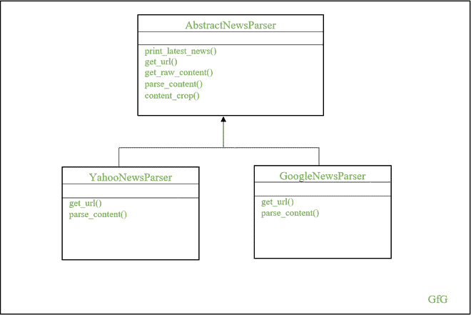
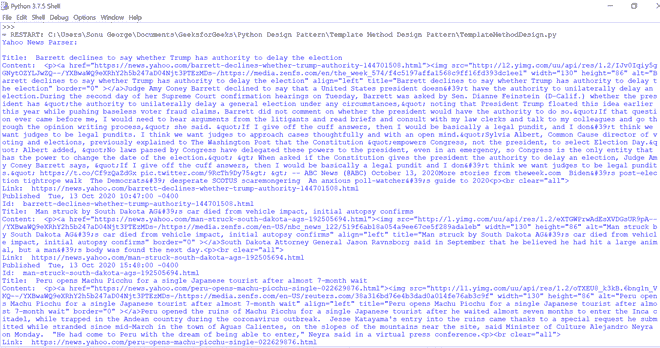
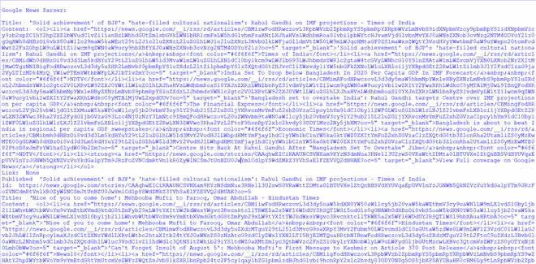

# 在 Python 中使用模板方法设计模式实现新闻解析器

> 原文:[https://www . geesforgeks . org/implementing-news-parser-use-template-method-design-pattern-in-python/](https://www.geeksforgeeks.org/implementing-news-parser-using-template-method-design-pattern-in-python/)

在定义算法时，程序员往往忽略了对不同算法的相同方法进行分组的重要性。通常，他们从头到尾定义算法，并在每个算法中重复相同的方法。这种做法会导致代码重复和代码维护困难——即使是很小的逻辑变化，程序员也必须在几个地方更新代码。

一个常见的例子是使用社交网络帐户建立身份验证。使用不同社交网络帐户的身份验证过程大体相似，但实施级别略有不同。如果您从头到尾都在为不同的帐户定义算法，而不分离常见的方法，这将导致代码重复和代码维护困难。

[模板设计模式](https://www.geeksforgeeks.org/template-method-python-design-patterns/)是 Python 中的一种设计模式，提供了防止代码重复的专用模式。在这个设计模式中，相同的方法将在抽象类中实现，并且从这个抽象类派生的算法可以重用这些方法。它有一个模板方法，便于每个派生算法的方法调用。让我们来看看模板设计模式的好处。

*   它允许类控制和公开它的部分
*   它提供了很好的扩展性
*   避免代码重复
*   易于代码维护

## 新闻解析器的实现

让我们实现一个新闻解析器，从不同的站点获取最新的新闻。在这里，我们考虑 RSS 提要和 Atom 提要来获取最新消息。这两个提要都基于 XML 协议，只是在 XML 结构上有一些不同。可以查看 [RSS](https://news.yahoo.com/rss/) 和 [Atom](https://news.google.com/atom) 的 XML 结构。

在这里，我们的模板设计模式由两个具体的类组成——YahooNewsParser*和 GoogleNewsParser*——这些都是从一个名为 AbstractNewsParser 的抽象类中派生出来的。这个抽象类包含模板方法–*print _ latest _ news()*–调用原语操作方法。这里，原语操作方法既包括通用算法，也包括不同的算法，其中通用算法在抽象类本身中定义，不同的算法在各自的具体类中重新定义。



新闻记者

从上图可以清楚地看到，get_url()和 parse_content()原语操作方法在各自的具体类中被重新定义。这是因为网址和 XML 结构与提要不同。因此，有必要重新定义这些方法，以实现所需的功能。其他基本方法，如 get_raw_content()和 content_crop()是常见的方法，它们是在抽象类本身中定义的。模板方法 print_lates_news()负责调用这些原语方法。让我们进入代码实现。

## 蟒蛇 3

```py
import abc
import urllib.request
from xml.dom.minidom import parseString

class AbstractNewsParser(object, metaclass=abc.ABCMeta):
    def __init__(self):

        # Restrict creating abstract class instance
        if self.__class__ is AbstractNewsParser:
            raise TypeError('Abstract class cannot be instantiated')

    def print_latest_news(self):
        """ A Template method, returns 3 latest news for every
    news website """
        url = self.get_url()
        raw_content = self.get_raw_content(url)
        content = self.parse_content(raw_content)
        cropped = self.content_crop(content)

        for item in cropped:
            print('Title: ', item['title'])
            print('Content: ', item['content'])
            print('Link: ', item['link'])
            print('Published ', item['published'])
            print('Id: ', item['id'])

    @abc.abstractmethod
    def get_url(self):
        pass

    def get_raw_content(self, url):
        return urllib.request.urlopen(url).read()

    @abc.abstractmethod
    def parse_content(self, content):
        pass

    def content_crop(self, parsed_content, max_items=3):
        return parsed_content[:max_items]

class YahooNewsParser(AbstractNewsParser):
    def get_url(self):
        return 'https://news.yahoo.com/rss/'

    def parse_content(self, raw_content):
        yahoo_parsed_content = []
        dom = parseString(raw_content)

        for node in dom.getElementsByTagName('item'):
            yahoo_parsed_item = {}
            try:
                yahoo_parsed_item['title'] = node.getElementsByTagName('title')[0].\
                    childNodes[0].nodeValue
            except IndexError:
                yahoo_parsed_item['title'] = None

            try:
                yahoo_parsed_item['content'] = node.getElementsByTagName('description')[0].\
                    childNodes[0].nodeValue
            except IndexError:
                yahoo_parsed_item['content'] = None

            try:
                yahoo_parsed_item['link'] = node.getElementsByTagName('link')[0].\
                    childNodes[0].nodeValue
            except IndexError:
                yahoo_parsed_item['link'] = None

            try:
                yahoo_parsed_item['id'] = node.getElementsByTagName('guid')[0].\
                    childNodes[0].nodeValue
            except IndexError:
                yahoo_parsed_item['id'] = None

            try:
                yahoo_parsed_item['published'] = node.getElementsByTagName('pubDate')[0].\
                    childNodes[0].nodeValue
            except IndexError:
                yahoo_parsed_item['published'] = None

            yahoo_parsed_content.append(yahoo_parsed_item)

        return yahoo_parsed_content

class GoogleNewsParser(AbstractNewsParser):
    def get_url(self):
        return 'https://news.google.com/atom'

    def parse_content(self, raw_content):
        google_parsed_content = []
        dom = parseString(raw_content)

        for node in dom.getElementsByTagName('entry'):
            google_parsed_item = {}

            try:
                google_parsed_item['title'] = node.getElementsByTagName('title')[0].\
                    childNodes[0].nodeValue
            except IndexError:
                google_parsed_item['title'] = None

            try:
                google_parsed_item['content'] = node.getElementsByTagName('content')[0].\
                    childNodes[0].nodeValue
            except IndexError:
                google_parsed_item['content'] = None

            try:
                google_parsed_item['link'] = node.getElementsByTagName('href')[0].\
                    childNodes[0].nodeValue
            except IndexError:
                google_parsed_item['link'] = None

            try:
                google_parsed_item['id'] = node.getElementsByTagName('id')[0].\
                    childNodes[0].nodeValue
            except IndexError:
                google_parsed_item['id'] = None

            try:
                google_parsed_item['published'] = node.getElementsByTagName('title')[0].\
                    childNodes[0].nodeValue
            except IndexError:
                google_parsed_item['published'] = None

            google_parsed_content.append(google_parsed_item)

        return google_parsed_content

class NewsParser(object):
    def get_latest_news(self):
        yahoo = YahooNewsParser()
        print('Yahoo: \n', yahoo.print_latest_news())
        print()
        print()
        google = GoogleNewsParser()
        print('Google: \n', google.print_latest_news())

if __name__ == '__main__':
    newsParser = NewsParser()
    newsParser.get_latest_news()
```

### 输出



雅虎新闻解析器



谷歌新闻解析器

当您的算法在不同的实现过程中具有相同的行为时，模板设计模式提供了最佳的设计解决方案。它有助于为算法设计一个标准结构，使得派生类可以在不改变结构的情况下重新定义步骤。