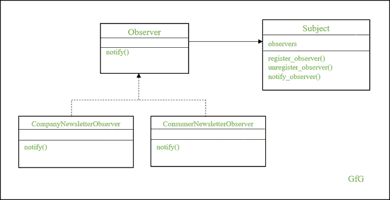

# 使用 Python 中的观察者设计模式实现新闻稿订阅

> 原文:[https://www . geesforgeks . org/implementing-简讯-订阅-使用-观察者-设计-python 中的模式/](https://www.geeksforgeeks.org/implementing-newsletter-subscription-using-observer-design-pattern-in-python/)

观察者设计模式是 Python 中的一种设计模式，它促进了一对多的关系。比方说，你和其他几个读者订阅了一份时事通讯。当有新的时事通讯时，你会和其他订阅者一起收到。假设，如果你不想收到简讯，你可以取消订阅，你将不会收到新版本。

观察者设计模式不限于订阅时事通讯。它可以是任何信息，如并发线程信号、操作系统信号等。观察者设计模式是发布订阅者模式的一种形式。它便于管理订阅和向订阅者广播信息。

## 观察者设计模式的好处

观察者设计模式有一个静态对象叫做主体，一个可变对象叫做观察者。可以有零个或 N 个观察器，观察器的数量可以根据订阅而变化。这里，主体保留观察者，如果任何对象状态改变，主体通知其他观察者。例如，考虑 LinkedIn 帖子的情况。当你发布一个新的 LinkedIn 帖子(状态改变)时，你的关注者的时间线会随着你的新帖子而更新。

让我们看看它的好处。

*   促进主体和观察者之间的松散耦合
*   观察器可以在运行时更新
*   一个主体可以保持零个或 N 个观察者
*   在主体和观察者之间传播信息的能力。

## 新闻稿订阅实施

让我们设计一个简单的时事通讯订阅模型来理解观察者的设计模式。正如我们所讨论的，观察者设计模式有两个主要对象——主体和观察者。主体可以通过 register_observer、unregister_observer 和 notify_observer 添加、删除和通知观察者。然而，观察者是一个接口，它有一个抽象的方法——notify。



观察者设计模式

这里，两个具体的观察器——company newslettobserver 和 consumernewslettobserver——是从观察者界面派生出来的。这些具体的方法实现了抽象的方法 notify，Subject 将在其 notify_observer 方法中调用 notify 方法。因此，为了向订阅者发送信息，我们只需要调用 Subject 中的 notify_observer 方法。让我们看看实现。

## 蟒蛇 3

```py
import abc
import time
import datetime

class Subject(object):
    def __init__(self):
        self.observers = []
        self.cur_time = None

    def register_observer(self, observer):
        if observer in self.observers:
            print(observer, 'already registered')
        else:
            self.observers.append(observer)

    def unregister_observer(self, observer):
        try:
            self.observers.remove(observer)
        except ValueError:
            print('Cannot Indentify the Observer')

    def notify_observer(self):
        self.cur_time = datetime.datetime.now()

        for observer in self.observers:
            observer.notify(self.cur_time)

class Observer(object, metaclass=abc.ABCMeta):    
    """ Abstract class for Observers """
    @abc.abstractmethod
    def notify(self, unix_timestamp):
        pass

class CompanyNewsletterObserver(Observer):
    """ Company Newsletter """
    def __init__(self, name):
        self.name = name

    def notify(self, time):
        print(self.name, ':', time)

class ConsumerNewsletterObserver(Observer):
    """ Consumer Newsletter """
    def __init__(self, name):
        self.name = name

    def notify(self, time):
        print(self.name, ':', time)

if __name__ == '__main__':
    subject = Subject()

    print('Registering company_newsletter_observer')
    cmp_observer = CompanyNewsletterObserver('company_newsletter_observer')
    subject.register_observer(cmp_observer)
    subject.notify_observer()
    print()
    time.sleep(2)

    print('Registering consumer_newsletter_observer')
    con_observer = ConsumerNewsletterObserver('consumer_newsletter_observer')
    subject.register_observer(con_observer)
    subject.notify_observer()
    print()
    time.sleep(2)

    print('Unregistering company_newsletter_observer')
    subject.unregister_observer(cmp_observer)
    subject.notify_observer()
```

**输出:**

> 注册公司 _ 快讯 _ 观察者
> 公司 _ 快讯 _ 观察者:2020-10-15 20:40:04.335355
> 
> 注册消费者 _ 快讯 _ 观察者
> 公司 _ 快讯 _ 观察者:2020-10-15 20:40:06.336913
> 消费者 _ 快讯 _ 观察者:2020-10-15 20:40:06.336913
> 
> 注销公司 _ 时事通讯 _ 观察者
> 消费者 _ 时事通讯 _ 观察者:2020-10-15 20:40:08.33966620662

您可以参考上面的输出来理解代码在注册和不注册观察器时的行为。

观察者设计模式最适合实现一对多关系的需要。你可以向许多听众广播同样的信息。而且，侦听器可以在运行时添加或删除。这里，主体只具有关于观察者界面的信息，这有助于保持主体和观察者之间的松散耦合。