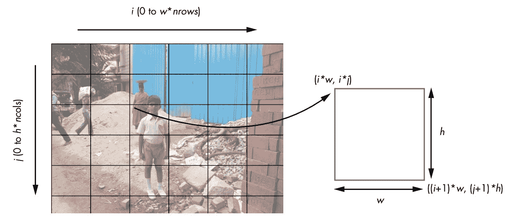
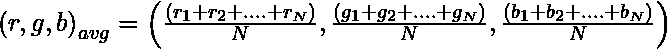
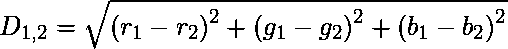

# 实现摄影测量

> 原文:[https://www.geeksforgeeks.org/implementing-photomosaics/](https://www.geeksforgeeks.org/implementing-photomosaics/)

**简介**

photo masic 是分割成矩形网格的图像，每个矩形网格由与目标匹配的另一个图像(您最终希望出现在 photo masic 中的图像)替换。换句话说，如果你从远处看照片，你会看到目标图像；但是如果你靠近一点，你会看到图像实际上由许多较小的图像组成。这是因为人眼的工作原理。

根据匹配的方式，有两种马赛克。简单来说，目标图像的每个部分被平均成单一颜色。每个库图像也被简化为单一颜色。然后，目标图像的每个部分都被替换为库中颜色尽可能相似的部分。实际上，目标图像的分辨率被降低(通过下采样)，然后每个结果像素被平均颜色与该像素匹配的图像替换。

在更高级的摄影镶嵌中，目标图像不进行下采样，匹配是通过将矩形中的每个像素与每个库图像中的相应像素进行比较来完成的。目标中的矩形随后被最小化总差异的库图像所替换。这需要比简单类型多得多的计算，但是结果可以好得多，因为逐像素匹配可以保持目标图像的分辨率。

**如何创建 Photomosaics？**

1.  读取切片图像，这将替换原始图像中的切片。
2.  读取目标图像，并将其分割成 M×N 个平铺网格。
3.  对于每个图块，从输入图像中找到最佳匹配。
4.  通过在 M×N 网格中排列选定的输入图像来创建 fnal 镶嵌。

**将图像分割成小块**



现在让我们看看如何从这个网格计算单个图块的坐标。带有索引(I，j)的图块的左上角坐标为(i*w，i*j)，右下角坐标为((i+1)*w，(j+1)*h)，其中 w 和 h 分别代表图块的宽度和高度。这些可以与 PIL 一起使用，从这个图像裁剪和创建一个图块。

**平均颜色值**

图像中的每个像素都有一种颜色，可以用它的红色、绿色和蓝色值来表示。在这种情况下，您使用的是 8 位图像，因此这些分量中的每一个都有一个在[0，255]范围内的 8 位值。给定一个总共有 N 个像素的图像，平均 RGB 计算如下:



**匹配图像**

对于目标图像中的每个图块，您需要从用户指定的输入文件夹中的图像中找到匹配的图像。要确定两幅图像是否匹配，请使用平均 RGB 值。最接近的匹配是平均 RGB 值最接近的图像。
最简单的方法是计算一个像素中 RGB 值之间的距离，在输入图像中找到最佳匹配。可以对几何图形中的三维点使用以下距离计算:



现在让我们试着把它编码出来

## 蟒蛇 3

```py
#Importing the required libraries
import os, random, argparse
from PIL import Image
import imghdr
import numpy as np

def getAverageRGBOld(image):
  """
  Given PIL Image, return average value of color as (r, g, b)
  """
  # no. of pixels in image
  npixels = image.size[0]*image.size[1]
  # get colors as [(cnt1, (r1, g1, b1)), ...]
  cols = image.getcolors(npixels)
  # get [(c1*r1, c1*g1, c1*g2),...]
  sumRGB = [(x[0]*x[1][0], x[0]*x[1][1], x[0]*x[1][2]) for x in cols] 
  # calculate (sum(ci*ri)/np, sum(ci*gi)/np, sum(ci*bi)/np)
  # the zip gives us [(c1*r1, c2*r2, ..), (c1*g1, c1*g2,...)...]
  avg = tuple([int(sum(x)/npixels) for x in zip(*sumRGB)])
  return avg

def getAverageRGB(image):
  """
  Given PIL Image, return average value of color as (r, g, b)
  """
  # get image as numpy array
  im = np.array(image)
  # get shape
  w,h,d = im.shape
  # get average
  return tuple(np.average(im.reshape(w*h, d), axis=0))

def splitImage(image, size):
  """
  Given Image and dims (rows, cols) returns an m*n list of Images 
  """
  W, H = image.size[0], image.size[1]
  m, n = size
  w, h = int(W/n), int(H/m)
  # image list
  imgs = []
  # generate list of dimensions
  for j in range(m):
    for i in range(n):
      # append cropped image
      imgs.append(image.crop((i*w, j*h, (i+1)*w, (j+1)*h)))
  return imgs

def getImages(imageDir):
  """
  given a directory of images, return a list of Images
  """
  files = os.listdir(imageDir)
  images = []
  for file in files:
    filePath = os.path.abspath(os.path.join(imageDir, file))
    try:
      # explicit load so we don't run into resource crunch
      fp = open(filePath, "rb")
      im = Image.open(fp)
      images.append(im)
      # force loading image data from file
      im.load() 
      # close the file
      fp.close() 
    except:
      # skip
      print("Invalid image: %s" % (filePath,))
  return images

def getImageFilenames(imageDir):
  """
  given a directory of images, return a list of Image file names
  """
  files = os.listdir(imageDir)
  filenames = []
  for file in files:
    filePath = os.path.abspath(os.path.join(imageDir, file))
    try:
      imgType = imghdr.what(filePath) 
      if imgType:
        filenames.append(filePath)
    except:
      # skip
      print("Invalid image: %s" % (filePath,))
  return filenames

def getBestMatchIndex(input_avg, avgs):
  """
  return index of best Image match based on RGB value distance
  """

  # input image average
  avg = input_avg

  # get the closest RGB value to input, based on x/y/z distance
  index = 0
  min_index = 0
  min_dist = float("inf")
  for val in avgs:
    dist = ((val[0] - avg[0])*(val[0] - avg[0]) +
            (val[1] - avg[1])*(val[1] - avg[1]) +
            (val[2] - avg[2])*(val[2] - avg[2]))
    if dist < min_dist:
      min_dist = dist
      min_index = index
    index += 1

  return min_index

def createImageGrid(images, dims):
  """
  Given a list of images and a grid size (m, n), create 
  a grid of images. 
  """
  m, n = dims

  # sanity check
  assert m*n == len(images)

  # get max height and width of images
  # ie, not assuming they are all equal
  width = max([img.size[0] for img in images])
  height = max([img.size[1] for img in images])

  # create output image
  grid_img = Image.new('RGB', (n*width, m*height))

  # paste images
  for index in range(len(images)):
    row = int(index/n)
    col = index - n*row
    grid_img.paste(images[index], (col*width, row*height))

  return grid_img

def createPhotomosaic(target_image, input_images, grid_size,
                      reuse_images=True):
  """
  Creates photomosaic given target and input images.
  """

  print('splitting input image...')
  # split target image 
  target_images = splitImage(target_image, grid_size)

  print('finding image matches...')
  # for each target image, pick one from input
  output_images = []
  # for user feedback
  count = 0
  batch_size = int(len(target_images)/10)

  # calculate input image averages
  avgs = []
  for img in input_images:
    avgs.append(getAverageRGB(img))

  for img in target_images:
    # target sub-image average
    avg = getAverageRGB(img)
    # find match index
    match_index = getBestMatchIndex(avg, avgs)
    output_images.append(input_images[match_index])
    # user feedback
    if count > 0 and batch_size > 10 and count % batch_size is 0:
      print('processed %d of %d...' %(count, len(target_images)))
    count += 1
    # remove selected image from input if flag set
    if not reuse_images:
      input_images.remove(match)

  print('creating mosaic...')
  # draw mosaic to image
  mosaic_image = createImageGrid(output_images, grid_size)

  # return mosaic
  return mosaic_image

# Gather our code in a main() function
def main():
  # Command line args are in sys.argv[1], sys.argv[2] ..
  # sys.argv[0] is the script name itself and can be ignored

  # parse arguments
  parser = argparse.ArgumentParser
    (description='Creates a photomosaic from input images')
  # add arguments
  parser.add_argument('--target-image', dest='target_image', required=True)
  parser.add_argument('--input-folder', dest='input_folder', required=True)
  parser.add_argument('--grid-size', nargs=2, dest='grid_size', required=True)
  parser.add_argument('--output-file', dest='outfile', required=False)

  args = parser.parse_args()

  ###### INPUTS ######

  # target image
  target_image = Image.open(args.target_image)

  # input images
  print('reading input folder...')
  input_images = getImages(args.input_folder)

  # check if any valid input images found  
  if input_images == []:
      print('No input images found in %s. Exiting.' % (args.input_folder, ))
      exit()

  # shuffle list - to get a more varied output?
  random.shuffle(input_images)

  # size of grid
  grid_size = (int(args.grid_size[0]), int(args.grid_size[1]))

  # output
  output_filename = 'mosaic.png'
  if args.outfile:
    output_filename = args.outfile

  # re-use any image in input
  reuse_images = True

  # resize the input to fit original image size?
  resize_input = True

  ##### END INPUTS #####

  print('starting photomosaic creation...')

  # if images can't be reused, ensure m*n <= num_of_images 
  if not reuse_images:
    if grid_size[0]*grid_size[1] > len(input_images):
      print('grid size less than number of images')
      exit()

  # resizing input
  if resize_input:
    print('resizing images...')
    # for given grid size, compute max dims w,h of tiles
    dims = (int(target_image.size[0]/grid_size[1]), 
            int(target_image.size[1]/grid_size[0])) 
    print("max tile dims: %s" % (dims,))
    # resize
    for img in input_images:
      img.thumbnail(dims)

  # create photomosaic
  mosaic_image = createPhotomosaic(target_image, input_images, grid_size,
                                   reuse_images)

  # write out mosaic
  mosaic_image.save(output_filename, 'PNG')

  print("saved output to %s" % (output_filename,))
  print('done.')

# Standard boilerplate to call the main() function to begin
# the program.
if __name__ == '__main__':
  main()
```

```py
python test.py --target-image test-data/a.jpg --input-folder test-data/set1/ --grid-size 128 128
```

输出:

<video class="wp-video-shortcode" id="video-163365-1" width="640" height="360" preload="metadata" controls=""><source type="video/mp4" src="https://media.geeksforgeeks.org/wp-content/uploads/2017-11-06-at-01-47-50.mp4?_=1">[https://media.geeksforgeeks.org/wp-content/uploads/2017-11-06-at-01-47-50.mp4](https://media.geeksforgeeks.org/wp-content/uploads/2017-11-06-at-01-47-50.mp4)</video>

参考链接:

Mahesh Venkitachalam 的 Python 游乐场。
2) [抱枕文档](http://pillow.readthedocs.io)
3) [维基百科-影像学](https://en.wikipedia.org/wiki/Photographic_mosaic)

本文由 [**Subhajit Saha**](https://www.linkedin.com/in/subhajit-saha-06aa29131/) 供稿。如果你喜欢 GeeksforGeeks 并想投稿，你也可以使用[write.geeksforgeeks.org](http://www.write.geeksforgeeks.org)写一篇文章或者把你的文章邮寄到 review-team@geeksforgeeks.org。看到你的文章出现在极客博客主页上，帮助其他极客。

如果你发现任何不正确的地方，或者你想分享更多关于上面讨论的话题的信息，请写评论。