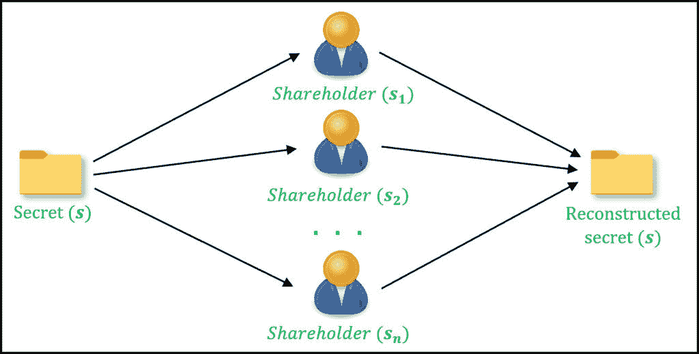
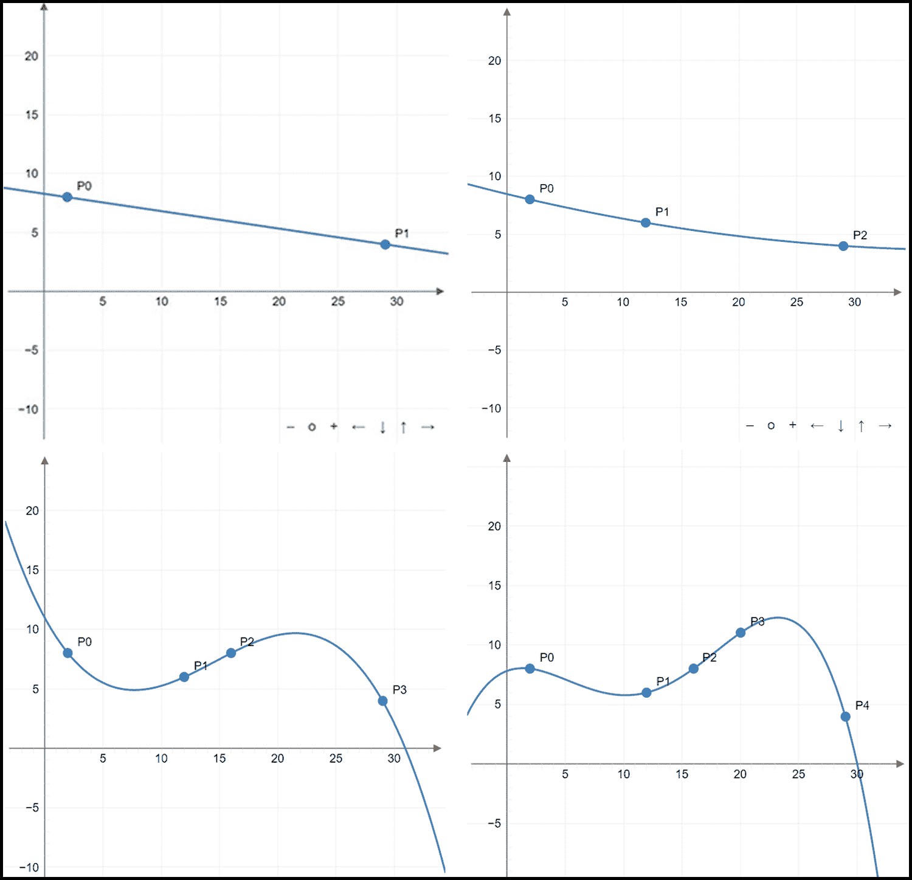

# 在 Python 中实现 Shamir 的秘密共享方案

> 原文:[https://www . geesforgeks . org/impering-shamirs-secret-sharing-scheme-in-python/](https://www.geeksforgeeks.org/implementing-shamirs-secret-sharing-scheme-in-python/)

**秘密共享**方案通过将秘密分成片段 *( **股份** )* ，用于在多个参与者 *( **股东** )* 之间分配秘密值。这样做是为了防止单一股东对原始秘密有任何有用的了解。检索原始秘密的唯一方法是合并分配给参与者的份额。因此，秘密的**控制被分配**。这些方案是**门限密码系统**的例子，涉及多方之间的秘密划分，使得几方(超过一些**门限**数)必须合作来重构秘密。



**图 1** :对 ***n*** 参与者之间秘密分享的描述

一般来说，一个秘密可能会被拆分成 **n** 股(对于 **n** 股东)，其中至少需要 **t** 、 **(t < n)** 股才能成功重建。这种方案被称为(t，n)共享方案。从 **n** 个参与者中，*个股东的任意子集*，大小大于或等于 **t** ，可以重新生成秘密。重要的是，即使有任何 **k (k < t)** 股票，*也没有*关于原始秘密的新信息被获知。

## 沙米尔秘密分享

Shamir Secret Sharing ( **SSS** )是由以色列著名密码学家**阿迪·萨莫尔**创建的秘密共享方案的最受欢迎的实现之一，他也为 RSA 算法的发明做出了贡献。SSS 允许将秘密分成任意数量的份额，并允许任意的阈值(只要它小于参与者总数)。SSS 基于**多项式插值**的数学概念，该概念指出，可以根据已知位于曲线上的 t *或更多*点的知识重构 t-1 次多项式。
例如，要重建 1 度曲线(直线)，我们需要至少 2 个点位于该线上。相反，如果可用的唯一点的数量小于(曲线度数+ 1)，则重建曲线在数学上是不可行的。人们可以想象，在 2D 空间中，仅仅一个点就可能形成无限多条直线。

## SSS 背后的动机

多项式插值的概念可以通过将秘密嵌入多项式来产生秘密共享方案。一般多项式的次数 **p** 可以表示如下:


在 P(x)的表达式中，值 a_{1}、a_{2}、a_{3}、…、a_{n}代表多项式的系数。因此，多项式的构造需要选择这些系数。请注意， **x 实际上没有替代值；**多项式中的每个项都充当存储系数值的“占位符”。
一旦生成多项式，我们基本上可以通过位于曲线上的 **p+1** 点来表示曲线。这遵循多项式插值原理。例如，如果我们可以访问位于其上的至少 5 个唯一点，则可以重建 4 度的曲线。为此，我们可以运行拉格朗日插值或任何其他类似的插值机制。



**图 2:** 使用多项式插值重建曲线的示例

因此，如果我们将秘密值隐藏在这样的多项式中，并使用曲线上的各个点作为份额，我们就得到一个秘密共享方案。更准确地说，为了建立一个 **(t，n)** 秘密共享方案，我们可以构造一个次数为 **t-1** 的多项式，并在曲线上选取 **n** 点作为份额，这样，只有当 **t** 或更多份额被合并时，该多项式才会重新生成。秘密值( **s** )隐藏在多项式的常数项(0 次项的系数或曲线的 y 截距)中，只有在曲线重建成功后才能得到。

## 使用的算法

Shamir 的秘密共享使用多项式插值原理在以下两个阶段执行阈值共享:
**第一阶段:份额的生成**
该阶段涉及系统的设置以及份额的生成。

1.  决定参与者人数 **(n)** 和阈值 **(t)** 的值，以获得一些秘密值 **(s)**
2.  通过选择多项式的随机系数，构造一个次数为 **t-1** 的随机多项式 **P(x)** 。将多项式中的常数项(零次项的系数)设置为等于秘密值 **s**
3.  要生成 **n** 股，随机选择位于多项式 **P(x)** 上的 **n** 点
4.  将上一步中拾取的坐标分发给参与者。这些作为系统中的份额

**第二阶段:重建秘密**
为了重建秘密，至少需要 **t** 个参与者将他们的股份集中起来。

1.  募集 **t** 或更多股份
2.  使用插值算法从份额中重建多项式**P’(x)**。**拉格朗日插值**就是这样一个算法的例子
3.  确定 **x = 0** 的重构多项式的值，即计算**P’(0)**。这个值揭示了多项式的常数项，它恰好是原始的秘密。这样，秘密就被重建了

下面是实现。

## 蟒蛇 3

```py
import random
from math import ceil
from decimal import Decimal

FIELD_SIZE = 10**5

def reconstruct_secret(shares):
    """
    Combines individual shares (points on graph)
    using Lagranges interpolation.

    `shares` is a list of points (x, y) belonging to a
    polynomial with a constant of our key.
    """
    sums = 0
    prod_arr = []

    for j, share_j in enumerate(shares):
        xj, yj = share_j
        prod = Decimal(1)

        for i, share_i in enumerate(shares):
            xi, _ = share_i
            if i != j:
                prod *= Decimal(Decimal(xi)/(xi-xj))

        prod *= yj
        sums += Decimal(prod)

    return int(round(Decimal(sums), 0))

def polynom(x, coefficients):
    """
    This generates a single point on the graph of given polynomial
    in `x`. The polynomial is given by the list of `coefficients`.
    """
    point = 0
    # Loop through reversed list, so that indices from enumerate match the
    # actual coefficient indices
    for coefficient_index, coefficient_value in enumerate(coefficients[::-1]):
        point += x ** coefficient_index * coefficient_value
    return point

def coeff(t, secret):
    """
    Randomly generate a list of coefficients for a polynomial with
    degree of `t` - 1, whose constant is `secret`.

    For example with a 3rd degree coefficient like this:
        3x^3 + 4x^2 + 18x + 554

        554 is the secret, and the polynomial degree + 1 is
        how many points are needed to recover this secret.
        (in this case it's 4 points).
    """
    coeff = [random.randrange(0, FIELD_SIZE) for _ in range(t - 1)]
    coeff.append(secret)
    return coeff

def generate_shares(n, m, secret):
    """
    Split given `secret` into `n` shares with minimum threshold
    of `m` shares to recover this `secret`, using SSS algorithm.
    """
    coefficients = coeff(m, secret)
    shares = []

    for i in range(1, n+1):
        x = random.randrange(1, FIELD_SIZE)
        shares.append((x, polynom(x, coefficients)))

    return shares

# Driver code
if __name__ == '__main__':

    # (3,5) sharing scheme
    t, n = 3, 5
    secret = 1234
    print(f'Original Secret: {secret}')

    # Phase I: Generation of shares
    shares = generate_shares(n, t, secret)
    print(f'Shares: {", ".join(str(share) for share in shares)}')

    # Phase II: Secret Reconstruction
    # Picking t shares randomly for
    # reconstruction
    pool = random.sample(shares, t)
    print(f'Combining shares: {", ".join(str(share) for share in pool)}')
    print(f'Reconstructed secret: {reconstruct_secret(pool)}')
```

**输出:**

```py
Original Secret: 1234
Shares: (79761, 4753361900938), (67842, 3439017561016), (42323, 1338629004828), (68237, 3479175081966), (32818, 804981007208)
Combining shares: (32818, 804981007208), (79761, 4753361900938), (68237, 3479175081966)
Reconstructed secret: 1234
```

### 实际应用

秘密共享方案广泛应用于要求信任是分布式而不是集中式的密码系统中。使用秘密共享的真实场景的突出例子包括:

*   基于阈值的比特币签名
*   安全多方计算
*   具有多方计算的私有机器学习
*   密码管理