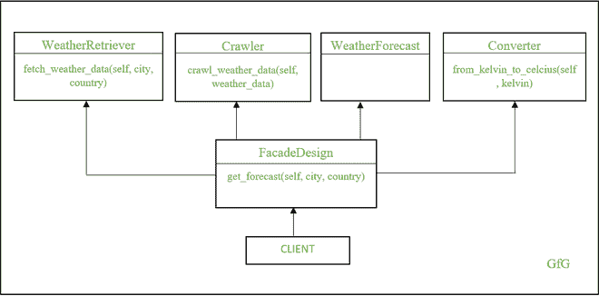

# 利用 Python 中的立面设计模式实现天气预报

> 原文:[https://www . geesforgeks . org/implementing-weather-forecast-use-facade-design-pattern-in-python/](https://www.geeksforgeeks.org/implementing-weather-forecast-using-facade-design-pattern-in-python/)

[外观设计模式](https://www.geeksforgeeks.org/facade-method-python-design-patterns/)是 Python 中的设计模式，为复杂的子系统提供简单的接口。当我们观察周围的世界时，我们总能发现立面设计模式。汽车就是最好的例子:你不需要了解发动机是如何工作的。要操作发动机，会给你提供一套简单的界面，比如在点火时转动钥匙启动发动机，利用方向盘转动车轮等等。让我们来看看立面设计模式的优势。它们如下:

*   保持客户端和子系统之间的松散耦合。
*   更易于使用和测试
*   为客户端代码提供更好、更清晰的应用编程接口
*   它用简单的接口包装了一个复杂的子系统

## 天气预报的实施

让我们进入实现部分。在这个应用程序中，我们获取一个城市的当前温度。为此，我们使用来自 openweathermap.org 资源的可用应用编程接口。在这里，在不使用外观设计模式的情况下，客户端必须经历许多复杂的任务，例如调用应用编程接口、解析和检索必要的数据，以及从开尔文转换为 Celcius。如果客户端只需要调用一个方法就可以得到当前的温度，那就更简单了。这就是我们通过外观设计模式实现的目标。

在进入源代码之前，让我们看看代码设计模式。



在上图中，我们有一个由四个模块组成的子系统。如果客户端直接使用这些模块，它将失去灵活性。这是因为，如果任何模块被更改，那么客户端代码需要被修改，这增加了额外的复杂性。当使用外观设计模式时，客户端使用外观，其中外观调用子模块并将必要的细节返回给客户端。这种设计基于分解原理，将一个复杂的系统分解成更小更简单的子系统。

让我们看看每个模块的功能。

*   *天气检索器*类向天气应用编程接口端点发出请求，并返回预测数据。
*   *爬虫*类抓取 WeatherRetriever 类返回的数据，以 JSON 格式解码，并获取温度。
*   *天气预报*类负责存储温度数据。
*   最后，*转换器*类将温度从开尔文转换为摄氏度

## 蟒蛇 3

```
import urllib
import urllib.request
import urllib.parse
import json

class WeatherRetriever(object):
    def __init__(self):
        self.api_url = 'https://samples.openweathermap.org/data/2.5/\
weather?q={},{}&appid=439d4b804bc8187953eb36d2a8c26a02'

    # takes input (city and country), produces a URL string,
    # generate HTTP request, and returns the data.
    def fetch_weather_data(self, city, country):
        city = urllib.parse.quote(city)
        url = self.api_url.format(city, country)
        return urllib.request.urlopen(url).read()

class Crawler(object):
    def crawl_weather_data(self, weather_data):
        data = json.loads(weather_data)

        # fetch the current temperature
        temp_data = data['main']['temp']
        return temp_data

class Converter(object):
    """ converts the temperature from kelvin to celcius """

    def from_kelvin_to_celcius(self, kelvin):
        return kelvin - 273.15

class WeatherForecast(object):
    def __init__(self, data):
        self.temperature = data

class FacadeDesign(object):
    def get_forecast(self, city, country):
        weather_retriever = WeatherRetriever()
        weather_data = weather_retriever.fetch_weather_data(city, country)

        crawl = Crawler()
        crawl_data = crawl.crawl_weather_data(weather_data)
        weather = WeatherForecast(crawl_data)
        converter = Converter()
        temp_celcius = converter.from_kelvin_to_celcius(weather.temperature)
        return temp_celcius

if __name__ == '__main__':
    facadeDesign = FacadeDesign()
    print("So today's forecast is about ",
          facadeDesign.get_forecast('London', 'uk'), "degrees")
```

**输出:**

> 所以今天的预测是 7.17 亿度左右

外观设计模式提供了更高级别的界面，简化了子系统的使用。外观设计没有添加任何新的功能，相反，它充当了一个包装器，为访问复杂的子系统提供了灵活性。