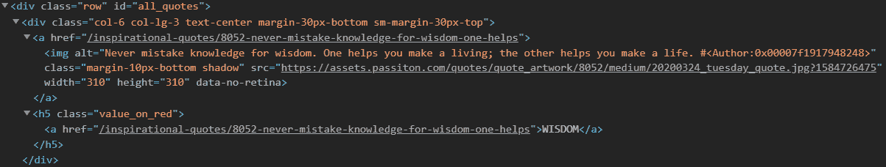

# 用美图实现 Python 中的网页抓取

> 原文:[https://www . geeksforgeeks . org/impering-web-scratch-python-beautiful-soup/](https://www.geeksforgeeks.org/implementing-web-scraping-python-beautiful-soup/)

从网站提取数据主要有两种方法:

*   使用网站的应用编程接口(如果有)。例如，脸书有脸书图形应用编程接口，允许检索发布在脸书的数据。
*   访问网页的 HTML 并从中提取有用的信息/数据。这种技术被称为网页抓取或网页收集或网页数据提取。

本文通过实现一个名为“美丽的汤”的 Python 网页抓取框架来讨论网页抓取的相关步骤。

**刮网涉及的步骤:**

1.  向您想要访问的网页的网址发送一个 HTTP 请求。服务器通过返回网页的 HTML 内容来响应请求。对于这个任务，我们将使用第三方 HTTP 库来处理 python 请求。
2.  一旦我们访问了 HTML 内容，我们就剩下解析数据的任务了。由于大多数 HTML 数据是嵌套的，我们不能简单地通过字符串处理来提取数据。我们需要一个解析器，它可以创建一个嵌套/树形结构的 HTML 数据。有许多可用的 HTML 解析器库，但最高级的是 html5lib。
3.  现在，我们需要做的就是导航和搜索我们创建的解析树，即树遍历。对于这个任务，我们将使用另一个第三方 python 库，[美人汤](http://www.crummy.com/software/BeautifulSoup/)。它是一个 Python 库，用于从 HTML 和 XML 文件中提取数据。

**步骤 1:安装所需的第三方库**

*   用 python 安装外部库最简单的方法是使用 pip。 **pip** 是一个包管理系统，用于安装和管理用 Python 编写的软件包。
    你所需要做的就是:

```
pip install requests
pip install html5lib
pip install bs4
```

*   另一种方法是从这些链接手动下载:
    *   [请求](https://pypi.python.org/pypi/requests/2.11.1)
    *   [html5lib](https://pypi.python.org/pypi/html5lib/0.999999999)
    *   [美丽的 ulsoup4](https://pypi.python.org/pypi/beautifulsoup4)

**第二步:从网页**访问 HTML 内容

```
import requests
URL = "https://www.geeksforgeeks.org/data-structures/"
r = requests.get(URL)
print(r.content)
```

让我们试着理解这段代码。

*   首先导入请求库。
*   然后，指定你要刮的网页的网址。
*   将 HTTP 请求发送到指定的 URL，并将来自服务器的响应保存在名为  的响应对象中
*   现在，作为打印 r.content 来获取网页的**原始 HTML 内容**。它属于“字符串”类型。

**第三步:解析 HTML 内容**

```
#This will not run on online IDE
import requests
from bs4 import BeautifulSoup

URL = "http://www.values.com/inspirational-quotes"
r = requests.get(URL)

soup = BeautifulSoup(r.content, 'html5lib') # If this line causes an error, run 'pip install html5lib' or install html5lib
print(soup.prettify())
```

美丽的输出库的一个非常好的地方是它建立在 HTML 解析库的基础上，比如 html5lib、lxml、html.parser 等等。所以美化输出对象和指定解析器库可以同时创建。

在上面的例子中，

```
soup = BeautifulSoup(r.content, 'html5lib')
```

我们通过传递两个参数来创建一个美丽的输出对象:

*   **r.content** :是原始的 HTML 内容。
*   **html5lib** :指定我们想要使用的 html 解析器。

现在**已经打印出来了，给出了从原始 HTML 内容创建的解析树的可视化表示。**

**第 4 步:在解析树中搜索和导航**

现在，我们想从 HTML 内容中提取一些有用的数据。soup 对象包含嵌套结构中可以通过编程提取的所有数据。在我们的例子中，我们正在抓取一个包含一些报价的网页。因此，我们希望创建一个程序来保存这些报价(以及所有相关信息)。

```
#Python program to scrape website 
#and save quotes from website
import requests
from bs4 import BeautifulSoup
import csv

URL = "http://www.values.com/inspirational-quotes"
r = requests.get(URL)

soup = BeautifulSoup(r.content, 'html5lib')

quotes=[]  # a list to store quotes

table = soup.find('div', attrs = {'id':'all_quotes'}) 

for row in table.findAll('div',
                         attrs = {'class':'col-6 col-lg-3 text-center margin-30px-bottom sm-margin-30px-top'}):
    quote = {}
    quote['theme'] = row.h5.text
    quote['url'] = row.a['href']
    quote['img'] = row.img['src']
    quote['lines'] = row.img['alt'].split(" #")[0]
    quote['author'] = row.img['alt'].split(" #")[1]
    quotes.append(quote)

filename = 'inspirational_quotes.csv'
with open(filename, 'w', newline='') as f:
    w = csv.DictWriter(f,['theme','url','img','lines','author'])
    w.writeheader()
    for quote in quotes:
        w.writerow(quote)
```

在继续之前，我们建议您浏览一下我们使用 soup.prettify()方法打印的网页的 HTML 内容，并尝试找到一种模式或方法来导航到报价。

*   It is noticed that all the quotes are inside a div container whose id is ‘all_quotes’. So, we find that div element (termed as table in above code) using **find()** method :

    ```
    table = soup.find('div', attrs = {'id':'all_quotes'}) 
    ```

    第一个参数是要搜索的 HTML 标记，第二个参数是字典类型元素，用于指定与该标记相关联的附加属性。 **find()** 方法返回第一个匹配的元素。你可以试着打印**table . pretify()**来了解这段代码的作用。

*   Now, in the table element, one can notice that each quote is inside a div container whose class is quote. So, we iterate through each div container whose class is quote.
    Here, we use findAll() method which is similar to find method in terms of arguments but it returns a list of all matching elements. Each quote is now iterated using a variable called **row.** Here is one sample row HTML content for better understanding:
    
    Now consider this piece of code:

    ```
    for row in table.find_all_next('div', attrs = {'class': 'col-6 col-lg-3 text-center margin-30px-bottom sm-margin-30px-top'}):
        quote = {}
        quote['theme'] = row.h5.text
        quote['url'] = row.a['href']
        quote['img'] = row.img['src']
        quote['lines'] = row.img['alt'].split(" #")[0]
        quote['author'] = row.img['alt'].split(" #")[1]
        quotes.append(quote)
    ```

    我们创建了一个字典来保存报价的所有信息。嵌套结构可以使用点符号来访问。要访问 HTML 元素中的文本，我们使用**。正文:** 

    ```
    quote['theme'] = row.h5.text
    ```

    我们可以添加、移除、修改和访问标签的属性。这是通过将标签视为字典来完成的:

    ```
    quote['url'] = row.a['href']
    ```

    最后，所有的报价都被添加到名为**报价的列表中。**

*   Finally, we would like to save all our data in some CSV file.

    ```
    filename = 'inspirational_quotes.csv'
    with open(filename, 'w', newline='') as f:
        w = csv.DictWriter(f,['theme','url','img','lines','author'])
        w.writeheader()
        for quote in quotes:
            w.writerow(quote)
    ```

    在这里，我们创建了一个名为励志 _quotes.csv 的 CSV 文件，并保存其中的所有报价以备将来使用。

这是一个如何用 Python 创建网页抓取器的简单例子。从这里，你可以尝试放弃你选择的任何其他网站。如有任何疑问，请在下方评论区发表。

**注意:**刮网在很多情况下被认为是违法的。它还可能导致您的 IP 被网站永久阻止。

本博客由**尼克尔·库马尔**投稿。如果你喜欢 GeeksforGeeks 并想投稿，你也可以使用[write.geeksforgeeks.org](https://write.geeksforgeeks.org/)写一篇文章或者把你的文章邮寄到 contribute@geeksforgeeks.org。看到你的文章出现在极客博客主页上，帮助其他极客。

如果你发现任何不正确的地方，或者你想分享更多关于上面讨论的话题的信息，请写评论。