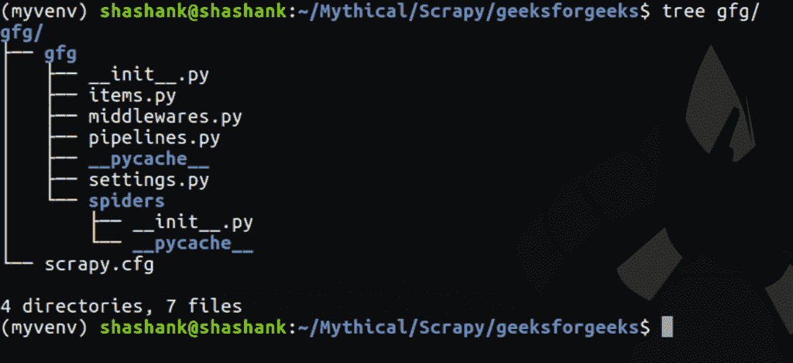

# 用 Scrapy 在 Python 中实现网页抓取

> 原文:[https://www . geeksforgeeks . org/impering-web-scratch-python-scratchy/](https://www.geeksforgeeks.org/implementing-web-scraping-python-scrapy/)

如今，数据就是一切，如果有人想从网页上获取数据，那么一种方法就是使用应用编程接口或实现网页抓取技术。在 Python 中，通过使用像美化程序这样的抓取工具，可以很容易地完成网页抓取。但是如果用户关心刮刀的性能或者需要高效地刮擦数据怎么办。

为了克服这个问题，人们可以使用多线程/多处理与美丽的输出模块，他/她可以创建蜘蛛，这可以帮助抓取网站并提取数据。为了节省时间，我们使用了 Scrapy。

```py
With the help of Scrapy one can :

1\. Fetch millions of data efficiently
2\. Run it on server
3\. Fetching data 
4\. Run spider in multiple processes
```

Scrapy 带来了全新的功能，创建蜘蛛，运行它，然后通过抓取它轻松保存数据。起初它看起来很混乱，但这是最好的。

让我们谈谈安装，创建一个蜘蛛，然后测试它。

**第一步:创建虚拟环境**

创建一个虚拟环境是很好的，因为它隔离了程序，并且不影响机器中的任何其他程序。要创建虚拟环境，首先使用以下命令安装它:

```py
sudo apt-get install python3-venv
```

创建一个文件夹，然后激活它:

```py
mkdir scrapy-project && cd scrapy-project
python3 -m venv myvenv 
```

如果上面的命令给出了错误，那么试试这个:

```py
python3.5 -m venv myvenv
```

创建虚拟环境后，使用以下方法激活它:

```py
source myvenv/bin/activate
```

**第二步:安装 Scrapy 模块**

使用以下方法安装剪贴簿:

```py
pip install scrapy
```

要为任何特定版本的 python 安装 scrapy:

```py
python3.5 -m pip install scrapy
```

用类似 3.6 的其他版本替换 3.5 版本。

**第三步:创建剪贴簿项目**

在与 scrapy 一起工作时，需要创建一个 Scrapy 项目。

```py
scrapy startproject gfg
```



在 Scrapy 中，总是尝试创建一个帮助获取数据的蜘蛛，所以要创建一个，移动到蜘蛛文件夹，在那里创建一个 python 文件。创建一个名为`gfgfetch.py` python 文件的蜘蛛。

**第四步:创造蜘蛛**

移动到蜘蛛文件夹，创建`gfgfetch.py`。创建 spider 时，始终创建一个具有唯一名称的类，并定义需求。第一件事是通过给蜘蛛分配名称变量来命名它，然后提供蜘蛛开始爬行的起始网址。定义一些有助于更深入地爬进那个网站的方法。现在，让我们废弃所有存在的网址，并存储所有这些网址。

```py
import scrapy

class ExtractUrls(scrapy.Spider):

    # This name must be unique always
    name = "extract"                 

    # Function which will be invoked
    def start_requests(self):

        # enter the URL here
        urls = ['https://www.geeksforgeeks.org/', ]

        for url in urls:
            yield scrapy.Request(url = url, callback = self.parse)
```

主要动机是获取每个网址，然后请求它。从中获取所有 URL 或锚标签。为此，我们需要再创建一个方法`parse` ，从给定的 url 获取数据。

**第五步:从给定页面获取数据**
在编写解析函数之前，测试一些事情，比如如何从给定页面获取任何数据。要做到这一点，利用报废的外壳。它就像 python 解释器一样，但是能够从给定的 url 中抓取数据。简而言之，它是一个具有 Scrapy 功能的 python 解释器。

```py
scrapy shell *URL*
```

注意:确保在存在 scrapy.cfg 的同一个目录中，否则它将不起作用。

```py
scrapy shell https://www.geeksforgeeks.org/
```

现在要从给定页面获取数据，使用*选择器*。这些选择器可以来自 CSS，也可以来自 Xpath。现在，让我们试着用 CSS 选择器获取所有的网址。

*   要获取锚点标签:

    ```py
    response.css('a')
    ```

*   提取数据:

    ```py
    links = response.css('a').extract()
    ```

*   例如，链接[0]将显示如下内容:

    ```py
    '<a href="https://www.geeksforgeeks.org/" title="GeeksforGeeks" rel="home">GeeksforGeeks</a>'
    ```

*   要获取`href` 属性，请使用`attributes` 标记。

    ```py
    links = response.css('a::attr(href)').extract()
    ```

这将获得非常有用的所有 href 数据。利用这个链接，开始申请。

现在，让我们创建一个解析方法，获取所有的 URL，然后产生它。跟随那个特定的网址，从那个页面获取更多的链接，这种情况会一次又一次地发生。简而言之，我们正在获取该页面上的所有 url。

默认情况下，Scrapy 会过滤那些已经访问过的网址。所以它不会再次抓取相同的 url 路径。但是有可能在两个不同的页面中有两个或两个以上相似的链接。例如，在每个页面中，标题链接将可用，这意味着该标题链接将出现在每个页面请求中。所以通过检查来排除它。

```py
# Parse function
def parse(self, response):

    # Extra feature to get title
    title = response.css('title::text').extract_first() 

    # Get anchor tags
    links = response.css('a::attr(href)').extract()     

    for link in links:
        yield 
        {
            'title': title,
            'links': link
        }

        if 'geeksforgeeks' in link:         
            yield scrapy.Request(url = link, callback = self.parse)
```

下面是刮刀的实现:

```py
# importing the scrapy module
import scrapy

class ExtractUrls(scrapy.Spider):
    name = "extract"

    # request function
    def start_requests(self):
        urls = [ 'https://www.geeksforgeeks.org', ]

        for url in urls:
            yield scrapy.Request(url = url, callback = self.parse)

    # Parse function
    def parse(self, response):

        # Extra feature to get title
        title = response.css('title::text').extract_first() 

        # Get anchor tags
        links = response.css('a::attr(href)').extract()     

        for link in links:
            yield 
            {
                'title': title,
                'links': link
            }

            if 'geeksforgeeks' in link:         
                yield scrapy.Request(url = link, callback = self.parse)
```

**第六步:最后一步，运行蜘蛛，在简单的 json 文件**中获得输出

```py
scrapy crawl NAME_OF_SPIDER -o links.json
```

在这里，蜘蛛的名字是“提取”给定的例子。它将在几秒钟内获取大量数据。

**输出:** 

**注意:**抓取任何网页都不是合法活动。未经允许，不要进行任何刮削操作。

参考:[https://doc.scrapy.org/en/](https://doc.scrapy.org/en/latest/intro/tutorial.html)。