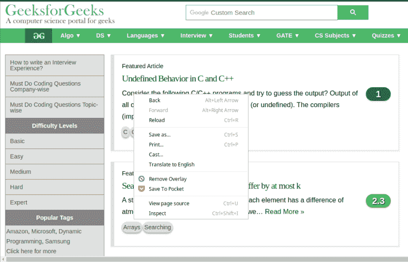
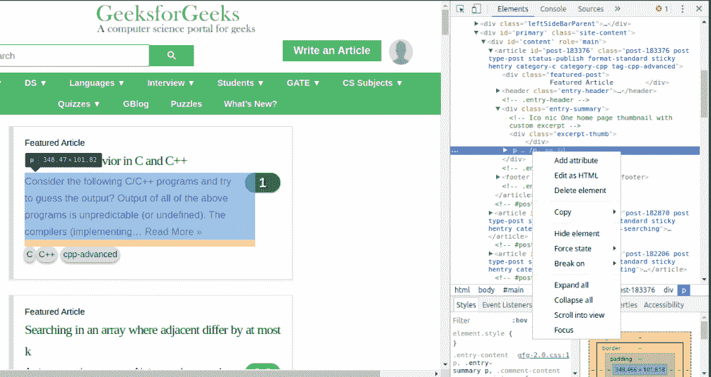
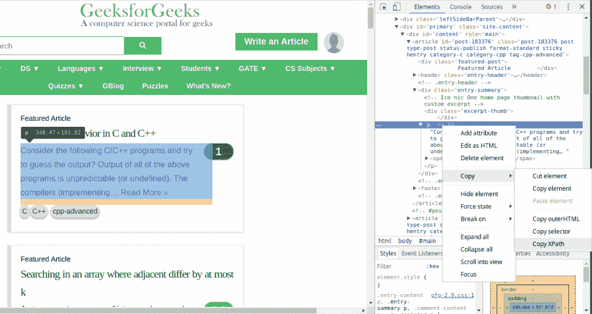

# 在 Python 中使用 lxml 实现网页抓取

> 原文:[https://www . geeksforgeeks . org/implementing-web-scratch-use-lxml-python/](https://www.geeksforgeeks.org/implementing-web-scraping-using-lxml-python/)

网页抓取基本上是指只从一个或多个网站获取一些重要的信息。每个网站都有可识别的 HTML 元素结构/模式。

> **执行刮网的步骤:**
> 1。发送链接，从发送的链接
> 2 得到响应。然后将响应对象转换为字节字符串。
> 3。将字节字符串传递给 lxml 模块中 html 类的“fromstring”方法。
> 4。通过 xpath 获取特定元素。
> 5。根据需要使用内容。

为了完成这项任务，需要安装一些第三方软件包。使用 pip 安装车轮()。文件。

```py
pip install requests
pip install lxml
```

还需要元素的 xpath，数据将从该元素中删除。一个简单的方法是–

1.右键单击页面中必须废弃的元素，然后转到“检查”。



2.右键单击源代码右侧的元素。



3.复制 xpath。



这里是“ [geeksforgeeks 主页](https://www.geeksforgeeks.org)上的一个简单实现:

## 蟒蛇 3

```py
# Python3 code implementing web scraping using lxml

import requests

# import only html class
from lxml import html

# url to scrap data from
url = 'https://www.geeksforgeeks.org'

# path to particular element
path = '//*[@id ="post-183376"]/div / p'

# get response object
response = requests.get(url)

# get byte string
byte_data = response.content

# get filtered source code
source_code = html.fromstring(byte_data)

# jump to preferred html element
tree = source_code.xpath(path)

# print texts in first element in list
print(tree[0].text_content())
```

以上代码将第一篇文章中的段落从“ [geeksforgeeks 主页](https://www.geeksforgeeks.org)”主页中划去。
下面是输出示例。对每个人来说，输出可能不一样，因为文章可能会发生变化。

**输出:**

```py
"Consider the following C/C++ programs and try to guess the output?
Output of all of the above programs is unpredictable (or undefined).
The compilers (implementing… Read More »"
```

这是另一个从[维基抓取数据的例子——网页抓取](https://en.wikipedia.org/wiki/Web_scraping)。

## 蟒蛇 3

```py
import requests
from lxml import html

# url to scrap data from
link = 'https://en.wikipedia.org / wiki / Web_scraping'

# path to particular element
path = '//*[@id ="mw-content-text"]/div / p[1]'

response = requests.get(link)
byte_string = response.content

# get filtered source code
source_code = html.fromstring(byte_string)

# jump to preferred html element
tree = source_code.xpath(path)

# print texts in first element in list
print(tree[0].text_content())
```

**输出:**

> 网页抓取、网页收集或网页数据提取是用于从网站提取数据的数据抓取。[1]网页抓取软件可以直接使用超文本传输协议或通过网络浏览器访问万维网。虽然网页抓取可以由软件用户手动完成，但该术语通常指的是使用机器人或网络爬虫实现的自动化过程。这是一种复制形式，在这种形式中，特定数据从网络上收集并复制，通常复制到中央本地数据库或电子表格中，以供以后检索或分析。