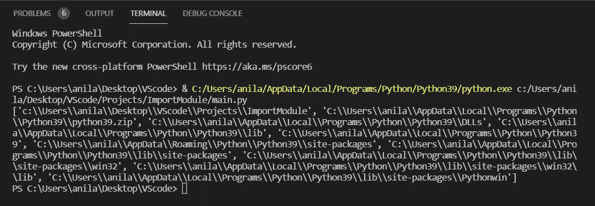
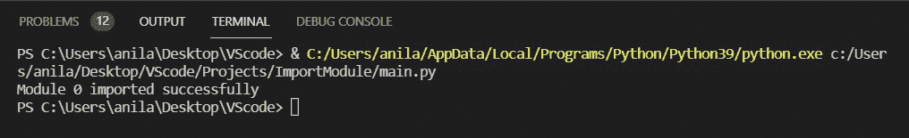
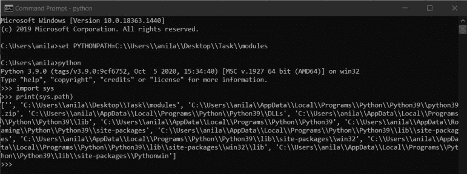
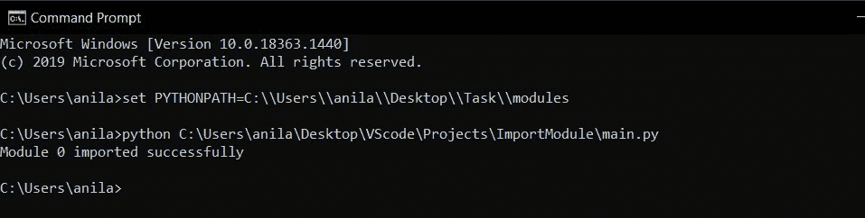

# 从 Python 中的另一个文件夹导入模块

> 原文:[https://www . geesforgeks . org/import-modules-from-other-folder-in-python/](https://www.geeksforgeeks.org/import-modules-from-another-folder-in-python/)

在本文中，我们将看到如何从另一个文件夹中导入模块，在处理大型项目时，我们可能会遇到一种情况，即我们想要从不同的目录中导入模块，这里我们将看到从不同的文件夹中导入模块的不同方法。

**有两种方式可以做到:**

*   **使用系统路径**
*   **使用 PythonPath。**

**创建一个演示模块:**

**文件名:**模块 0.py

## 蟒蛇 3

```
def run():
    print("Module 0 imported successfully")
```

### **方法一:使用** [**系统路径**](https://www.geeksforgeeks.org/sys-path-in-python/)

**sys.path:** 它是 python sys 模块中的一个内置变量。它包含一个目录列表，解释器将在其中搜索所需的模块。

## 蟒蛇 3

```
import sys

# Prints the list of directories that the 
# interpreter will search for the required module. 
print(sys.path)
```

**输出:**



**在这种方法中，在系统路径**中插入或追加包含模块的目录的路径

> **语法:**
> 
> sys.path.insert(0，路径)
> 
> sys.path.append(路径)

**示例:**假设我们需要从**【桌面\ \ vs code \ \ project \ \ import module \ \ main . py】中的**【桌面\ \任务\ \模块】**导入以下模块。**


将路径插入/追加到目录中的 ***系统路径*** 并导入 ***模块 0*** 并调用其运行函数。

## 蟒蛇 3

```
import sys

# Insert the path of modules folder 
sys.path.insert(0, "C:\\Users\\anila\\Desktop\\Task\\modules")

# Import the module0 directly since 
# the current path is of modules.
import module0

# Prints "Module0 imported successfully"
module0.run()
```

**输出:**



### 方法二:使用 [PYTHONPATH](https://www.geeksforgeeks.org/pythonpath-environment-variable-in-python/)

**pythonPATH :** 这是一个环境变量，您可以设置它来添加其他目录，PYTHON 将在这些目录中查找模块和包。

打开终端或命令提示符，输入以下命令:

```
Syntax: set PYTHONPATH=path_to_module_folder
```

添加目录中 PYTHONPATH 和 import module0 的路径，并调用其 run 函数。



**下面是实现:**

## 蟒蛇 3

```
# Import the module0 directly since 
# the current path is of modules.
import module0

# Prints "Module0 imported successfully"
module0.run()
```

**输出:**

