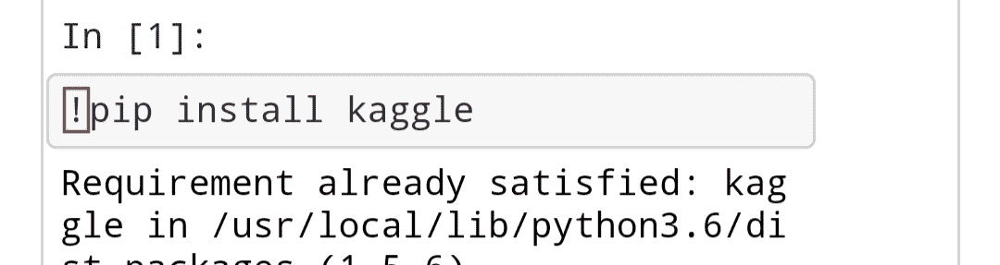
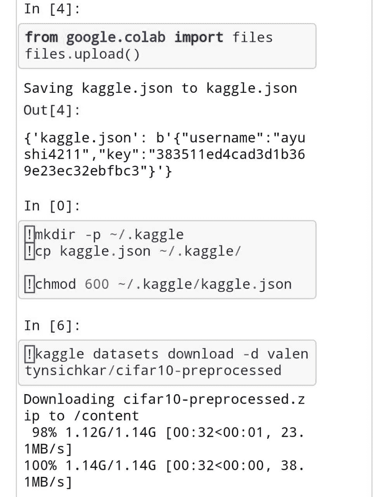
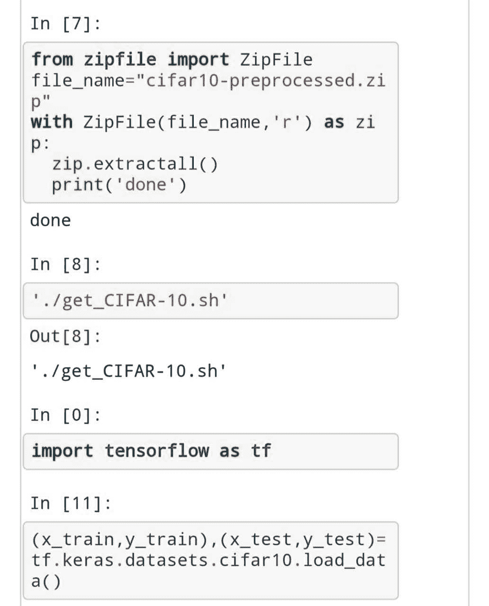

# 将 Kaggle 数据集导入谷歌合作实验室

> 原文:[https://www . geeksforgeeks . org/import-ka ggle-dataset-in-Google-co laboratory/](https://www.geeksforgeeks.org/importing-kaggle-dataset-into-google-colaboratory/)

在构建深度学习模型时，第一个任务是在线导入数据集，这一任务有时会非常繁忙。
我们只需几个步骤就可以轻松导入 Kaggle 数据集:
**代码:导入 CIFAR 10 数据集**

```py
!pip install kaggle
```



现在转到你的 Kaggle 帐户，从我的帐户部分创建一个新的 API 令牌，一个 kaggle.json 文件将被下载到你的电脑中。
**代号:**

```py
from google.colab import files
files.upload()
```

**代码:上传 kaggle.json 文件**

```py
!mkdir -p ~/.kaggle
!cp kaggle.json ~/.kaggle/
!chmod 600 ~/.kaggle/kaggle.json
```

复制数据集的网址并将其粘贴到另一个单元格中。


**代码:解压上传的数据集。**

```py
from zipfile import Zipfile
file_name=("cifar10-preprocessed.zip")
with Zipfile(file_name,'r') as zip:
             zip.extractall()
             print("done")
```

**代码:**

```py
'./get_CIFAR-10.sh'
import tensorflow as tf

(x_train,y_train),(x_test,y_test) = tf.keras.cifar10.load_data()
```



现在，您的训练和测试集已经准备好可以使用了。