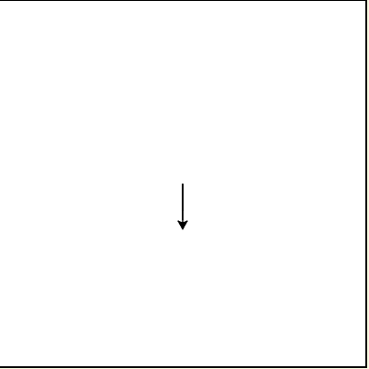
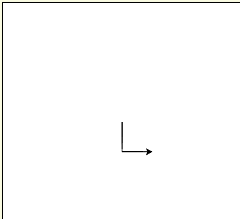
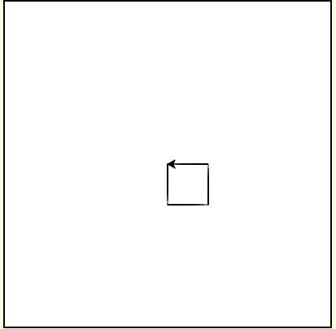
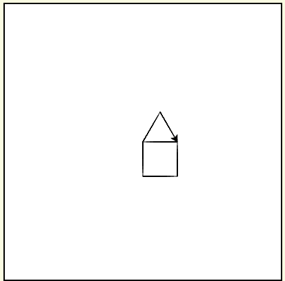

# Python 中的增量编程

> 原文:[https://www . geesforgeks . org/增量式 python 编程/](https://www.geeksforgeeks.org/incremental-programming-in-python/)

在**增量系统**中，每次测量都参考一个先前标注的位置(点对点)。增量尺寸是两个相邻点之间的距离。增量移动根据您当前的位置移动一段距离。

**从小处开始–**首先，从小处开始你的程序，并保持它工作，而不是写很多行，而不知道程序是否正常工作或其中有一些错误。

**保持它工作–**现在，由于我们的小部分工作正常，那么我们应该开始将程序的另一个小部分添加到我们的主程序中，并检查它是否正常工作。如果有任何错误，你可以在第一时间找到。一旦没有错误，继续重复第二步，直到我们的问题得到解决。

通过这样做，我们可以避免在最后一次编译整个代码时出现大量错误，并且我们会被显示的大量错误所迷惑。因为当我们将程序的一小部分添加到主代码中时，我们将同时消除所有的错误。

基本上我们在不知不觉中遵循这种编程方法。这是程序员可以在日常代码中练习的最佳编程方法之一。

我们将看到一个简单的例子，通过构建一个房子，增量编程如何与 Python 中的简单程序一起工作，因为这是我们在日常生活中可以看到的最好的例子。我们将使用海龟模块。

**1\.** We will instantiate the turtle object.

```
# importing the odule
import turtle

wn = turtle.Screen()
house = turtle.Turtle()
```

**2。**首先让我们画一条垂直线

```
house.right(90)
house.forward(50)
house.left(90)
house.forward(50)
```



**3。**我们在底部加一条水平线

```
house.left(90)
house.forward(50)
```



**4。**在这里我们可以添加一条垂直和水平的线，这样我们就可以得到一个盒子的形状。

```
house.left(90)
house.forward(50)
house.left(90)
house.forward(50)
```



**5。**现在我们要加屋顶才能让房子完整。

```
house.left(180)
house.left(60)
house.forward(50)
house.right(120)
house.forward(50
```



你可以看到的另一个例子是，数控机床也使用这种技术进行加工。如上所示，如果我们把程序分成小的部分，这对我们编写一个无错误的代码将非常有帮助。