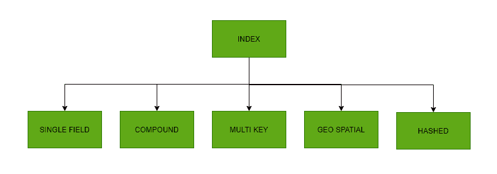

# 使用 Python 在 MongoDB 中进行索引

> 原文:[https://www . geesforgeks . org/indexing-in-MongoDB-using-python/](https://www.geeksforgeeks.org/indexing-in-mongodb-using-python/)

通过在 [MongoDB](https://www.geeksforgeeks.org/mongodb-and-python/) 集合中创建索引，查询性能得到了提高，因为它们以这样一种方式存储信息，使得遍历信息变得更加容易和高效。不需要完全扫描，因为 MongoDB 可以通过索引搜索查询。因此，它限制了需要检查查询条件的文档数量。

> **语法**–create _ index([str1，方向]，[str 1，方向]……。，可选)
> 
> **参数为:**
> 
> *   str:用于命名索引的字符串，它可以是一个或多个
> *   方向:可以是一个或多个方向，它必须是这些方向中的一个-下降、上升、散列、地圈、geohaystack、geo2d 或文本



**例 1:**

## 蟒蛇 3

```
from pymongo import MongoClient
# Create a pymongo client 
client = MongoClient('localhost', 27017) 

# database instance 
db = client['GFG'] 

# collection instance 
doc = db['Student'] 

# Creating a single field index
res = doc.create_index("index_created")
print(res)
```

**输出:**

```
index_created_1

```

**例 2:**

## 蟒蛇 3

```
from pymongo import MongoClient
# Create a pymongo client 
client = MongoClient('localhost', 27017) 

# database instance 
db = client['GFG'] 

# collection instance 
doc = db['Student'] 

# Creating a single field index in descending order
res = doc.create_index([ ("index_descending", -1) ])
print(res)
```

**输出:**

```
index_descending_-1

```

**例 3:**

## 蟒蛇 3

```
from pymongo import MongoClient,, ASCENDING, DESCENDING 
# Create a pymongo client 
client = MongoClient('localhost', 27017) 

# database instance 
db = client['GFG'] 

# collection instance 
doc = db['Student'] 

# Creating a compund field index in descending order
res = doc.create_index(
[
("ascending_index", 1),
("second_descnding_indexed", DESCENDING)
]
)
print(res)
```

**输出:**

```
ascending_index_1
second_descnding_indexed_DESCENDING

```