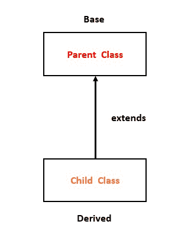
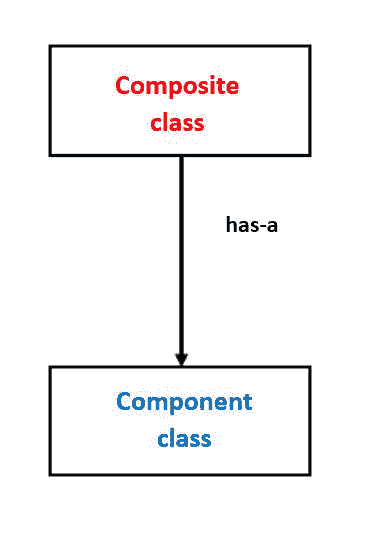

# Python 中的继承和组合

> 原文:[https://www . geesforgeks . org/python 中的继承和组合/](https://www.geeksforgeeks.org/inheritance-and-composition-in-python/)

**先决条件–**[**Python 中的类和对象**](https://www.geeksforgeeks.org/python-classes-and-objects/)

本文将比较并突出 Python 中 **is-a 关系**和 **has-a 关系**的特点。

## **什么是遗传(是一种关系)？**

这是一个面向对象编程的概念。继承是一种允许我们从另一个类继承所有属性的机制。利用属性和功能的类称为**父类(**也称为**基类)**。使用另一个类的属性的类称为**子类(**也称为**派生类)**。继承也称为**是一种关系**。



继承——图解表示

在上图中，类被表示为盒子。继承关系由从**派生类(子类)**指向**基类(父类)**的箭头表示。extends 关键字表示**子类**继承或派生自**父类**。

**语法:**

```py
# Parent class
class Parent :        
           # Constructor
           # Variables of Parent class

           # Methods
           ...

           ...

# Child class inheriting Parent class 
class Child(Parent) :  
           # constructor of child class
           # variables of child class
           # methods of child class

           ...

           ... 

```

**示例:**

## 蟒蛇 3

```py
# parent class
class Parent:

    # parent class method
    def m1(self):
        print('Parent Class Method called...')

# child class inheriting parent class
class Child(Parent):

    # child class constructor
    def __init__(self):
        print('Child Class object created...')

    # child class method
    def m2(self):
        print('Child Class Method called...')

# creating object of child class
obj = Child()

# calling parent class m1() method
obj.m1()

# calling child class m2() method
obj.m2()
```

**Output**

```py
Child Class object created...
Parent Class Method called...
Child Class Method called...

```

## **什么是作文(有-有关系)？**

它是面向对象编程的基本概念之一。在这个概念中，我们将描述一个引用其他类的一个或多个对象作为实例变量的类。这里，通过使用类名或者通过创建对象，我们可以在另一个类中访问一个类的成员。它能够通过组合不同类的对象来创建复杂类型。这意味着一个复合类可以包含另一个组件类的对象。这种类型的关系被称为**有一种关系**。



构图-图解表示

在上图中，类被表示为带有类名**复合**和**组件**的方框，这两个组件表示它们之间的 Has-A 关系。

```py
class A :

      # variables of class A
      # methods of class A
      ...
      ...

class B : 
      # by using "obj" we can access member's of class A.
      obj = A()

      # variables of class B
      # methods of class B

      ...
      ...

```

**示例:**

## 蟒蛇 3

```py
class Component:

   # composite class constructor
    def __init__(self):
        print('Component class object created...')

    # composite class instance method
    def m1(self):
        print('Component class m1() method executed...')

class Composite:

    # composite class constructor
    def __init__(self):

        # creating object of component class
        self.obj1 = Component()

        print('Composite class object also created...')

     # composite class instance method
    def m2(self):

        print('Composite class m2() method executed...')

        # calling m1() method of component class
        self.obj1.m1()

# creating object of composite class
obj2 = Composite()

# calling m2() method of composite class
obj2.m2()
```

**Output**

```py
Component class object created...
Composite class object also created...
Composite class m2() method executed...
Component class m1() method executed...

```

**说明:**

*   在上面的例子中，我们创建了两个类**复合**和**组件**来显示其中的**有-一个关系**。
*   在**组件类**中，我们有一个构造函数和一个实例方法 **m1()** 。
*   类似地，在**复合类**中，我们有一个构造器，在其中我们创建了一个**组件类的对象。**每当我们创建**复合类**的对象时，****组件类**的对象是自动创建的。**
*   **现在在**复合类**的 **m2()** 方法中，我们使用实例变量 **obj1** 调用**组件类**的 **m1()** 方法，其中存储了**组件类**的引用。**
*   **现在，每当我们调用**复合类的 **m2()** 方法时，就会自动调用 **m1()** 组件类**的方法。**

## ****合成 vs 继承****

**这两个概念都指向**代码可重用性**那么**什么是****b/w 继承和组合的区别以及何时使用继承和何时使用组合，这让大多数人感到非常困惑。****

****继承**用于类想要派生父类的性质，然后修改或扩展其功能的情况。**继承**会用额外的特性扩展功能允许 [**覆盖方法**](https://www.geeksforgeeks.org/method-overriding-in-python/) ，但是在**合成**的情况下，我们只能使用那个类我们不能修改或者扩展它的功能。它不会提供额外的功能。因此，当需要在没有任何修改的情况下按原样使用类时，建议使用组合；当需要在另一个类中更改方法的行为时，建议使用继承。**