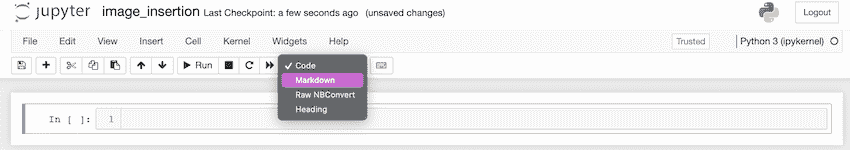
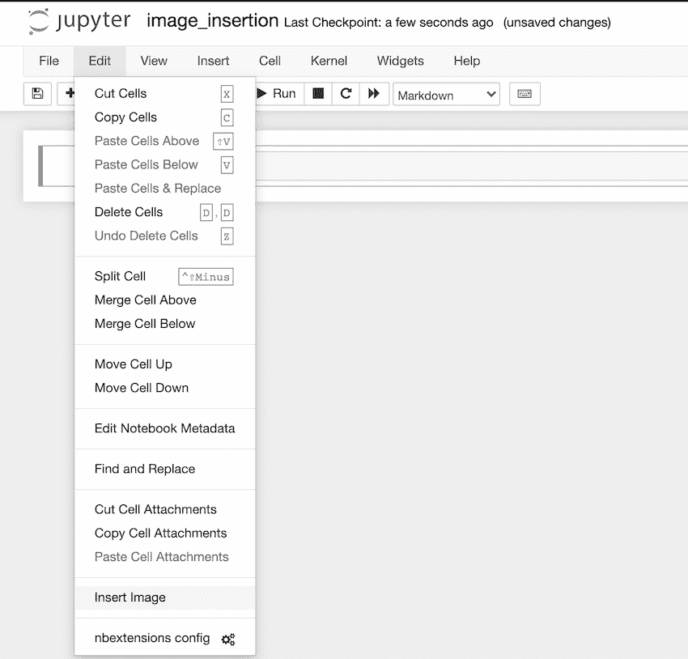
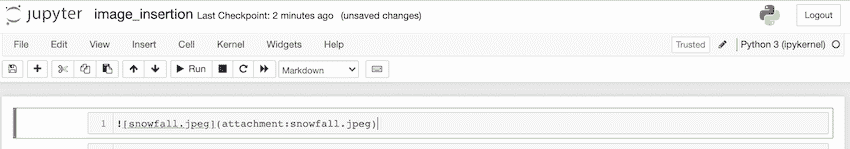

# 在 Jupyter 笔记本中插入图像

> 原文:[https://www . geesforgeks . org/insert-image-in-a-jupyter-notebook/](https://www.geeksforgeeks.org/insert-image-in-a-jupyter-notebook/)

在本文中，我们将讨论如何在 Jupyter 笔记本中插入图像。有几种方法可以插入图像。这些是–

*   使用编辑菜单直接插入。
*   嵌入减价单元格
*   通过 python 代码(在代码单元格中嵌入图像)。

## 方法 1:使用编辑菜单直接插入

**第一步:**这个方法最简单。首先，将单元格的类型更改为- >标记。



**第二步:**之后点击 jupyter 笔记本菜单中的编辑。然后点击“插入图像”。编辑- >插入图片。



**第三步:**之后，一个对话框打开，要求我们定位文件。点击“确定”。

 

### 最终输出:


## 方法 2:嵌入降价单元格

有不同的方法可以在 markdown 中嵌入图像。下面是一个直接嵌入的例子:

## 蟒蛇 3

```py

```

**输出:**


## 方法 3:使用 python 代码(在代码单元中嵌入图像)

代码单元也可以用来嵌入图像。要显示图像， **Ipython.display()** 方法需要使用函数。在笔记本中，您还可以指定图像的宽度和高度。

## 蟒蛇 3

```py
# import image module
from IPython.display import Image

# get the image
Image(url="snowfall4.jpeg", width=300, height=300)
```

**输出:**

