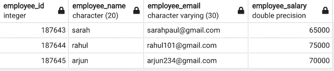

# 使用 Psycopg2

在 PostgreSQL 中插入 Python 字典

> 原文:[https://www . geesforgeks . org/insert-python-dictionary-in-PostgreSQL-using-psycopg 2/](https://www.geeksforgeeks.org/insert-python-dictionary-in-postgresql-using-psycopg2/)

在本文中，我们将看到如何使用 Psycopg2 在 PostgreSQL 中插入 Python 字典。

我们可以通过将字典键作为列名，将值作为字典值来插入 python 字典。我们导入 Psycopg2 包，并使用 [psycopg2.connect()](https://www.geeksforgeeks.org/postgresql-connecting-to-the-database-using-python/) 方法形成到 PostgreSQL 数据库的连接。首先，让我们创建一个表，然后将 python 字典值插入其中。我们通过使用 [cursor.execute()](https://www.geeksforgeeks.org/sql-using-python-set-3-handling-large-data/) 方法执行 SQL 语句来创建表。

### 创建表 SQL 命令:

```py
'''CREATE TABLE DETAILS(employee_id int NOT NULL, employee_name char(20),
         employee_email varchar(30), employee_salary float);'''
```

创建空表后，使用[从字典中获取表中的值。values()](https://www.geeksforgeeks.org/python-dictionary-values/) 方法。


空表

我们遍历字典值，并将它们插入到表中。每次插入都会执行下面的 SQL 语句。

```py
'''insert into DETAILS(employee_id , employee_name ,
         employee_email , employee_salary) VALUES{};'''
```

**下面是实现:**

## 蟒蛇 3

```py
import psycopg2

# connection establishment
conn = psycopg2.connect(
   database="geeks",
    user='postgres',
    password='root',
    host='localhost',
    port= '5432'
)

conn.autocommit = True
cursor = conn.cursor()

sql = '''CREATE TABLE DETAILS(employee_id int NOT NULL,\
          employee_name char(20),
          employee_email varchar(30), employee_salary float);'''

cursor.execute(sql)
dictionary ={ 'empl1' : (187643,'sarah',
                       'sarahpaul@gmail.com',65000),
              'empl2' : (187644,'rahul',
                       'rahul101@gmail.com',75000),
              'empl3' : (187645,'arjun',
                       'arjun234@gmail.com',70000)
}
columns= dictionary.keys()
for i in dictionary.values():
    sql2='''insert into DETAILS(employee_id , employee_name ,
          employee_email , employee_salary) VALUES{};'''.format(i)

    cursor.execute(sql2)

sql3='''select * from DETAILS;'''
cursor.execute(sql3)
for i in cursor.fetchall():
    print(i)

conn.commit()
conn.close()
```

**输出:**

```py
(187643, 'sarah               ', 'sarahpaul@gmail.com', 65000.0)
(187644, 'rahul               ', 'rahul101@gmail.com', 75000.0)
(187645, 'arjun               ', 'arjun234@gmail.com', 70000.0)
```

#### 插入后的 PostgreSQL 表:



插入后的最终表格