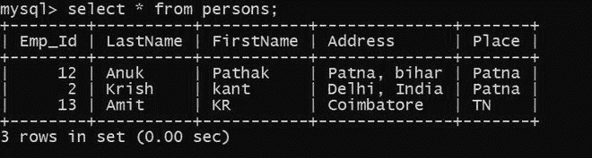
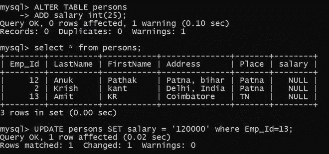
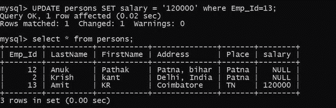
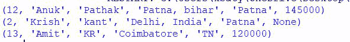

# 使用 Python 将数据插入到 MySQL 中已经存在的表的新列中

> 原文:[https://www . geesforgeks . org/insert-data-in-a-new-column-of-a-existing-in-a-existing-table-in-MySQL-use-python/](https://www.geeksforgeeks.org/inserting-data-into-a-new-column-of-an-already-existing-table-in-mysql-using-python/)

**先决条件:** [Python: MySQL 创建表](https://www.geeksforgeeks.org/python-mysql-create-table/)

在本文中，我们将看到如何使用 Python 将数据插入到 MySQL 中已经存在的表的新列中。Python 允许广泛的数据库服务器与应用程序的集成。从 Python 访问数据库需要数据库接口。 [MySQL Connector](https://www.geeksforgeeks.org/mysql-connector-python-module-in-python/) Python 模块是 Python 中的一个 API，用于与 MySQL 数据库进行通信。

**正在使用的数据库表:**



我们要用**极客**(数据库名)数据库和表格描述工资。

**进场:**

*   导入模块。
*   向数据库发出连接请求。
*   为数据库游标创建一个对象。
*   执行以下 MySQL 查询:

```py
ALTER TABLE person
ADD salary int(20);
UPDATE persons SET salary = '145000' where Emp_Id=12;
```

*   并打印结果。

**在开始之前，让我们在 SQL 中做同样的事情:**

**步骤 1:** 使用 alter 命令创建一个新列。

```py
ALTER TABLE table_name ADD column_name datatype;
```



**步骤 2:** 在新列中插入数据。



**下面是 python 中的完整实现:**

## 蟒蛇 3

```py
# Establish connection to MySQL database
import mysql.connector

db = mysql.connector.connect(
    host="localhost",
    user="root",
    password="root123",
    database="geeks"
)

# getting the cursor by cursor() method
mycursor = db.cursor()
query_1 = "ALTER TABLE person ADD salary int(20);"
query_2 = "UPDATE persons SET salary = '145000' where Emp_Id=12;"

# execute the queries
mycursor.execute(query_1)
mycursor.execute(query_2)

mycursor.execute("select * from persons;")
myresult = mycursor.fetchall()
for row in myresult:
    print(row)

db.commit()

# close the Connection
db.close()
```

**输出:**

