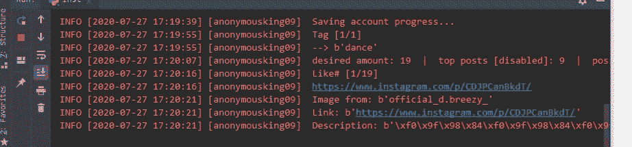

# 使用 Python 和 InstaPy 的 insta gram Bot

> 原文:[https://www . geesforgeks . org/insta gram-bot-using-python-and-insta py/](https://www.geeksforgeeks.org/instagram-bot-using-python-and-instapy/)

在本文中，我们将使用 Python 和 InstaPy 设计一个简单有趣的项目“Instagram Bot”。作为初学者，想做一些额外的学习小项目，这样有助于构建未来的大项目。现在，是时候学习一些新的项目和更好的未来了。

这个 python 项目提供了 Instagram 机器人的功能来喜欢、评论、**，并在他们的帖子上跟随带有特定标签的简介。**要做到这一点，我们必须使用 InstaPy。确保你也安装了火狐浏览器，因为 InstaPy 的最新版本放弃了对 Chrome 的支持。为了安装 InstaPy，我们使用下面给出的命令:

```
pip install instapy==0.6.8
```

最新版本是 0.6.9，但随时崩溃，尽量用注释。没有注释脚本也能完美工作。

**登录**

首先，让我们创建一个 Python 文件，并在其中放入以下代码，用您的用户名和密码替换用户名和密码，运行脚本，这必须让您进入 Instagram。

## 蟒蛇 3

```
from instapy import InstaPy

session = InstaPy(username="your username",password="your password")
session.login()
```

**InstaPy** 做一些其他的事情，比如检查你的互联网连接和 Instagram 服务器的状态。我们可以直接在浏览器或日志中观察到这一点:

如下图所示，加载可能需要一些时间



**通过标签喜欢**

首先，我们可以使用像 _by_tags()这样的来喜欢一些被标记为#dance 或者#mercedes 的帖子:

## 蟒蛇 3

```
session.like_by_tags(["dance", "mercedes"], amount=10, interact=True)
```

在这里，我们给了这个方法一个喜欢的标签列表和每个给定标签的帖子数量。在这里，我们指示它每个人喜欢十个帖子。InstaPy 会记录下它采取的每一个动作。

它提到了它喜欢的帖子及其链接、描述、位置，以及机器人是评论了帖子还是跟随了作者。

**不喜欢**

我们可以用**set _ don _ like():防止机器人喜欢不合适的帖子。**

## **蟒蛇 3**

```
session.set_dont_like(["naked", "murder", "nsfw"])
```

**在运行代码之前，我们必须在“site-packages/insta py/xpath_compile.py”中的 XPath _ compile . py 文件中更改一些代码，因为 Instagram 已经修改了 HTML**

****移除:****

> **XPath[" like _ image "]= { 0**
> 
> **" Like "://section/span/button[*[local-name()= ' SVG ']/@ aria-label = ' Like ']"，**
> 
>  **"不像"://section/span/button[*[local-name()= ' SVG ']/@ aria-label = '不像']"，
> 
> }**

****替换为:****

> **XPath[" like _ image "]= { 0**
> 
> **" Like "://section/span/button/div[*[local-name()= ' SVG ']/@ aria-label = ' Like ']"，**
> 
> **"不像"://section/span/button/div[*[local-name()= ' SVG ']/@ aria-label = '不像']"，**
> 
> **}**

**如果不替换上面的代码，就会抛出 insta py:**“Like 元素无效！”****

******设置评论******

****接下来，你也可以在帖子上留下一些评论。首先，使用 set_do_comment()启用注释。其次，告诉机器人用 set_comments()留下什么注释。****

## ****蟒蛇 3****

```
**session.set_do_comment(True, percentage=100)
session.set_comments(["Nice", "Amazing", "Super"])**
```

******设定跟随******

****接下来，你可以告诉机器人不仅要喜欢这些帖子，还要关注这些帖子的作者。您可以使用 set_do_follow()实现这一点。****

## ****蟒蛇 3****

```
**session.set_do_follow(enabled=True, percentage=100)**
```

******设置交互******

****之后，您必须使用 set _ user _ interaction()来反映与用户界面进行一次交互后的实际用户体验。这里的数量是机器人将在一个单一的配置文件中互动的帖子数量。****

## ****蟒蛇 3****

```
**session.set_user_interact(amount=1, randomize=True, percentage=100)**
```

******重要**:你必须在调用活动之前设置配置，也要设置交互，也就是说在上述会话设置之后保留活动，否则机器人只会喜欢帖子，但不会评论或跟随。****

******结束******

****现在您已经完成了基本设置，最好以结束()来结束会话。****

## ****蟒蛇 3****

```
**session.end()**
```