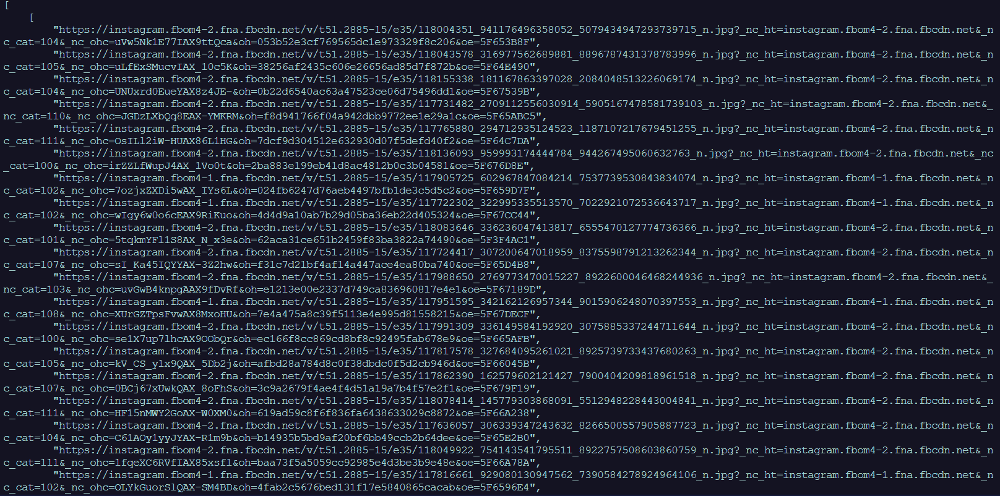

# insta gram-Python 中的探索模块

> 原文:[https://www . geesforgeks . org/insta gram-explore-module-in-python/](https://www.geeksforgeeks.org/instagram-explore-module-in-python/)

**instagram-explore** 模块是 instagram 报废模块。

### **安装**:

运行以下 pip 命令:

```py
pip install instagram-explore

```

该模块目前有 8 个功能用于探索 Instagram:

1.  获取用户信息
2.  获取标签
3.  获取用户图像
4.  获取位置
5.  位置
6.  位置图像
7.  媒体
8.  媒体图像

**示例 1 :** 要获取用户的信息，我们将使用 user()方法。

```py
ie.user("username", max_id = None)

```

它将给出网页的 html，即 Instagram 个人资料的主页

## 蟒蛇 3

```py
# import the modules
import instagram_explore as ie
import json

# search user name
result = ie.user('timesofindia')

parsed_data= json.dumps(result, indent = 4,
                        sort_keys = True)

# displaying the data
print(parsed_data[15:400])
```

**输出:**

> 《传记》:《印度时报》是印度阅读量最大的英文报纸，也是世界上销量最大的英文报纸——一份时报互联网有限产品》，
> 
> “被查看者阻止”:假，
> 
> “业务 _ 类别 _ 名称”:“发布者”，
> 
> business_email:"你的社交媒体@gmail.com "，
> 
> “category _ enum”:“BRADING _ MEDIA _ PRODUCTION”，
> 
> “已连接 _fb_p

**示例 2 :** 获取用户图像

如果帐户是私有的–>返回空值，否则返回的图像链接按最新排序。

## 蟒蛇 3

```py
# importing the modules
import instagram_explore as ie
import json

res = ie.user_images('timesofindia')

parsed_data = json.dumps(res, indent = 4,
                        sort_keys = True)

# displaying the data
print(parsed_data)
```

**输出:**

这里只显示一个链接。

> https://scontent-del1-1.cdninstagram.com/v/t51.2885-15/fr/e15/s1080x1080/117758575_167564261503193_2290116502716246854_n.jpg?_nc_ht=scontent-del1-1.cdninstagram.com&_nc_cat=105&_nc_ohc=4Yds4Fv58wUAX-4Pgra&oh=eaa3b5b243433239e134e427f340049c&oe=5F666630

**示例 3 :** 搜索标签

通过 tag()函数，我们将获得关于搜索到的标签的信息

```py
variable = ie.tag("Name_of_tag", max_id = None)

```

## 蟒蛇 3

```py
# importing the modules
import instagram_explore as ie
import json

# using the tag method
result = ie.tag('Binod')

parsed_data = json.dumps(result, indent = 4, 
                         sort_keys = True)

# displaying the data
print(parsed_data)
```

**输出:**


**示例 4 :** 通过标签获取图像

## 蟒蛇 3

```py
# importing the modules
import instagram_explore as ie
import json

# Search user name
result = ie.tag_images('Binod')

parsed_data = json.dumps(result, indent = 4, 
                         sort_keys = True)

# displaying the data
print(parsed_data)
```

**输出:**



。