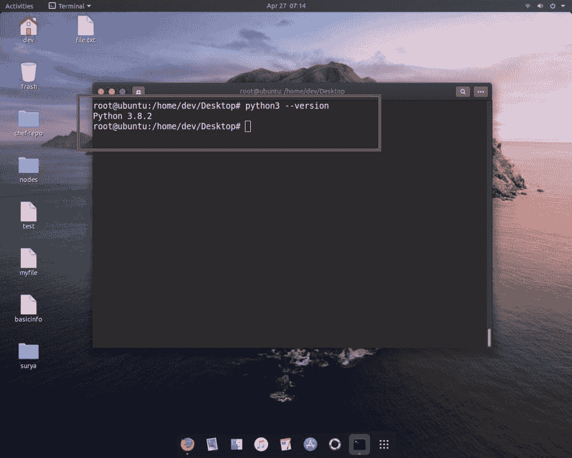
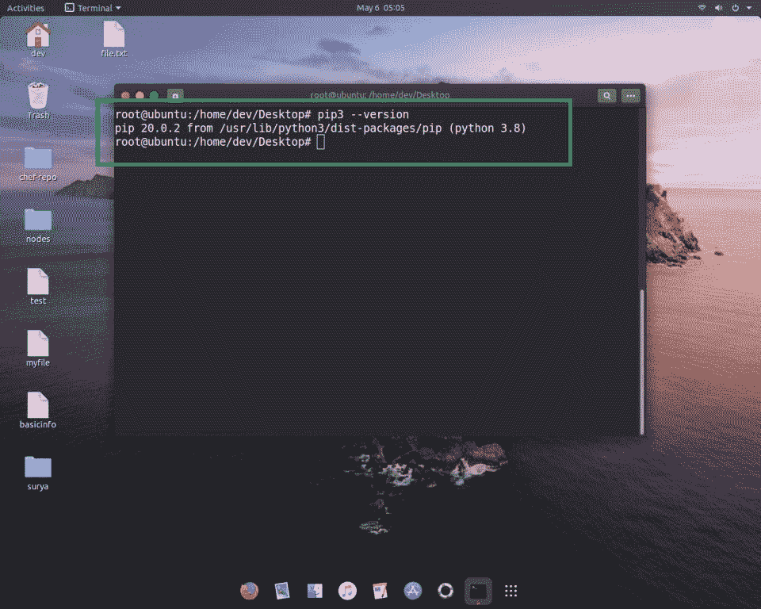
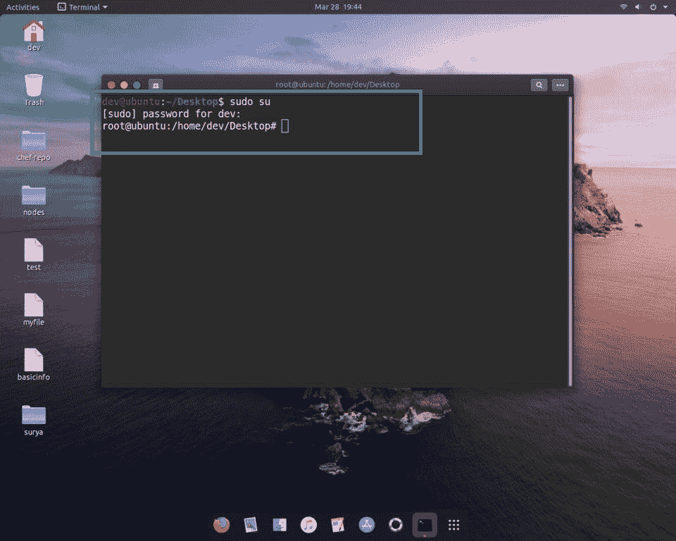
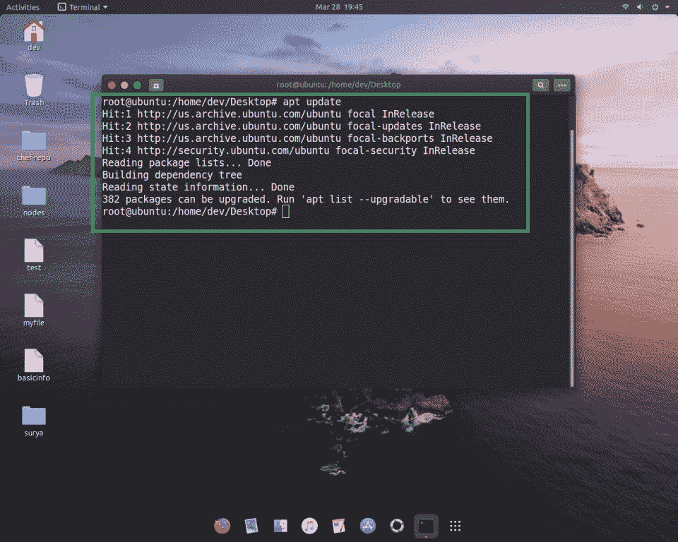
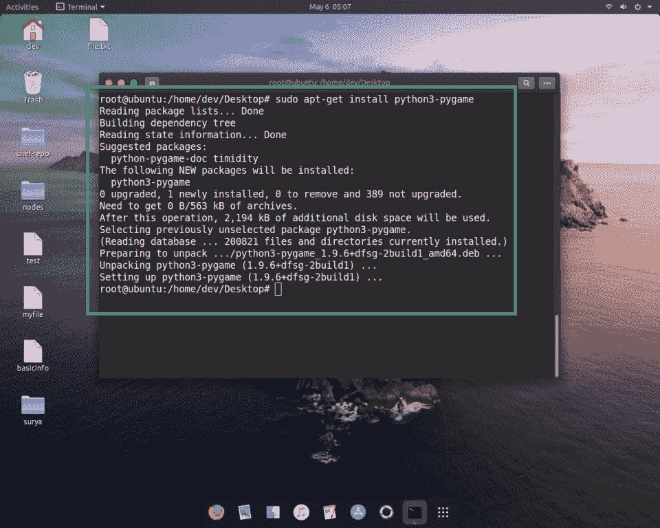
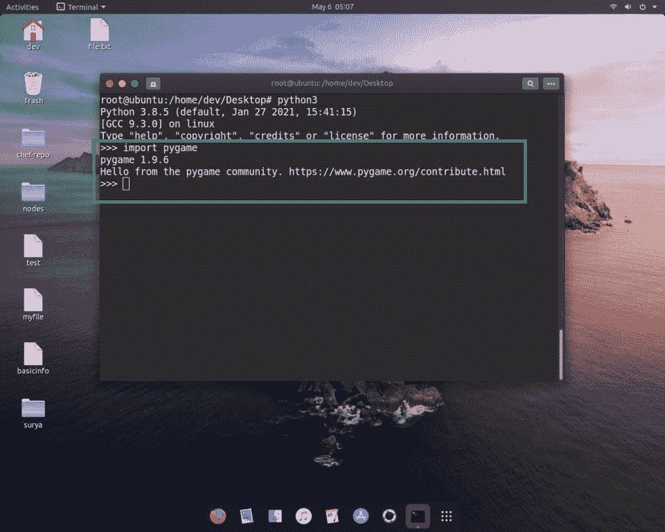

# 在 Linux 中安装 Pygame

> 原文:[https://www.geeksforgeeks.org/install-pygame-in-linux/](https://www.geeksforgeeks.org/install-pygame-in-linux/)

在本文中，我们将讨论如何在 Linux 系统中安装 **PyGame** 。我们正在使用 Ubuntu 20 LTS，你可以使用任何其他的。

要在您的 Linux 系统中成功安装 PyGame，请遵循以下步骤:

*   **首先检查你用的是不是 python 的最新版本。**

因为 PyGame 只支持 python 3.7.7 或更高版本，所以请确保您使用的是最新版本的 python。键入以下命令检查文章的版本。

> python 3–版本

**注意:**如果没有安装 python 请参考[在 Linux 系统](https://www.geeksforgeeks.org/how-to-install-python-on-linux/)中安装 Python。

*   **检查你是否使用 pip 最新版本。**

pip 是一个 python 包安装程序，如果你想在你的 python 文件中使用任何外部包，你首先要在你的本地系统中安装它，所以使用 pip 工具。如果您已经在使用新的 pip 版本，请按照下面的步骤操作。如果没有，请参考关于如何在 Linux 系统中安装 pip 的文章。

> pip 3–版本

*   **如果您没有使用最新的 pip 版本，请成为 root 用户并更新 Linux 包。**

打开终端，确保您是根用户。

> 我出汗了

键入您的密码，并以 root 用户身份执行以下过程，然后使用以下命令更新 Linux 软件包。

> apt 更新

完成该步骤后，您就可以在您的 Linux 系统中安装 PyGame 了。

### **安装 Pygame**

在您的终端中键入以下命令，然后按回车键。

> sudo apt-get 安装 python3-pygame

这个过程需要时间，最终你成功地在你的 Linux 系统中安装了你的 PyGame 模块。

*   **检查 PyGame 是否工作。**

键入以下命令，打开 python 解释器并导入 PyGame。

显示 PyGame 版本表示库安装正确。