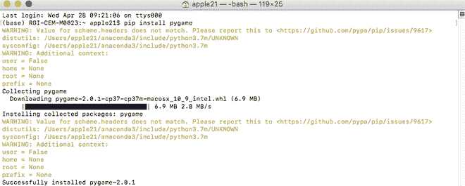
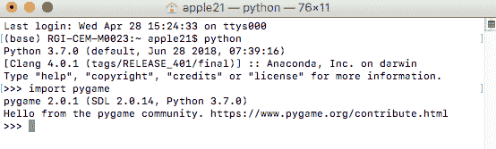

# 在 MacOS 中安装 Pygame

> 原文:[https://www.geeksforgeeks.org/install-pygame-in-macos/](https://www.geeksforgeeks.org/install-pygame-in-macos/)

PyGame 是突破 Python 应用程序语言的模块集合。这些模块旨在编辑视频游戏。因此，PyGame 包括为 Python 程序的使用和语言而创建的计算机图形和音频库。

首先，打开位于应用程序->实用程序->终端的终端，确保系统中安装了 Python3。如果没有安装，请键入以下命令。

```
brew install python3
```

### **安装依赖关系**

**XCode:**PyGame 的第一步是安装苹果的 XCode 程序。在终端应用程序中，输入并运行以下命令来安装 XCode。

```
xcode-select --install
```

请务必点击所有需要 XCode 的验证建议

### 正在安装 PyGame

我们现在可以安装最新版本的 PyGame 了。在终端中键入以下命令，然后按回车键。

```
pip3 install pygame
```



要测试您的 Mac 上是否安装了 pygame，请打开终端并键入 python，然后按如下方式导入 PyGame



如果您没有看到任何错误，这意味着 PyGame 已经成功安装在您的 Mac 上。