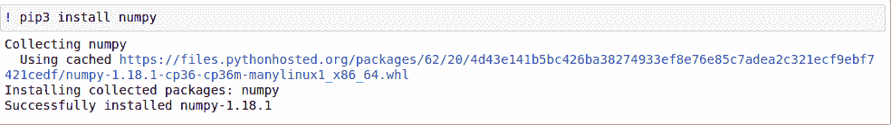
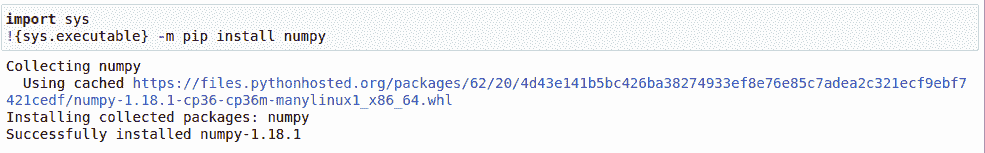

# 使用 Jupyter 笔记本

安装 Python 包

> 原文:[https://www . geesforgeks . org/install-python-package-using-jupyter-notebook/](https://www.geeksforgeeks.org/install-python-package-using-jupyter-notebook/)

Jupyter Notebook 是一个开源网络应用程序，用于创建和共享包含不同格式数据的文档，包括实时代码、公式、可视化和文本。用途包括数据清理和转换、数值模拟、统计建模、数据可视化、机器学习等等。

Jupyter 支持 40 多种不同的编程语言， [Python](https://www.geeksforgeeks.org/python-tutorial/) 就是其中之一。Python 是安装 Jupyter 笔记本本身的要求(Python 3.3 或更高版本，或 Python 2.7)。

> **关于 Jupyter 笔记本的安装，请参考以下文章。**
> 
> *   [如何在 Linux 中安装 Jupyter 笔记本？](https://www.geeksforgeeks.org/how-to-install-jupyter-notebook-in-linux/)
> *   [如何在 Windows 中安装 Jupyter 笔记本？](https://www.geeksforgeeks.org/how-to-install-jupyter-notebook-in-windows/)

在朱皮特，一切都在细胞中运行。它提供了将单元格类型更改为标记、文本、Python 控制台等的选项。在 Python IPython 控制台单元中，jupyter 允许执行 Python 代码。

### 在 Jupyter 安装 Python 库

#### 使用！pip 安装

要安装 Python 库，我们在操作系统的命令行控制台上使用 pip 命令。操作系统在其所谓的环境变量中有一组可执行程序的路径，通过这些路径可以直接识别 pip 的确切含义。这就是每当 pip 命令可以直接在控制台上运行的原因。

在 Jupyter 中，控制台命令可以由“！”执行在单元格内的命令前签名。例如，如果下面的代码写在 Jupyter 单元格中，它将作为命令在 CMD 中执行。

```py
! echo GeeksforGeeks

```

**输出**


同样，我们可以通过 jupyter 以同样的方式安装任何软件包，它将直接在 OS shell 中运行。

**语法:**

```py
! pip install [package_name] 
```

**示例:**让我们使用 Jupyter 安装 NumPy。



但是由于操作系统的行为，不建议使用这种方法。此命令在操作系统的$PATH 变量中的当前版本上执行。因此，在多个 Python 版本的情况下，这可能不会在 jupyter 的 Python 版本中安装相同的包。在最简单的情况下，它可能行得通。

#### 使用系统库

为了解决上述问题，建议使用 Python 中的 **sys** 库，该库将返回运行 jupyter 的当前版本的 pip 的路径。sys.executable 将返回当前 Jupyter 实例所在版本的 Python.exe 路径

**语法:**

```py
import sys
!{sys.executable} -m pip install [package_name]

```

**示例:**



根据上面的代码，该包将安装在运行 jupyter 笔记本的同一 Python 版本中。