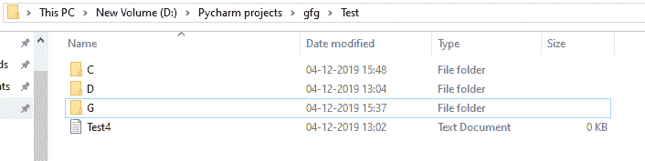
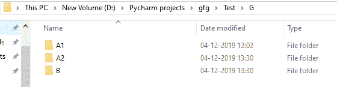
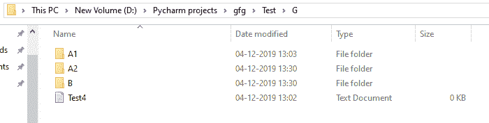
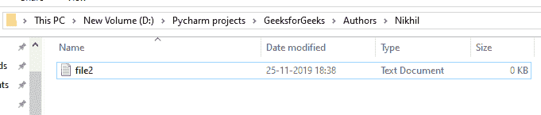

# 在 Python 中与文件交互

> 原文:[https://www . geesforgeks . org/与 python 中的文件交互/](https://www.geeksforgeeks.org/interact-with-files-in-python/)

Python 也支持文件处理，并允许用户处理文件，即读取、写入、创建、删除和移动文件，以及许多其他文件处理选项，以对文件进行操作。文件处理的概念已经扩展到各种其他语言，但是实现要么复杂要么冗长，但是和 Python 的其他概念一样，这里的这个概念也很简单和简短。

本文的主要重点将放在以下主题上。

*   [创建文件](#create)
*   [从文件中读取](#read)
*   [写入文件](#write)
*   [移动文件](#move)
*   [删除文件](#delete)

## 创建文件

使用文件实例的第一步是打开磁盘文件。在任何计算机语言中，这意味着在代码和外部文件之间建立通信链接。创建新文件的输入输出类提供了成员函数`open()`。

**语法:**

```py
open(filename, mode)
```

这里的模式指的是访问模式。访问模式控制打开的文件中可能的操作类型。它指的是文件打开后将如何使用。这些模式还定义了文件句柄在文件中的位置。文件句柄就像一个光标，它定义了从哪里读取或写入文件中的数据。python 中有 6 种访问模式。

*   **只读(' r'):** 打开文本文件阅读。句柄位于文件的开头。如果文件不存在，将引发输入/输出错误。这也是打开文件的默认模式。
*   **读写(' r+'):** 打开文件进行读写。句柄位于文件的开头。如果文件不存在，将引发输入/输出错误。
*   **只写(' w'):** 打开文件写。对于现有文件，数据被截断和覆盖。句柄位于文件的开头。如果文件不存在，则创建该文件。
*   **读写(' w+'):** 打开文件进行读写。对于现有文件，数据被截断和覆盖。句柄位于文件的开头。
*   **仅追加(' a'):** 打开文件进行写入。如果文件不存在，则创建该文件。句柄位于文件的末尾。正在写入的数据将被插入到现有数据的末尾。
*   **追加并读取(' a+'):** 打开文件进行读写。如果文件不存在，则创建该文件。句柄位于文件的末尾。正在写入的数据将被插入到现有数据的末尾。

**示例:**假设文件夹如下所示–


```py
# Open function to open the file "MyFile1.txt"  
# (same directory) in append mode and 
file1 = open("MyFile.txt","w+") 
```

**输出:**


在上面的例子中，`open()`函数和访问模式“w+”一起用于以读写模式打开文件，但是如果该文件在计算机系统中不存在，那么它会创建新文件。

**注意:**要了解更多关于创建文件[的信息，请点击此处](https://www.geeksforgeeks.org/create-an-empty-file-using-python/)。

## 从文件中读取

从文本文件中读取数据有三种方法。

1.  **read():** 以字符串的形式返回读取的字节。读取 n 个字节，如果没有指定 n，读取整个文件。

    ```py
    File_object.read([n])
    ```

2.  **readline():** 读取文件的一行并以字符串形式返回。对于指定的 n，读取最多 n 个字节。但是，不会读取多行，即使 n 超过了该行的长度。

    ```py
    File_object.readline([n])
    ```

3.  **readline():**读取所有行，并将它们作为列表中的字符串元素返回。

    ```py
    File_object.readlines()
    ```

**注意:** `‘\n’`被视为两个字节的特殊字符。

```py
# Program to show various ways to  
# read data from a file.  

# Creating a file 
file1 = open("myfile.txt", "w") 
L = ["This is Delhi \n", "This is Paris \n", "This is London \n"] 

# Writing data to a file 
file1.write("Hello \n")  
file1.writelines(L) 
file1.close()  # to change file access modes 

file1 = open("myfile.txt", "r+") 

print("Output of Read function is ") 
print(file1.read()) 
print() 

# seek(n) takes the file handle to the nth 
# bite from the beginning.  
file1.seek(0) 

print("Output of Readline function is ") 
print(file1.readline()) 
print() 

file1.seek(0) 

# To show difference between read and readline  
print("Output of Read(9) function is ") 
print(file1.read(9)) 
print() 

file1.seek(0) 

print("Output of Readline(9) function is ") 
print(file1.readline(9)) 
print() 

file1.seek(0) 

# readlines function  
print("Output of Readlines function is ") 
print(file1.readlines()) 
print() 
file1.close()  
```

**输出:**

```py
Output of Read function is
Hello
This is Delhi
This is Paris
This is London

Output of Readline function is
Hello

Output of Read(9) function is
Hello
Th

Output of Readline(9) function is
Hello

Output of Readlines function is
['Hello \n', 'This is Delhi \n', 'This is Paris \n', 'This is London \n']

```

**注意:**要了解更多关于从文件[阅读的信息，请点击此处](https://www.geeksforgeeks.org/how-to-read-from-a-file-in-python/)。

## 写入文件

有两种方法可以写入文件。

1.  **write():** 将字符串 str1 插入文本文件中的一行。
    文件 _ 对象.写

*   **writelines():** For a list of string elements, each string is inserted in the text file. Used to insert multiple strings at a single time.
    File_object.writelines(L) for L = [str1, str2, str3]

    **注意:** `‘\n’`被视为两个字节的特殊字符。

    ```py
    # Python program to demonstrate 
    # writing to file 

    # Opening a file 
    file1 = open('myfile.txt', 'w') 
    L = ["This is Delhi \n", "This is Paris \n", "This is London \n"] 
    s = "Hello\n"

    # Writing a string to file 
    file1.write(s) 

    # Writing multiple strings 
    # at a time 
    file1.writelines(L) 

    # Closing file 
    file1.close() 

    # Checking if the data is 
    # written to file or not 
    file1 = open('myfile.txt', 'r') 
    print(file1.read()) 
    file1.close() 
    ```

    **输出:**

    ```py
    Hello
    This is Delhi
    This is Paris
    This is London

    ```

    **注意:**要了解更多关于写入文件[的信息，请点击此处](https://www.geeksforgeeks.org/writing-to-file-in-python/)。

    ## 移动文件

    这可以通过使用**关闭模块**的`shutil.move()`功能来实现。`shutil.move()`方法递归地将文件或目录(源)移动到另一个位置(目标)并返回目标。如果目标目录已经存在，那么 src 将被移动到该目录中。如果目的地已经存在，但不是一个目录，那么它可能会被覆盖，这取决于`os.rename()`语义。

    **示例:**假设目录如下–

    

    **内 G:**

    

    ```py
    # Python program to move 
    # files

    import shutil 

    # Source path 
    source = "D:\Pycharm projects\gfg\Test\Test4.txt"

    # Destination path 
    destination = "D:\Pycharm projects\gfg\Test\G"

    # Move the content of 
    # source to destination 
    dest = shutil.move(source, destination) 

    # print(dest) prints the  
    # Destination of moved directory 
    ```

    **输出:**

    

    **注意:**要了解更多关于移动文件的信息[点击这里](https://www.geeksforgeeks.org/how-to-move-files-and-directories-in-python/)。

    ## 删除文件

    Python 中的`os.remove()`方法用于移除或删除文件路径。此方法不能删除目录。如果指定的路径是目录，则该方法将引发 OSError。

    **示例:**假设文件夹中包含的文件有:

    

    我们想从上面的文件夹中删除文件 1。下面是实现。

    ```py
    # Python program to explain os.remove() method   

    # importing os module   
    import os  

    # File name  
    file = 'file1.txt'

    # File location  
    location = "D:/Pycharm projects/GeeksforGeeks/Authors/Nikhil/"

    # Path  
    path = os.path.join(location, file)  

    # Remove the file  
    # 'file.txt'  
    os.remove(path)  
    ```

    **输出:**

    

    **注意:**要了解更多关于删除文件的信息[点击这里](https://www.geeksforgeeks.org/delete-a-directory-or-file-using-python/)。